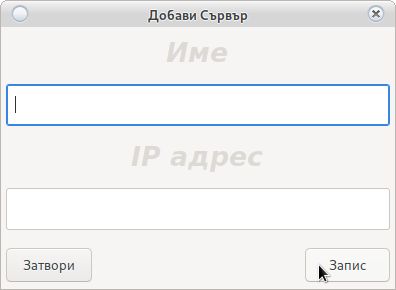

# Промяна на казино

**В случай на успешно свързване с последно избраното казино**

    От прозореца за вход се кликва на 
    Промени казино което ще отвори Фиг.1

**При липса на връзка с последно избрано казино**

    Автоматично ще се отвори Фиг.1
    `

> **Фиг.1**
>
> 

Ако обекта съществува се избира от падащото меню. От бутона +
се добавя нов обект. Новия обект трябва да съдържа име на латиница (за разпознаване) и IP на обекта.
Портовете на рутера в обекта трябва да са пренасочени към сървъра.

Отвори порт се слага в случай, че:

    На сървъра има активирана защитна стена.
    
    
Не в необходима ако:

    
    1. Се намирате в локална мрежа.
    2. Ако защитната стена на сървъра е спряна.
    3. Ако вече стената е отворена за съответния адрес.
    
    В тези случаи опцията няма работи дори да е избрана.
    
> <h5 style="color:red">Не се препоръчва спиране на защитната стена.
> При невъзможност използвайте Ban процеса.
> Пълното спиране на защитата може да предизвика неоторизиран достъп до информационната система.</h5>

# Добавяне на ново казино

Добавяне на ново казино става от бутона 
от [Фиг.1](change_server.html##_1)

Отваря се **Фиг.2**

> **Фиг.2**
>
> 

> <h5 style="color:blue">При някой операционни системи 
ще се наложи рестарт на програмата за да се покаже новия обект в менюто за избиране</h5>

**Всичко полета са задължителни.**

> <h2 style="color:red">Името на обекта трябва да е:</h2>
> <ul style="color:red">
> <li>Написано на латиница</li>
> <li>Уникално без да се повтаря</li>
> <li>IP адреса на обекта трябва да е реален и статичен</li>
> <li>Портове 5432 и 30593 да са пренасочени към сървъра</li>
> <li>Препоръчително сервизен порт 44554 да е пренасочен</li></ul>

# Съобщения

* Няма връзка със сървъра (Ще се отвори [Фиг.1](change_server.html#_2)): 

    * Липсва интернет
    
    * Портовете са затворени 
    
    * Грешно IP на обекта
    
    * Не е пусната функцията ОТВОРИ ПОРТ, връзката се блокира от защитната стена на сървъра.
    
    * Ако е пуснат BAN процес (може да ви бъде наложен бан за 24 или до отключване от администратор) Не се използва при 
    работеща защитна стена. Препоръчително използване на защитна стена.
    
    * Сървърът не работи (свържете се с администратор)

* Грешна дата и час
    
    * Датата и часът на работния компютър не отговаря на използваната от сървъра
    
    * Батерията на RTC модула е свършил и сверяване през интернет е неуспешно (При сигурна
    интернет връзка с рестарт на сървъра ще свери, дори и без работещ RTC модул)

* Няма връзка с RTC (в случай, че пост терминала е настроен да се синхронизира със сървъра)
(Ще се отвори [Фиг.1](change_server.html#_1))

* Не e регистриран POS терминал. Погледнете [регистриране на POS](config_system.html)

* Ревизията не отговаря на минимално зададена (Системата ще се ъпдейтва принудително от собственика
 и ще се рестартира програмата)

* Невалиден базов лиценз (Програмата не е лицензирана или срока на лиценза е изтекъл. Свържете се с администратор)

* Наближава изтичане на лиценз (Някой от лицензите е ще изтече в близките 10 дена. 
 Свържете се с администратор)
 

