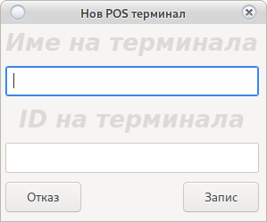
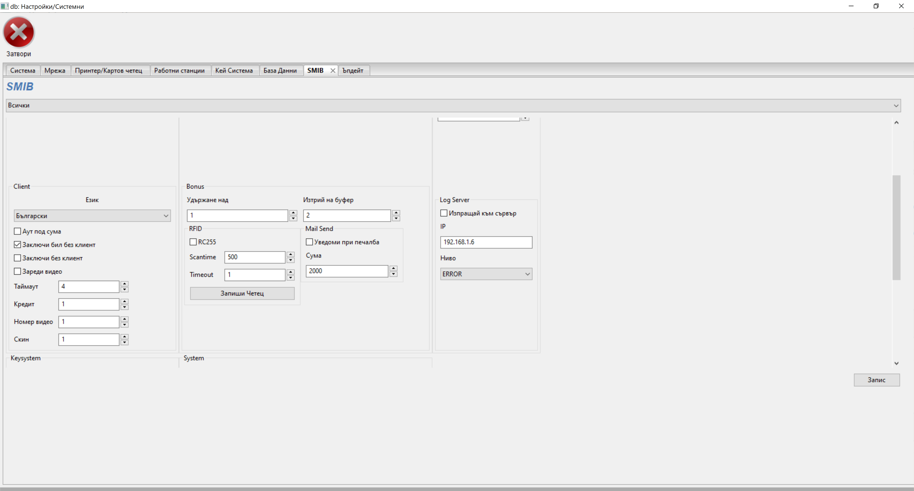

# Системни настройки

Настройка на цялата система.

В тези настройки не е включен само [джакпот сървър](jackpot.html)

Част от настройките искат рестарт на програмата, за да влязат в сила.

<h5 style="color:red">
Част от настройките са индивидуални за всяка програма,<br> 
други са общи за цялата система.<br>
Запознайте се в детайли с всички настройки</h5>


<h5 style="color:blue">
Настройките касещи само програмата се намират в <b>colibri/colibri.conf</b><br>
Ако преинсталирате програмата копирайте <b>colibri.conf</b><br>
След преинсталация го върнете в директорията <b>colibri/</b><br>
Това ще запази вашите настройки<br>
Не сменяйте пътя или дяла на програмата<br>
При смяна на дял или път регистрирайте <a href="config_system.html#_36">POS терминал</a>
</h5>

## Системни

Настройки на системата касаещи начина на работа.


#### Дата и час

Датата и часът са от изключителна важност за програмата.

В случай на грешна дата и/или час програмата няма да стартира.

Моля уверете се, че датата и часът са верни преди използване на програмата.

В идеалния случай системата сверява датата и часът от интернет.

При зададена опция [Използвай RTC](config_system.html#_15) програмата ще синхронизира __Дата и Час__ 
със сървъра.

В случай, че програмата не стартира можете да сверите __Дата и Час__ от опциите на вашата OS.

При малки отклонения използвайте календара и полетата да час и минута. Натиснете __Запис__

> <h5 style="color:red">Внимание!<br>
> При произведен от нас терминал се убедете, че опцията
> <a href='config_system.html#_15'>Използвай RTC</a> е включена.</h5>


#### Debug

Опцията се използва от __Програмистите__ за откриване на грешки.
Тя отваря малък бял прозорец с описание на възникнала грешка.
При деактивирана опция, грешките се записват във лог файл.

При критични грешки моля изпратете __colibri/colibri.log__ на <a href="mailto:grigor.kolev@gmail.com">Grigor Kolev</a>

> <h5 style="color:blue">Не винаги прозореца може да бъде затворен<br>
> Излизането на прозорец не означава критична грешка и/или бъг в системата<br>
> Препоръчваме деактивиране на опцията в работен режим.
> </h5>


#### DB Debug

Дебъг на база данни. Използва се от програмистите за поправка на грешки в базата.
В случай, че активирате тази опция цялата комуникация с базата ще се запише в __colibri/colibri.log__

> <h5 style="color:red">Препоръчваме деактивиране на опцията в работен режим.
> </h5>

#### Цял Екран

Системата ще се отвори на цял екран. Спирането на системата няма да бъде възможно.

> <h5 style="color:red">Няма да е възможно отварянето на нито една друга програма в OS<br>
> При нужда от спиране използвайте бутона [Рестарт](config.html#_8)
> </h5>

#### Клавиатура

Ще показва виртуална клавиатура за устройства с тъч скрийн. Не активирайте на компютър с хардуерна клавиатура.

#### Зачисли удържане

Ако активирате тази опция, всички удържано [Бонус Карти](config_bonus.html#_2) и [Клиентски бонуси](cust.html#_4)
ще бъдат зачислени към касата на крупието.

Понякога крупиетата не могат да се ориентират кои бонуси са __Удържани__.
Моля използвайте [бърза справка](main.html#_16)

#### Вход веднъж

Указва на системата, че един потребител може да влезе само веднъж. Ако сесията от друга програма не е 
затворена, вход ще е невъзможен.

Съществуват случаи (Токов удар, неправилно спиране на програмата, грешка в кода) когато
даден потребител ще остане със заключена сесия.

Използвайте [формата при вход](login.html#_4) или деактивирайте сесията от [потребителски настройки](user.html#_7)

#### Печат на ордер

Печата касов ордер за изплащане. В противен случай се пишат на ръка от крупие. Необходим е POS принтер.

#### Крупие/име на отчет

Вади името на крупието на дневния отчет, за да не е необходимо крупието да си пише името ръчно. Подава се в НАП, използвайте реални имена.

#### Пари преди отчет

Тази опция изисква крупието да направи подробен опис по купюри на парите с които разполага преди да се отчете. Справката на необходимата събрана сума ще се покаже чак след като изпълни тази стъпка.

#### Токен НАП
Специален токен за връзка с НАП. Издава се от НАП по молба на фирмата. За повече информация и издаване на такъв токен свържете се с НАП


#### Език

Системата ще зареди избраната локализация заедно със всички шаблони.

В случай, че искате да добавите нов език и/или да промените шаблон и/или съобщение,
погледнете [Локализация на системата](locale.html)

#### Организатор

Използва се за печат на [дневен отчет](main.html#_7)

#### Адрес на организатор

Използва се за печат на [дневен отчет](main.html#_7)

#### Игрална зала

Използва се за печат на [дневен отчет](main.html#_7)

#### Адрес игрална зала

Използва се за печат на [дневен отчет](main.html#_7)

#### Управител

Използва се за печат на [дневен отчет](main.html#_7)

#### ЕИК

Използва се за печат на [дневен отчет](main.html#_7)


## Мрежа

Настройки на връзки


#### Отвори Порт

Ако е активна защитната стена на сървъра, тази опция е задължителна, в противен случай
връзка с казиното ще бъде невъзможна.

Съветваме използването на защитна стена, тя ограничава всеки достъп до системата не минал през 
криптиращите алгоритми. Криптиращия алгоритъм може да бъде уникален за всеки клиент<br>
свържете се с <a href="mailto:grigor.kolev@gmail.com">Grigor Kolev</a><br>
Промяна в криптиращия алгоритъм се заплаща допълнително и не влиза в първоначалната цена.

При активна защитна стена, системата записва всяко IP получило достъп, като на всяко IP може
да бъде наложен ban.


#### Буфер

Не променяйте без консултация с <a href="mailto:grigor.kolev@gmail.com">Grigor Kolev</a>

Индивидуален буфер ще увеличи сигурността на цялата система. <br>
Промяна в буфера се заплаща допълнително и не влиза в първоначалната цена.

#### Таймаут

Времето в което сървъра очаква отговор от останалите елементи на системата (Джакпот сървър, SMIB, Визуализация)

Не правете времето по малко от 10. Може да увеличите в случай на бавен интернет. За повече информация консултирайте се с  <a href="mailto:grigor.kolev@gmail.com">Grigor Kolev</a>

### Redirect (редирект)

Редирект сървъра играе много важа роля в цялата система.
Това е мястото където се съдържа цялата информация.
Редирект сървъра отговаря и за връзката с всички SMIB контролери и настройката на Джакпот сървъра.

Сървъра вкарва отдалечени програми в мрежата на казиното. Отговаря за изпълнението на всичко свързано с
[клиентския модул](cust.html)

#### Зареди

Зарежда настройките на __Редирект Сървъра__

#### Запис

Записва настройките в __Редирект Сървъра__

#### Loging

Активира сървър за запис на грешки. Сървърът ще вземе всяка грешка от всеки SMIB контролер и
ще я запише в базата данни. [Погледни](report.html)

Може да деактивирате loggin сървъра и да пренасочите всички грешки към компютър на 
[Сервиза](service.html)

Свържете се с <a href="mailto:grigor.kolev@gmail.com">Grigor Kolev</a> за tool за четене на грешки на отдалечен компютър.

#### Часовник

Обикновено сървъра се сверява през интернет, но при липса на такъв използва RTC (real time clock) модул.

Часовников механизъм който ще свери __Дата и Час__

Сървъра ще синхронизира __Дата и Час__ на цялата система.

> <h5 style="color:red">Внимание!<br>
> Уверете се, че RTC модула е поставен правилно на сървъра<br>
> Уверете се, че батерия RC2032 на RTC модула е изправна.
> </h5>

#### TCP

Използва TCP протокол вместо UDP, който е по подразбиране

#### Променливо криптиране

Променя динамично криптирането след всяка заявка. Тази функция усложнява криптирането и го вкарва в режим с променящ се ключ и случайно генериран вектор

#### NRA Test
Тестов сървър към НАП за разработчици. Използва се само от разработчика. 

#### Отключи с OCR
Активира възможност за отключване с четец за лична карта.

#### SVN
Функция за отдалечен достъп (remote control) на програмата.

#### Защитна стена

Активира защитната стена на редирект сървъра.

#### Бан система

Остаряла технология. Разчита на логове и налага бан за 24 часа при 3 пъти въведена грешна парола.

Ще бъде премахната в следващи ревизии.

Моля използвайте __Защитна Стена__

#### Няма защита

Деактивиране на всички функции за защита на сървъра.

> <h5 style="color:red">Внимание!<br>
> Не деактивирайте защитата ако не сте сигурни какво правите.
> </h5>

#### E-mail

Машините ще подават сигнал при печалба или кешаут на посочения e-mail
[Погледни](config_system.html#smib)

#### Subject

При подаден сигнал за печалба служи за разпознаване на различните казина

#### Принтер
Избор на принтер по подразбиране.
Системата може да бъде настроена, целия печат да минава през сървъра и да излиза на един принтер.
Принтера трябва да е закачен и настроен на редирект сървъра.
За повече информация се свържете с <a href="mailto:grigor.kolev@gmail.com">Grigor Kolev</a>

#### POS
Избор на POS (Point of sale) принтер, ако има такъв. Най-често се ползват за фискални бележки, но могат да се ползват и за други цели


### Секция RTC

Real Time Clock модул

> <h5 style="color:red">Внимание!<br>
> Уверете се, че RTC модула е поставен правилно на сървъра<br>
> Уверете се, че батерия RC2032 на RTC модула е изправна.
> </h5>

#### Използвай RTC сървър

Указва на системата да синхронизира __Дата и Час__ със сървъра при всяко стартиране.

Препоръчително за POS терминал произведен от нас.

#### Свери Дата и Час на RTC 

Използвайте __Календара__ и полетата __Час и Минута__ за сверяване на RTC Модула.

> <h5 style="color:red">Внимание!<br>
> Уверете се, че RTC модула е поставен правилно на сървъра<br>
> Уверете се, че батерия RC2032 на RTC модула е изправна.
> </h5>

## Принтери и Четци

Настройки на принтери и четци


> <h5 style="color:red">Внимание!<br>
> Изисква инсталиран [wkhtmltopdf](https://wkhtmltopdf.org/)<br>
> За Window добевете C:\Program Files\wkhtmltopdf\bin в [пътя за търсене](https://www.architectryan.com/2018/03/17/add-to-the-path-on-windows-10/) и рестартирайте компютъра<br>
> За Debian или Ubuntu използвайте apt install wkhtmltopdf<br>
> При затруднения с инсталирането на wkhtmltopdf свържете се с  <a href="mailto:grigor.kolev@gmail.com">Grigor Kolev</a>
> </h5>

### Директен печат

Ще отпечата директно на избрания принтер, необходимия документ без да отваря PDF четец.

> <h5 style="color:red">Внимание!<br>
> На OS Windows споделете принтерите<br>
> Не използвайте в имената за споделяне интервали.</h5>

Ако опцията не е избрана, ще отвори __PDF__ документ в избрания от вас PDF четец и можете да направите
печат през опциите на четеца.

### POS Принтер

Активира POS принтер за печат на талони за томбола.

> <h5 style="color:red">Внимание!<br>
> POS Принтера трябва да е в режим __Принтер__, няма да работи в режим __Сериен порт__<br>
> Препоръчваме използване на [Citizen CT-S2000](https://www.supplylineid.com/shop/printers/pos-epos-printers/citizen-ct-s2000-receipt-printer/)<br>
> Използвайте произведен от нас POS терминал за свързване на POS принтер</h5>

### Печат на сървър

Определя дали програмата ще отпечатва на локален принтер или на отдалечен принтер закачен на сървъра.

В случай на наличие на много POS терминали в едно казино, свържете принтера на сървъра и
изберете опцията. Това ще позволи всички POS терминали да използват един и същ принтер.

Може да използвате споделен принтер или интернет принтер. 
Свържете с <a href="mailto:grigor.kolev@gmail.com">Grigor Kolev</a>

> <h5 style="color:red">Внимание!<br>
> Препоръчваме използване на принтер с драйвери за Linux ARM</h5>

### Директен печат на POS
### Печат на сървър POS
### Мънибек на POS
Печата разходни касови ордери на POS принтер.

### OCR
Избор на четец за лични карти. Ако изберете първата опция Наличен, по подразбиране ще използва Access OCR, но поддържа и Desco OCR.

### Програма за PDF

* За Linux 
    
    Въведете името на вашата любима програма за четене на pdf документи
    
* За Windows

    Въведете пътя на инсталираната програма за четене на pdf документи<br>
    
    Използвайте десен бутон на мишката върху линка на иконата на предпочитания
    pdf четец и изберете __Proparties__
    
    
    
    Копирайте текста и го поставете в полето
    
    
    
    Рестартирайте програмата.
    

### Принтер по подразбиране

Изберете локален принтер на който да се отпечатват всички документи при Linux.

При Windows въведете име на споделен принтер без интервали.
Погледнете  [Споделяне на принтер](https://support.microsoft.com/en-us/windows/share-your-network-printer-c9a152b5-59f3-b6f3-c99f-f39e5bf664c3)

> <h5 style="color:red">Внимание!<br>
> Използвайте при активно опция __Директен Печат__<br>
> Ще зареди всички принтери инсталирани в <a href='https://www.cups.org/'>CUPS</a><br>
> При OS Windows въведете името на споделен принтер което сте задали</h5>

### POS Принтер

#### Изберете POS принтер по подразбиране

Трябва да бъде инсталиран в [CUPS](https://www.cups.org/)

При OS Windows принтера трябва да бъде споделен. 
Погледнете  [Споделяне на принтер](https://support.microsoft.com/en-us/windows/share-your-network-printer-c9a152b5-59f3-b6f3-c99f-f39e5bf664c3)
Името на споделения принтер не трябва да съдържа интервали.
В полето се въвежда името на споделения принтер.

#### Размер на хартията на POS Принтер

Системата е настроена за [Citizen CT-S2000](https://www.supplylineid.com/shop/printers/pos-epos-printers/citizen-ct-s2000-receipt-printer/)
с 80 mm широчина и 110 mm дължина на талона.

За различен принтер, поиграйте с цифрите докато се получи правилния размер.

Използвайте бутона __Тест POS Принтер__ за да видите дали печата е наместен спрямо хартията.

#### Тест POS Принтер

Печата тест на POS принтер

#### Добави Инфо

Настройва информация която да се печата на POS принтер.

Отваря 


Това са първите 3 реда отпечатани в талона.

Моля съобразявайте се с размера на хартията, не е възможно отпечатване на 1000 символа на хартия 80 mm.

Използвайте бутона __Тест POS Принтер__ за да видите дали печата е наместен спрямо хартията.

### Секция RFID Четец

Настройка и работа на RFID четец

Всички четци трябва да са в режим __Сериен Порт__

<h5 style="color:red">Използвайте документацията на RFID четеца за да смените режима при нужда.</h5>

#### Активиране на четец

Указва на системата да използва RFID картов четец.

При затруднения се свържете с <a href="mailto:grigor.kolev@gmail.com">Grigor Kolev</a>

#### Порт на RFID четеца

* Linux
    
    __/dev/ttyACMХ__ или __/dev/ttyUSBX__

* За Windows

    __comX__
    
Заместете __X__ с номера на порта.

#### Скорост на комуникация

Изберете скорост в която серийния порт работи

#### Таймаут

Времето в секунди при което четеца ще генерира грешка за липса на поставена карта

#### Време на сканиране на четеца

Времето е в милисекунди. Четеца ще проверява за карта на всеки 500 милисекунди.

<h5 style="color:red">Не всички четци поддържат тази функция<br>
Свържете се с производителя на RFID четеца</h5>

#### Update RFID

## Работни Станции

Инсталиране на работни станции.

В случай, че определен компютър не е инсталиран в базата, системата няма да позволи връзка.

Или ако инсталирате програмата на компютъра на __Управител 1__ той няма да е в състояние 
да се свърже с __Казино 2__

В случай на напускане на управител, премахнете компютъра от POS терминалите за да отнемете достъпа.


### Инсталирай

Оторизиране на POS Терминал

Ако POS Терминала не е оторизиран за работа в съответното казино,
то връзката с базата данни ще бъде невъзможна.

Всеки компютър работещ с информацията на казиното трябва да бъде оторизиран.

Използвайте бутона __Инсталирай__ 



Въведете име за разпознаване на компютъра.

Въведете __Кода изпратен ви на E-Mail__ и използвайте бутона __Запис__

<h5 style="color:red">При преинсталация на компютър или промяна в пътя на програмата<br>
системата ще поиска нова регистрация на POS терминал<br>
</h5>

### Премахни

Освен [деактивиране на потребител](user.html) премахнете и POS терминала на<br>
управителите. Проверете и дали управителя е [логнат в системата](user.html#_7) и го изхвърлете.<br>
Ако опцията [Вход веднъж](config_system.html#_2) не е активирана, рестартирайте сървъра,<br>
това ще затвори всички активни сесии.

### Инициализирай

В случай, че забравите имената на POS терминалите използвайте __Инициализация__

Бутонът ще премахне всички POS терминали освен __Вашия__

## Кей Система

Настройки на __Кей Система__ 

Изисква работещ [RFID](config_system.html#_27) четец 


### Скачащ ключ

Ще накара кей системата на машините да работят само с [картата на крупието](user.html) което е 
стартирало смяна в избрания [регион](main.html#_8)

За правилна работа премахнете опцията  [много ключове](config_system.html#smib) от настройките
на всеки SMIB контролер.

### Промени при отчет
Само за потребители с администраторски права. Може да промени дневният отчет ако е необходимо.

Използвайте __Запис__ за промяна в настройките

### Запис на реле 1

Изисква работещ [RFID](config_system.html#_27) четец 

В зависимост от разположението на кабелите ще запише __OWNER__ или __ATENDANT__

При грешка може да завъртите от [настройки на SMIB](config_system.html#smib)

### Запис на реле 2

Изисква работещ [RFID](cconfig_system.html#_27) четец 

В зависимост от разположението на кабелите ще запише __OWNER__ или __ATENDANT__

При грешка може да завъртите от [настройки на SMIB](config_system.html#smib)

### Reset

За да възстановите настройките използвайте __Reset__ бутона

## База Данни

Система за профилактика и почистване на база данни


```
За архивиране е необходим pg_dump
За връщане pg_restore

Инсталирайте postgresql
За Linux
apt-get install postgresql

За Windows
Необходимо е да изтеглите и инсталирате POSTGRESQL Database
https://www.postgresql.org/download/
Добавете в пътя за търсене
```

### Архивиране на база данни

Изберете директория за създаване на архив.

<h5 style="color:blue">Препоръчваме архивиране на отдалечен компютър след всеки дневен отчет.</h5>

### Възстанови от архив

Изберете архив и върнете информацията в базата.

<h5 style="color:red">Ще премахне всичко записано след датата на архива</h5>

### Почисти База

Премахва цялата информация по стара от една година - 1 ден

 <h5 style="color:red">Задължително направете архив на базата</h5>

### Вакумирай База

Ще ускори работата на базата данни.

Няма да повлияе на информацията.

<h5 style="color:blue">Възможно е да изисква много време.</h5>

### Ново Индексиране

Ще ускори работата на базата данни.

Няма да повлияе на информацията.

<h5 style="color:blue">Възможно е да изисква много време.</h5>

### Почисти SMIB лог

Премахва цялата информация за грешките в SMIB контролерите и лога на отчетите.

## SMIB

Настройки на SMIB Контролер

От падащото меню може да заредите настройките на само една машина или да презапишете всички.

> <h2 style="color:red">Внимание!<br>
> В случай на презаписване на всички машини трябва да сте сигурни, че разполагат с еднакъв хардуер<br>
> Хардуера трябва да е закачен на еднакви портове</h2>

Фиг 1


Фиг 2



Фиг 3


### Секция PROC

Секция определяща работещите процеси в SMIB контролера.

Всяка опция отговаря на процес.

Премахването на опцията __Джакпот сървър__ ще блокира отчислението на съответната машина към мистериите.

Премахването на __SAS__ ще спре връзката на SMIB контролера с машината.

<h5 style="color:blue">Внимавайте със спирането и пускането на процеси<br>
Трябва да знаете кой процес зависи от __SAS__ и кой от __RFID__</h5>

### Секция SAS

Настройване на SAS протокола

#### Конфигурация

   В 95 % от случаите е достатъчно да изберете __ЕГТ__
   
   Тази настройка ще работи на почти всички машини с които се срещнете.
   
   Голямо изключение прави фирмата __Казино Технологии__
   
   Интересно при __Казино Технологии__, че няма две версии на една машина които да работят по един и същ начин.
   
   Опитали сме да заложим автоматични настройки на всеки вариант на тяхна машина която имаме.
   
   Не поемаме отговорност дали работят и как.
   
   Ако имате машина с различни версии или други производители отказващи да четат SAS протокола<br>
   поиграйте си с времената и опциите в тази секция.
   
   Моля ако попаднете на такъв модел, изпратете ни модела и версия на машината и снимка на настройките за да ги добавим
   в менюто за автоматична настройка.
   
#### Свери дата и час

SMIB контролера ще синхронизира __Дата и Час__ на машина със своята при всеки рестарт.

SMIB Контролера се синхронизира с [RTC модул](config_system.html#_15)

Може да изключите тази опция без последствия за работата на системата

#### AFT

Указва на SMIB контролера, че AFT е активирано на машината.

Контролера ще използва AFT винаги когато е възможно.

#### SAS Сигурност

Ако опцията е активна системата ще защитава Legacy бонус

При наливане на бонус без участие на SMIB контролера машината ще бъде заключена.

За отключване [Погледни](main.html#smib_2)

#### Провери за игра

Препоръчителна опция. Проверява дали има избрана игра и нейния номер.

__Казино Технологии__  отказват да я напишат в новите версии на машините които са произвели.

Спрете опцията при проблем с бонусирането.

#### USB2RS

Системата ще използва USB преходник вместо стандартна серийна комуникация.

#### Забави рил

Част от системата за сигурност

Ако бъде рестартирана машината или SMIB контролера ще забави завъртането на риловете.

Риловете ще се върнат в стандартен режим след 3 минути с кредит над 1 лев

При някой машини ще блокира аутоплей бутона (ще работи като старт)

#### Забави комуникация

SMIB контролера е 100 пъти по бърз от машините на __Казино Технологии__  с ARM и се налага да го приспим.

__0,04 == 40 милисекунди__ 

Използвайте полето за да регулирате

#### Спри Ауто Плей

Част от системата за сигурност

При сума върната като печалба надвишаваща __поле 1__ контролера ще забави риловете и/или ще блокира 
__аутоплей__ бутона за минути от __поле 2__

При задаване на __поле 2__ със стойност 0 риловете и/или блокирането на аутоплей бутона ще 
останат до [ръчното им пускане](main.html#_22)

#### Номер на машина по SAS

Новите машини на __Казино Технологии__ отказват да кажат номера си по SAS протокол

Въведете го ръчно __Пример: 01, 02, 03, ...___

#### SAS таймаут

Време в секунди след което серийния порт ще генерира грешка за липсва връзка.

В 95 % от машините 2 секунди е оптимално

При __Казино Технологии__ го вдигнете ако е необходимо.

### Секция Jackpot

* Изплащане на ръка

    Мистериите няма да падат в кредита на съответната машина.
    При __Казино Технологии__ може да се наложи използване на тази опция.

* Използвай AFT
В много редки случаи комуникацията AFT изисква активиране на опцията. Активира се само при необходимост. 
    
* Заключи при загуба

    В случай, че машината не осъществи връзка с джакпот сървъра в 20 последователни опита,
    то тя ще се заключи.
    
    При повреда в сървъра деактивирайте тази опция за да не блокират всички машини.
    
    При нормална работа е добре опцията да е активна. Тя ще ви уведоми за проблем с комуникацията.
    
    Регулирайте броя на последователните загуби за да имате възможност да рестартирате сървъра
    без да блокирате цялото казино.

* Падане при кредит

    Ако кредита на машината е под посочената сума в лева, то спечелване на мистерия е невъзможно.
    
### Секция Client

Настройки на [клиентски модул](cust.html)

* Аут под сума

    Ако кредита не е над сумата необходима за превъртане не позволява аут. 
    Пример: пада бонус 10 лв и за кешаут се изискват 20 лв. С отметка може да се направят на 20 лв. и да играта да продължи дори да падне на 10 лв. Без тази отметка аут или губи.

* Заключи бил без клиент

    Заключва бил ако няма клиентска карта

* Заключи без клиент

    Няма да позволи игра на машината без поставяне на клиентска карта

* Зареди видео

    Избор дали да се показва рекламен клип на машините
    
* Таймаут

    Време след което клиента ще бъде изтрит при премахване на карта
    
* Кредит

    След като кредита падне под посочената сума, ще се отвори бонус.
    
    При неактивно __AFT__ за падане на бонус ще изисква 1-2 завъртания
    
    Съобразете се с [коефициента на машината](device.html).

* Номер видео

    Избор на кой точно подред рекламен видеоклип да се показва.

* Скин

    Избор на скин / тема на SMIB контролера. Темите са две синя и жълта.
    
### Секция Bonus

Управлява [бонус картите](config_bonus.html)

* Удържане над

    Сумата над която ще бъде удържан бонус при кешаут.
    
    Погледнете:<br>
    [Удържане на бонус карти](config_bonus.html#_2)<br>
    [Удържане на клиентски бонус](cust.html#_4)<br>
    [Настройки/Системни](config_system.html#_2)

* Изтрий Буфер

    Времето в секунди през което няма да може да бъде сложен следващ [бонус](config_bonus.html)
    
### Секция RFID

Настройва RFID четеца на SMIB контролера

* RC255

    Избира се в случай че контролера е тип RC255

[Погледни](config_system.html#_27) 

Бутон __Запиши Четец__ променя времето на сканиране

Не се поддържа от всички RFID четци. Моля свържете се с производителя на четеца за 
допълнителна информация.

### Секция SendMail

SMIB контролера ще уведомява собственика за печалба или кешаут над посочената сума

[Погледни Ауто E-Mail](config_system.html#_2)

### Секция LogServer

* Изпращай към сървър

    Всички грешки генерирани от SMIB контролера ще се изпращат към сървър
    
* IP на сървър

    При активиран [logging сървър](config_system.html#_15) използвайте __192.168.1.6__
    
    Ако искате да изпращате грешки към отдалечен компютър въведете IP на [сервиз](config_system.html#_15) 

* Ново

    Изберете ниво на грешките които да се записват
    
### Секция KeySystem

Управление на Кей Системата

* Много ключове

    По подразбиране системата работи само с един ключ в един момент от време.
    
    Активиране на опцията ще позволи до 5 ключа записани едновременно
    
    При превишаване на лимита от 5 първия записан ще бъде премахнат.
    
    Моля проверете [Кей Система](config_system.html#smib_1) и [Потребители](user.html)<br>
    Преди да вземете решение за начина на работа.
    
* Опция AFT

    Ще активира [кешлес за клиентите](cust.html)
    
* Тест Реле

    Ще изпробва дали релето е закачено правилно и последователността на кабелите за __OWNER__ и __ATENDANT__
    
* Канали на реле

    При грешно поставени кабели може бързо да размените местата им с промяна на цифрите
    
    __1__ става __2__ и обратно
    
    Не съветваме такава промяна. Тя ще ви обърка ако програмирате 
    [Кей Система на всички машини](config_system.html#_40)

* Таймаут

    Време за отваряне на реле. Или колко време релето да паузира машината след премахване на ключ за слагане на кредит
    
### Секция System

Активиран режим на наблюдение на системата. Не е необходимо, използвайте само про проблеми с
машината, суичовете или SMIB контролера.

* Проверка процеси

    Проверява дали всички процеси работя. При нужда ги рестартира
    
* Проверка нет

    Проверява дали има връзка със [Редирект Сървъра](config_system.html#_15) и<br>
    [Джакпот сървъра](jackpot.html) и прави опит за поправка на Lan порта
    
* Проверка на система

    Проверява захранването на машината и температурата в сандъка.
    При висока температура ще изключи последователно ядрата на CPU за да защити SMIB контролера.
    Ще уведоми за проблем.
    
* Интервал на проверка в секунди

    Време през което да се извършва проверка на системата
    
* Критична Температура

    Температурата при която ядрата на CPU за започнат да блокират
    
* Лог Файл

    SMIB контролера ще записва всички грешки и в собствен лог файл, не само в [logging Сървър](config_system.html#_15)
    
### Секция Control

Бърз контрол на SMIB контролера

* Покажи Лог

    Показва грешките записани в SMIB контролера
    
* Включи деноминация

    Изберете игра на машината за да включите, изключена деноминация.
    
    При машини на __Казино Технологии__ не е възможно.
    
* Спри деноминация

    Деактивира възможността да се играе на определена деноминация.
    Изберете игра и желана деноминация за деактивиране и натиснете бутона.
    
    Няма да бъде възможна игра на съответната деноминация ако не бъде активирана отново.
    
    При машини на __Казино Технологии__ не е възможно спиране на деноминация.
    Цялата игра ще изчезне от екрана ако машината е стара версия (пускане е възможно след нулиране
    на SMIB контролер и рестарт на машина).<br>
    В случай на нова машина на __Казино Технологии__ функцията не работи.
    
* Нулирай

    Нулира SMIB контролера. Всички карти за кей система и бонус карти ще бъдат премахнати.
    Всички настройки на SMIB контролера ще бъдат изтрити. 
    [IP на SMIB контролера няма да бъде променено](device.html)

* Изключи Джакпот

    Избраната игра няма да отчислява на [Джакпот сървъра](jackpot.html)
    
    Пример: Ролетка
    
* Включи Джакпот

    Ако дадена игра е изключена от [Джакпот сървъра](jackpot.html)
    можете да я включите отново
    
* Автоъпдейт

    Ще ъпдейтва само този [SMIB контролер](config_system.html#_54)
    
    
* Рестарт

    [Рестартира SMIB контролера](main.html#smib_1)

    
### Секция LogConfig

Променя нивата на запис на грешки на всеки процес.

__DEBUG__ и __INFO__ се използва от програмистите

__WARNING__ е в случай, че имате съмнения за нередност

__ERROR__ ще запиши само грешки

__CRITICAL__ Грешки които са критични за системата (Изгорял RFID четец)

Ако зададете __WARNING__ ще бъдат запазен всички съобщение с по-висок статус като __ERROR__ и __CRITICAL__

Внимавайте с избора на ниво, може да препълни паметта на SMIB контролера и/или 
Базата данни на logging сървъра

## Ъпдейт

Ъпдейтване на системата


### SMIB 

Ще Ъпдейтва всички SMIB контролери до избраната ревизия

Оставете празно в случай, че ъпдейтвате до последна възможна ревизия

### CMS

Ъпдейтва програмата за отчитане

Опцията __Минимална ревизия__ ще принуди всички програми за отчет свързани към казиното
да се изравнят с тази ревизия

При Windows OS се стартира допълнителна програма за ъпдейт. От прозореца за стартиране като 
администратор изберете __Yes__ и изчакайте. След като командния промпт изпише __Press any key to close!__
Натиснете произволен бутон и стартирайте програмата отново.

> <h5 style="color:red">Внимание!<br>
> Проверете ревизията.<br>
> <a href="config.html#_10">Тук</a></h5>

> <h5 style="color:red">Внимание!<br>
> Ако OS ви каже че програмата не отговаря<br>
> Изберете:  __Изчакай__</h5>

### RedirectServer

Ще извърши ъпдейт на __Редирект Сървъра__

Моля свържете се с <a href="mailto:grigor.kolev@gmail.com">Grigor Kolev</a> преди ъпдейт.

При промяна на базата данни е нужна миграция и е възможно __Редирект Сървъра__ да 
не стартира след ъпдейт.