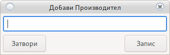

# Добавяне на машини

## Добавяне/Редактиране на машина

За добавяне на нова машина използвайте __Добави Машина__

За редакция на съществуваща __Двоен клик върху машината__ в дясно на [Основния прозорец](device.html#_1)

Ще се отвори прозорец за добавяне на машина

Всички полета са задължителни

* Сериен Номер
    
    Въвеждате серийния номер на машината
    
* SMIB IP
    
    Въведете IP адреса на SMIB контролера. 
    В случай, че контролера е нов кликнете на полето и натиснете ctrl+n 
    Това автоматично ще настрои контролера с нужния IP адрес. 
    <h5 style="color:red"><ul><li>Не пускайте два нови контролера едновременно</li>
    <li>Настройвате един по един с ctrl+n</li>
    <li>Не слагайте два контролера с еднакво IP в казиното</li>
    <li>Променете IP на единия с ctrl+n</li>
    <li>Може да пренаредите всички IP с ctrl+n без да размествате физически контролерите</li>
    <li>Никога не използвайте IP адреси (192.168.1.5, 192.168.1.6, 192.168.1.9, 192.168.1.7, 192.168.1.8) 
    за други устройства в мрежата (DVR, Телефон, Компютър и др.)</li></ul></h5>

* Вземи UUID

    Копира серийният номер на машината на клипборда.

* Версия 

    Показва версията на SMIB
    
* Регион

    Избор на регион в който машината работи
    Ако липсва регион използвайте 
    
* Производител

    Производител на машината. Използвайте  за нов производител
    
* Модел

    Модел на машината. Използвайте  за нов модел
    
* SAS Наличен

    За машини с SMIB контролен. [Погледни автоматичен отчет](order.html#_6)

* SAS Липсва

    За машини без възможност за свързване в системата. [Погледни ръчен отчет](order.html#_7)

* Опция Работеща

    В случай на премахване на машина от казино премахнете опцията. 
    <h5 style="color:red">Не редактирайте машината, деактивирайте старата и създайте нова при промяна.</h5>

* Превъртане в дясно

    В много редки случаи, при достигане на брояч от 8 цифри машините ще изрежат стотинките.
    <h5 style="color:red">Ако не сте сигурни оставете по подразбиране.</h5>
    
* Изтегли информация

    Ще вземе всички броячи от машината и ще попълни полетата. 
    Изисква SAS Наличен

* Номер в зала

    Номер на машина в зала. На някой места се среща като `Номер в лиценз`
    
* Вход

    Електронен вход на машината
    
* Изход

    Електронен изход на машината
    
* М.Вход

    Механичен вход. Изисква се за правилно изчисляване на механичен брояч 
    Погледни [редакция на механични броячи](main.html#_5)
    
* М.Изход

    Механичен изход. Изисква се за правилно изчисляване на механичен брояч 
    Погледни [редакция на механични броячи](main.html#_5)
    
* Bet

    Залог. Използва се за пресмятане на процент на възвръщаемост.
    
* Won

    Печалба. Използва се за пресмятане на процент на възвръщаемост.
    
* Бил
    
    Брояч на бил. Служи за управление на бил.
    
* Коеф

    коефициент на машината. Зависи от настройките на самата машина 
    <h5 style="color:blue"> 1 кредит Х 0,01 = 0,01 стотинка</h5>
    
* М.Коеф

    Механичен коефициент. Зависи от настройките на машината.
    <h5 style="color:blue"> 100 кредит Х 0,01 = 0,01 стотинка * М.Коеф = Превъртане през 1 лев</h5>
    

## Добави Регион

Бутон  добавя нов регион

Въведете __Уникално Име__ и натиснете запис.

Новия регион ще се покаже в списъка.

## Добави Производител

Добавяне на нов производител

Въведете __Уникално Име__ и натиснете бутон __Запис__

Новото име ще се покаже в списъка

## Добави модел

Добавяне на нов модел на машина

Въведете __Уникално Име__ и натиснете бутон __Запис__

Новото име ще се покаже в списъка

## Запис в Джакпот

Записва промените в джакпот сървъра

## Филтри

В ляво на [Основния прозорец](device.html#_1) се намират филтри

__Единичен клик__ ще покаже в дясно на [Основния прозорец](device.html#_1) само машините отговарящи
на условията
