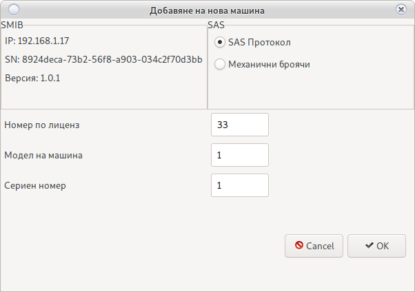
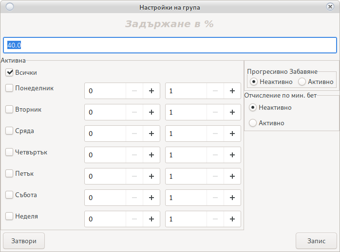

# Вход в Джакпот Сървър

Изисква стабилна интернет връзка

С цел защита, цялата комуникация минава пред [Редирект Сървър](config_system.html#_15)


Потребител: __root__

Парола: __123456__

<h5 style="color:red">Важно!<br>
След вход, създайте свой потребител и премахнете __root__<br>
Потребителя за вход в Джакпот Сървъра не зависи от потребителя на Системата за отчет</h5>

# Основен прозорец

Основен прозорец на програмата за настройки.


## Машини

Въвеждане на нова машина в Джакпот Сървъра

За добавяне или промяна на машините от [Системата за отчет в сървъра](device.html#_6)


<h5 style="color:red">Промените няма да влязат в сила докато не бъдат записани в сървъра</h5>

### Двоен клик на машина

Дава информация за машината и проверява наличие на връзка с __Джакпот Сървър__

### Добави

За добавяне на нова машина към __Джакпот Сървър__

Погледнете IP адреса на SMIB контролера и на кой номер машина в зала отговаря в
[Начален Екран](main.html), ще се наложи да го въведете.



Въведете нужната информация.

Не използвайте опцията __механични броячи__ ще бъде премахната в бъдещи версии.

Използвайте бутона __Запис__

### Редактирай

Редактиране на съществуваща машина

Изберете машина която искате да редактирате и използвайте бутона __Редактирай__


Променете нужната информация.

Не използвайте опцията __механични броячи__ ще бъде премахната в бъдещи версии.

Използвайте бутона __Запис__)

### Изтрий

Премахва машина от __Джакпот Сървър__

Изберете машина и натиснете бутона __Изтрий__

### Помощ

Отваря текуща документация

### Процент

Намалява отчисленията на SMIB контролера към всички групи

При стойност 0,8 и игра на 1 лев (100 кредита) сървъра ще направи отчисление на 80 кредита.

### Изключи игра

Избраната игра няма до отчислява на __Джакпот Сървър__

Пример: Ролетка

## Визуализации

Настройки на визуализации


Визуализациите могат да участват само в една група мистерии

Свободните визуализации не се използват и могат да бъдат добавени в нова група.

Моля освободете визуализация преди да я добавите в друга [група](jackpot.html#_12)

### Добави

Нова и свободна визуализация. Тя може да бъде използвана за нова група
или добавена в съществуваща.

Възможно е да се наложи рестарт на новата визуализация при инициализиране.

### Изтрий

Премахва избраната визуализация.

Уверете се, че групата няма да остане без визуализации.

### Аудио Тест

Изпраща сигнал за тест на звук към избраната визуализация.

### Помощ

Отваря текуща документация

### Рестарт

Рестартира избраната визуализация

В разработка.

Възможно е да не работи


## Групи

Настройки на групи от мистерии. __Джакпот Сървър__ няма ограничение в броя на групите.

Групи тип __класическа игра__ могат да съдържат до 5 нива.

Групи тип __времева игра__ могат да съдържат до 2 нива

Групи тип __бомби__ нямат ограничение в броя на нивата, но нямат и собствена визуализация.
Просто изпращат сигнал за падане към визуализация заета от друга група.


### Добавяне на нова група

Използвайте бутона добави. Имената са свободни, но трябва да бъдат уникални.

Въведете име за разпознаване и изберете тип на игра. 


Използвайте бутона __Запис__

Новата група ще се появи в основния прозорец.

### Визуализация в група

За добавяне на нова визуализация в групата използвайте __десен бутон__ върху името на групата.


Бутон  добавя визуализация в група

Бутон  премахва визуализация от група

### Добави машина в група

За добавяне на машина в групата използвайте __десен бутон__ върху името на групата.


Бутон  добавя визуализация в група

Бутон  премахва визуализация от група

### Централни настройки на група

Това е настройка която се използва в случай, че не е добавена индивидуална настройка на __ниво__



#### Задържане в %

При 40% мистерията ще задържи 40 % от разликата между __Начална__ и __Крайна__ стойност 
ако не е указано друго в самото ниво.

#### Активна

Ден и Час в който групата от мистерии да е активна. В останалото време е заключена и не върти.

#### Прогресивно забавяне

Колкото повече се качва мистерията, толкова по-бавно отчислява.

#### Отчисление по минимален бет

При зададен __Минимален BET__ за падане, мистерията няма да отчислява ако играта е слаба 
от минималния BET 

### Добави ниво

Използвайте __десен бутон__ върху името на групата

В зависимост от избрания тип игра се делят на три типа

#### Класическа игра


<h5 style="color:red">Внимание!<br>
В състезание, при неактивност на играч за над 3 минути<br>
Сървъра ще премахне играча от участниците и ще занули целия натрупан от него bet</h5>

* Въведете уникално име за разпознаване

* База е сумата от която ще започне мистерията при инициализация

    След падане към базата ще добави стойността на натрупания hidden 
    
    При инициализация да зададете начална стойност по желание в противен случай мистерията ще 
    стартира със сума __0__

    Ако не искате да имате Начална стойност, след запис в сървъра отворете в режим редактиране и 
    направете базовата сума __0__

* Задържане в % е задържането на определен % преди падане

    Ако въведете стойност 40 при мистерия от с граници 100-200 то мистерията ще падне след 140 лева.<br>
    Оставете 0 за деактивиране на опцията<br>
    Ако процент на задържане е настроен в настройки на група, а тази опция е деактивирана ще
    бъде използвана настройката на група.<br>
    Тази опция е с по-голям приоритет, в случай на активиране настройката на група ще бъде игнорирана.

* От сума

    Сумата при която мистерията ще влезе в активен за падане режим
    
* До сума

    Сумата която мистерията да не надвишава
    
* Отчисление в %

    1 означава 1% на 100 кредита = 1 кредит<br>
    при коефициент 0,01 един кредит = 0,01 стотинка<br>
    Погледнете настроения коефициент на машината.<br>
    <h5 style="color:red">Внимание!<br>
    При машини с коефициент различен от 0,01 мистерията няма да падне в кредита,<br>
    поради невъзможност да бъде изплатена цялата сума.<br>
    Изплатете сумата на ръка!</h5>
    
* Скрит %

    Процент за отчисление на скрита __hiden__ стойност<br>
    1 означава 1% на 100 кредита = 1 кредит<br>
    при коефициент 0,01 един кредит = 0,01 стотинка<br>
    Погледнете настроения коефициент на машината.
    
* Класическа мистерия

    След достигане на случайна сума, мистерията ще падне в кредита на машината
    
* Състезателна мистерия

    След достигане на случайна сума, мистерията ще влезе в състезателен режим.<br>
    Ще обяви стойност за падне.<br>
    Всички състезатели започват от __0__<br>
    Състезателите с най-много натрупан __bet__ ще се покажат на таблото<br>
    След достигане на предварително обявената сума, сървъра ще вземе решение кой е печелившия играч.<br>
    
    <h5 style="color:red">Внимание!<br>
    Само играчи покачени на таблото имат шанс за печалба<br>
    Не е задължително натрупалия най-голям bet да е печеливш.<br>
    Натрупания бет само увеличава шанса.</h5>
    
    ```
      Общ Bet = 100
      Общо играчи = 3
      Играч 1 бет = 50
      Играч 2 бет = 30
      Играч 3 бет = 20
  
      Играч едно има 50% шанс за печалба.
   ```

* Рейндж в състезание

    Две суми между които ще се избере сума която ще се добави към сумата на мистерията
    при влизане в състезание.
    
    <h5 style="color:red">Внимание!<br>
    Възможно е мистерията да превиши сумата зададена в полето __До сума__</h5>
    
    ```
        Сума до = 100
        Мистерията влиза в режим състезание = 90
        Добавя случайна стойност между рейндж в състезания: От 10 До 50
        Избира случайна стойност 20
        Обявява падане на 110 лева
    ``` 
* Брой играчи в състезание

    От 2 до 5 играча на таблото
    
* X2 

    В определен интервал от време сумата на мистерията ще се умножи по 2<br>
    <h5 style="color:red">Внимание!<br>
    При стойност на мистерия 100 и активна опция от 19 до 20 часа:<br>
    Ако мистерията падне в часовия интервал то нейната стойност ще бъде 100*2</h5>
    
* Минимален бет

    Не се използва в състезание. Това е минималната сума на която трябва да върти играч, 
    за спечелване на мистерия.

* Задължителна карта

    Изисква картов модул.
    
    При липса на клиентска карта мистерията не отчислява.

#### Времева игра

Това е игра падаща по време и няма горна граница на натрупаната сума.

Максимален брой нива 2.

<h5 style="color:red">Внимание!<br>
Мистериите от времеви тип могат да паднат Само веднъж в посочения интервал от време</h5>


* Име

    Името трябва да бъде уникално
    
* Период

    * Дневна 
        
        Мистерията ще се активира всеки ден в посочения интервал от време
    
    * Седмична
    
        Изберете дните в които желаете мистерията да се активира
        
* Стойност

    Това е стойност от която мистерията ще започва винаги след падане.
    
* От Час

    Час в който мистерията да влезе в режим __Активна__
    
* До Час

    Час в който мистерията да влезе в режим __Неактивна__
    
* Фиксирана стойност

    Мистерията не се трупа. Пада обявената стойност.

* С натрупване

    Мистерията се трупа с процента за отчисление
    
    <h5 style="color:red">Внимание!<br>
    Ако мистерията не падне в посочения интервал, нейната стойност няма да бъде занулена.<br>
    Ще бъде прехвърлена в следващия интервал от време</h5>
    
    ```
        Ден едно начална стойност = 50 лева
        В края на ден 1 натрупано = 10 лева
        Ден 2 начална стойност = 60 лева
        Край на ден 2 натрупано = 50 лева
        Ден 3 начална стойност = 110 лева
        Падане и край на ден 3
        Ден 4 начална стойност = 50 лева
    ```

* Минимален бет

    Бет над който трябва да играе играч за спечелване на мистерията.
    
    
#### Бомби

Разликата с  __Времева игра__ е: 

* липсата на ограничение в броя на нивата

* Не изисква собствена визуализация

* Часовите интервалите могат да съдържат и минути

    18.15 = 6 часа и 15 минути.
    
### Помощ

Отваря текущата документация

## Събития

Справки за паднали мистерии


Погледни [Справки](report.html)

## Сървър

Информация за сървъра и активиране на наемен сървър


### Активирай

Удължава дата на работа на наемен сървър.

Свържете се с <a href="mailto:grigor.kolev@gmail.com"> Grigor Kolev </a>

### CRC

Изчислява и проверява дали CRC на сървъра отговаря на версията регистрирана в __ДКХ__

Всяка не регламентирана промяна ще предизвика блокиране на __Джакпот Сървъра__

### Помощ

Отваря текущата документация

## Потребители

Управление на потребители на __Джакпот Сървъра__.

Потребителите на __Джакпот Сървъра__ не зависят от [потребителите на системата](user.html)


### Добави

Добавя нов потребител

### Премахни

Изберете потребител за премахване и използвайте бутона __Изтрий__

<h5 style="color:red">Внимание!<br>
Премахване на всички потребители или забравена парола<br>
няма да попречат на работата на сървъра.<br>
Но достъп за настройки ще бъде отнет без възможност за възстановяване.</h5>

### Помощ

Отваря текущата документация

## Опресни

Изтегля нужната информация от сървъра за промяна в настройките

<h5 style="color:red">Внимание!<br>
Ако не сте сигурни в настройките които сте направили<br>
Ореснете повторно. Това ще премахне всички промени.</h5>

<h4 style="color:red">Внимание!<br>
Уверете се, че имате стабилна интернет връзка със сървъра.<br>
При грешен запис на информация, опитайте повторно записване<br>
</h4>

<h4 style="color:blue">Внимание!<br>
Информацията се предава чрез технология __Ключ, Стойност__<br>
Всеки ключ трябва да бъде запасен в и цял или няма да бъде записан.<br>
При прекъсване в комуникацията е възможно една промяна да се запише, друга не.<br>
Препоръчваме промени на сървъра от __локална мрежа__
</h4>

## Запиши

Записва всички промени в сървъра.

<h5 style="color:red">Внимание!<br>
Не правете промени в сървъра при интензивна игра</h5>

## Задръж

Спира въртенето на сървъра.

Всички мистерии ще спрат отчислението


## Пусни

Пуска въртенето на сървъра.

Всички мистерии ще започнат да отчисляват.

## Архивирай

Създава архив на информацията от __Джакпот Сървъра__

Моля използвайте тази опция, тя не е поставена случайно.

Може да направите архиви в за много казина, но само последния за едно казино ще е активен.

## Зареди

Зарежда информация от създаден архив.

## Помощ

Отваря текущата документация

## Изход

Изход от програмата и връчване в [прозорец за вход](jackpot.html#_1)
