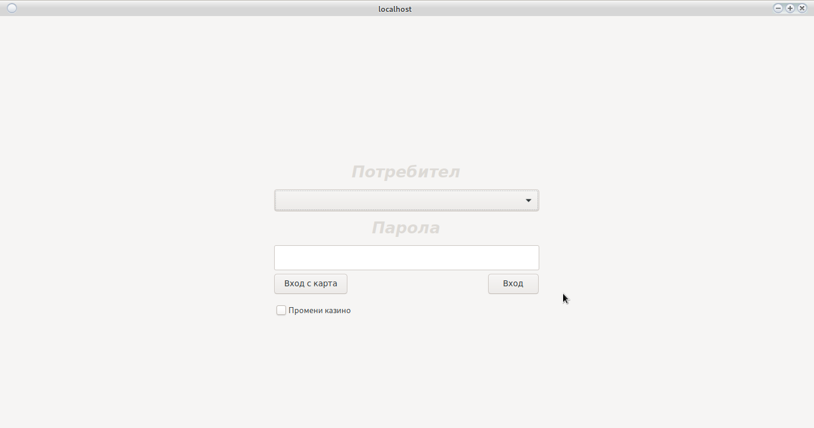
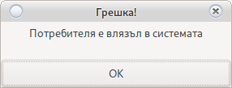
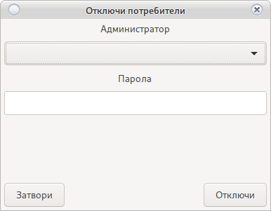

# Вход в системата

Основен прозорец за вход в системата.
Избира се потребител от падащото меню и се въвежда парола. Не се показват неактивни потребители.

По подразбиране:
 
 * Потребител __root__
 * Парола __123456__ 
 
> **Фиг.1**
>
> 


# Промяна на казино и добавяне на ново

Погледнете [Промяна на сървър](change_server.html)

# Промяна на начина на вход

Вход с карта [Изисква активен RFID четец](config_system.html#_27)

От бутона се "Вход с Карта" променя начина на вход в системата (от стандартен с парола към вход с карта)

Погледни [Настройки/Системни/Принтери и Картов четец](config_system.html)

При избор на вход с карта, всеки потребител влязъл веднъж по този начин ще загуби възможност да 
влиза с парола ако системата е настроена за вход веднъж. На екрана ще излезе съобщение.
<h5 style="color:red; display: inline;">За отключване погледни </h5>

[Отключване на заключен потребител](login.html#_4)




[Настройки/Системни/Система](config_system.html)

# Отключване на заключен потребител

При активна настройка за вход веднъж може да се покаже съобщение от Фиг.2

Това означава, че потребителя е влязъл в системата от друга програма или в редки 
случаи програмата е неправилно затворена.


> **Фиг.2**
>
> 

Използвайте бутон __CTRL+q__ след това ще се покаже прозорец Фиг.3 за отключване на потребителя.

Трябва да бъде избран потребител с права за отключване. Това действие ще отключи всички заключени потребители.

> **Фиг.3**
>
> 


```
Рестарт на сървъра отключва всички потребители.
Рестарт на сървъра изхвърля всички потребители.
```

# Регистрация на POS Терминал

[Регистрация на работна станция](config_system.html#_36)

# Лицензиране

[Настройки/Лицензи](license.html)

# Съобщения

* Не регистриран POS. 
    * Собственика е отнел правата на компютъра да се свързва с казиното
    * Компютъра е нов пос терминал.
    * Операционната система е преинсталирана или има промяна в дяловете на системата
    
    Системата може да бъде регистриран от потребител с права.
    
    [Погледни](config_system.html#_36)

* Невалиден базов лиценз
    * Системата е нова
    * Лиценза е изтекъл
    * Лиценза е отнет принудително (при опит за промяна в кода на системата)
    
    Моля свържете се с администратор за подновяване на лиценз. 
    
    При принудително отнет лиценз, подновяване е невъзможно.
    
    [Погледни](license.html#_3)
    
* Изтичащ лиценз
    * Някой от регистрираните лицензи е с изтичаща валидност.
    
    Свържете се с администратор в рамките на 10 дена.<br>
    [Погледни](license.html)
    
* Грешна парола
    * Системата разпознава малки и главни букви
    * Погледнете езика за въвеждане
    * Свържете се с потребител с права за промяна на паролата
    
    След промяна на паролата от друг потребител в основния панел натиснете ctrl+p за да изберете нова парола.

