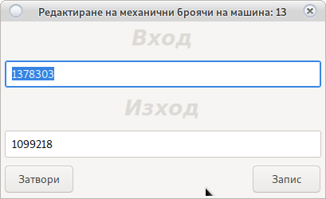
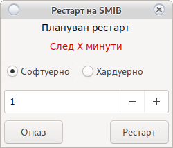

# Начален прозорец

Това е първия прозорец след вход в системата.
В него са разположени бутони за избор на модул, аварийни бутони и бутони за бързи действия.

> <h5 style="color:red">Аок не виждате някой от бутоните, то вероятно нямате права за достъп до
 съответната функция или модул</h5>

**Фиг.1**

# Модули

## Отчети

Модул за отчет и управление на паричните потоци.
За повече информация погледнете [Отчети](order.html)

## Клиенти

Модул за управнение на клиентски карти. 
За повече информация погледнете [Клиенти](cust.html)

## М.Броячи

Проверка и поправка на механичните броячи на машините.
Отваря се прозорец:

От бутона печат се разпечатва лист с текущите броячи и поле за нанасяне на промените.

Ако има промени в броячите с двоен клик на съответната машина се отваря

Поправят се механичните броячи и се записват. Системата ще се върне към поправка на механични броячи.
С червено са означени машините които са поправени.

Промените няма да влязат в сила докато не бъде натиснат бутона __Запис__ в основния прозорец.

> <h5 style="color:red">Препоръчителна проверка на механични броячи е всеки месец.  
В зависимост от коефициента е възможно да даде разлика от 2 до 50 лева.</h5>

## Регион 

Избор на регион в който потребителя работи.
Отваря прозорец за промяна на региона.

> <h5 style="color:blue">В основния прозорец се показват само машините работещи в избрания регион.</h5>

Бутон  добавя нов регион

## Печат на отчети

Отпечатване на отчет за __ДКХ__
Отваря прозорец за отчети.

Избира се тип на отчета:

* Дневен отчет
    
    Той взима като начална дата предходния дневен, а като крайна текущата дата.
    
    Номера на дневния отчет може да бъде променен ако имате права.
    
    Събира цялата информация и я отпечатва.
    
* Месечен отчет
    > <h5 style="color:blue"> В случай, че не виждате __От/До дата__. 
    Обърнете се към собственик за добавяне на права</h5>
    
    Ако не е избрано __От/До дата__ приема да начална дата предходния дневен, а за крайна текуща дата.
    
    При избор на __От/До дата__ ще използва зададените стойности
    
    Номера на месечния отчет може да бъде променен ако имате права.
     
    Събира цялата информация и я отпечатва.

## Начало на смяна

Започва смяна на крупие и отваря прозорец за избор на регион.

От там потребителя избира регион в който работи. 

> <h5 style="color:blue">В основния прозорец се показват само машините работещи в избрания регион.</h5>

От бутона  може да се добави нов регион.

Системата винаги помни последно избрания регион. Поради чести грешки системата няма да позволи отчет ако
няма започната смяна.

> <h5 style="color:red">Внимание!  Системата няма да позволи отчет ако няма начало на смяна</h5>
> <h6 style="color:blue">При грешно избран регион погледнете </h6>
> [Регион](main.html#_6)

## Справки

Модул Справки. За допълнителна информация погледни [Справки](report.html)

## Настройки

Модул Настройки. За допълнителна информация погледни [Настройки](config.html)

## Сервиз

Модул Настройки. За допълнителна информация погледни [Сервиз](service.html)

## Изход

Ще прекрати сесията на потребителя и ще върне системата към [Вход](login.html)

# Бързи действия

Бутоните намиращи се в дясно на основния прозорец

## Проверка SMIB

Ще провери дали всички SMIB контролери за работещи и имат връзка със централен сървър.

В случай че се забави на определен неработещ контролер всички след него ще се оцветят в <h5 style="color:red">Червено</h5>

Просто изчакайте процесът да продължи.

Проверените SMIB контролери са по цветове както следва:

* <h5 style="color:black">Не проверен</h5>
* <h5 style="color:green">Контролера работи</h5>
* <h5 style="color:red">Няма връзка с контролера</h5>
* <h5 style="color:blue">Контролера работи и на машината има играч</h5>
* <h5 style="color:purple">Контролера е с непозната ревизия (Ъпдейтвайте)</h5>
* <h5 style="color:yellow">Контролера е с непозната ревизия (Ъпдейтвайте)</h5>

## Намерих грешка с софтуера

Събира всички необходими лагове от избраната машина и ги изпраща към програмистите.

Помага за да направим програмата по добра. Не събира броячи или лична информация, само 
информация за грешките генерирани в кода.

## Съобщения

Позволява писане на съобщения между потребителите на системата.
Отваря диалогов прозорец за съобщение

След въвеждане на съобщение то може да бъде четено дори от всеки потребител с двоен клик на 
надписа 

`Съобщение: Има съобщение`

> <h5 style="color:red">Внимание! 
> Потребители без права, нямат възможност да пишат или редактират съобщения</h5>

## Бонус Карти

Това е справка към момента на всички паднали клиентски бонуси, бонус карти и на всички които трябва 
да бъдат удържани ако функцията е активирана [за клиенти](cust.html) и/или [бонус карти](config_bonus.html)

> <h5 style="color:red">Внимание! 
> В случай че искате удържаните бонуси да се зачисляват в касата на крупието  
> погледнете</h5> 
> `Настройки/Системни/Система`

## Извади Бил

Бързо изваждане на бил от машините. Използва се в случай когато крупието трябва бързо да намери
пари в средата на смяната.

Засича текущото състояние на била и вади на екрана сумата намираща се в касетата.
С двоен клик се определя от кои машини ще бъде изваден била като номериран на машината ще се оцвети в

<h5 style="color:green">Зелено</h5> 

Билът на машината ще спре да взима пари докато не се кликне повторно и
 машината не се оцвети отново в <h5 style="color:red">Червено</h5> или не бъде натиснат бутона __Извади__.
 
Ако билът не блокира погледнете `Настройки/Системни/Система` [Тук](config_system.html#_2)

След натискане на бутона __Извади__ събраната сума ще се зачисли в касата на крупието, а биловете ще 
продължат своята нормална работа.

> <h5 style="color:red">Внимание! 
> Системата ще направи нулев запис в справките за отчет.
> В записа няма да има вход и изход, но ще има бил.
> Този запис няма да попречи за продължаване на работа, а е просто информативен.</h5>

## Пусни бил

С случай, че бил не е тръгнал поради технически проблем след [Отчет](order.html) или е [спрян](main.html#_19) ще стартира била
 на машината в работен режим.

## Спри бил

Спира била на машината на машината.

Биеловете ще погасната и ще престанат за взимат пари. Може да се използва в случай, че крупието остава 
без пари. Това ще принуди клиентите да плащат в брой, а не да пускат парите в бил.

За повторно стартиране на бил използвай [Пусни Бил](main.html#_18)

## Резервация

В момента ще заключи машината по SAS.
При повторно натискане, ще я отключи.

> <h5 style="color:red">Внимание! 
> Бутонът е в разработка. 
> Пълната функционалност ще се появи в някоя от следващите ревизии.
> Логиката е машината да бъде резервирана за клиент __Х__ до __Дата и час__.
> В случай, че клиента за когото е резервирана машината постави карта в нея, то тя ще се отключи автоматично.
> друг клиент няма да е в състояние да играе на посочената машина до достигане на __Дата и час__.</h5>

## Наблюдавай

Система за наблюдение на машината в реално време.

От [Начален прозорец](main.html#_1) се избира машина

<h5 style="color:blue">В случай, че искате да изберете повече от една машина използвайте ctrl+Кликане с мишката върху машината</h5>

<h5 style="color:blue">В случай, че искате да изберете всички машини използвайте shift+клик на първа машина + клик на последна машина</h5>

Ще се отвори прозорец за настройка на наблюдението

В ляво избирате параметрите които искате да наблюдавате, а в дясно забавяте цикъла на наблюдение с __Х__ секунди.

> <h5 style="color:red">Внимание! 
> <ul><li>Колкото повече машини изберете толкова по бавен ще става цикъла и е възможно прескачане на един два beta</li>
> <li>Ако изберете само една машина опресняването ще е толкова бързи, че ще е трудно да наблюдавате.</li>
> <li>Регулирайте от прозореца за настройки времето на опресняване.</li>
> <li>Едно завъртане на риловете отнема 1 секунда.</li>
> <li>Ако изберете машина с технически проблем, това ще предизвика голямо забавяне във всички машини.</li>
> <li>Не избирайте повредена машина или машина с повреден SMIB контролер.</li></ul></h5>

След което с бутона __Няблюдавай__ ще се отвори прозорец:

От бутона __Затвори__ се връщате в [Начален прозорец](main.html#_1)

## Рестартирай SMIB

Рестартира SMIB контролера. В огромна част от случаите е необходим само софтуерен рестарт.
Хардуерен рестарт е нужен основно при добавяне на нови елементи към екрана на картовия модул или 
в случай, че SMIB контролера е и визуализация и има нови елементи добавени в нея.

<h5 style="color:blue">В случай, че искате да изберете повече от една машина използвайте ctrl+Кликане с мишката върху машината</h5>

<h5 style="color:blue">В случай, че искате да изберете всички машини използвайте shift+клик на първа машина + клик на последна машина</h5>

Хардуерния рестарт в най-бързия случай започва след една минута, това ще предизвика изгасване на дисплея 
и зареждане на SMIB контролера отново.

> <h5 style="color:red">Внимание! 
> <ul>
> <li>Софтуерния рестарт се извършва веднага и отнема около 10 секунди. Не изключва контролера</li>
> <li>Хардуерния рестарт отнема минимум 1 минута до започване и около минута до пълно стартиране на системата.</li>
> <li>В картовия четец не трябва да има поставена карта (ще предизвика блокиране на контролера)</li>
> <li>Хардуерния рестарт може да бъде плануван с времето в настройка на рестарт (600 значи след 10 минути)</li></ul>
> </h5>

## Забави рилове

Забавя скоростта на въртене на риловете с __X Милисекунди__
Ще отвори прозорец за настройка

> <h5 style="color:red">Внимание! 
> <ul><li>Времето на забавяне трябва да е кратно на 100 (100, 200, 300, 1500)</li>
> <li>При машини на ЕГТ ще аутоплей бутона ще започне да работи като старт</li></ul>
> </h5>

## Отключи/SMIB

Системата има вградена система за сигурност по легаци бонус погледни [Тук](config_system.html#smib_1)

<h5 style="color:blue">В случай, че искате да изберете повече от една машина използвайте ctrl+Кликане с мишката върху машината</h5>

<h5 style="color:blue">В случай, че искате да изберете всички машини използвайте shift+ клик на първа машина + клик на последна машина</h5>

В случай на поставяне на легаци бонус не минал през криптирането на SMIB контролера, машината ще се заключи.

> <h5 style="color:red">Внимание! 
> Проверете за чужди устройства преди да отключите машината.</h5>

## Извади пари

Авариен бутон. В случай на заложено превъртане не е възможен out на парите.
Ако крупие направи грешка този бутон ще извади парите от машината без последствия за нейната работа.

> <h5 style="color:red">Внимание! 
> Изисква AFT, погледни [Настройки/Системни/SMIB](config_system.html#smib_1)</h5>

## Изтрий играч

Авариен бутон.

Ако поради технически проблем картата на клиента остане закачена на контролера, 
то тази карта не може да се използва на друга машина.

Функцията за залепване на карта е от за синхронизиране между всички контролери.

Докато клиента и цялата информация не бъде записана от единия контролер на централен сървър, друг
контролер не е в състояние да зареди същата карта.

> <h5 style="color:red">Внимание! 
> Може да има технически проблем в машината който не позволява запис
> (скъсан SAS кабел, Повреден СУИЧ или повредено RG45)
> С този бутон ръчно ще освободите всички клиенти.</h5>

## Свери час

Сверява дата и час на машината със зададената стойност.

> <h5 style="color:red">Внимание! 
> Спазвайте зададения формат</h5>

## За Ремонт

С двоен клик на машината се подава сигнал за проблем в машина (изгорял монитор, не работещ бутон и др.)

Номера на машината е избран автоматично.

Описва се проблема и се натиска бутона __Запис__

Ако е [настроено](config_system.html#_2) сигнала се препраща автоматично към e-mail на сервиз и
 се записва в информационната система.
 
## Промяна на парола на потребител
 
 Натиснете ctrl+p ще се отвори прозорец за промяна на паролата на потребителя
 
## Помощ
 
 Натиснете F1 или fn+F1 за отваряне на документация

