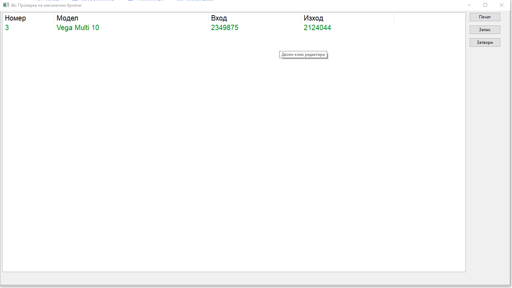
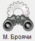
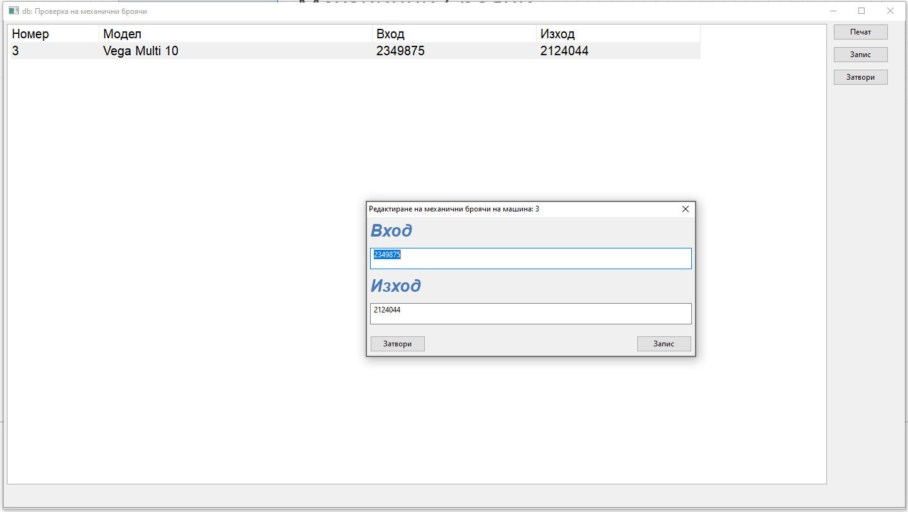

# Механични броячи

> * С бутона  от основното меню на програмата може да се преглежда състоянието на механичните броячи на машините.
> * С двоен клик върху машината може да се променят броячите при необходимост.

> * Бутон печат ще принтира моментното състояние броячите.
> * Бутон запис ще запише моментното състояние на броячите на сървъра.

