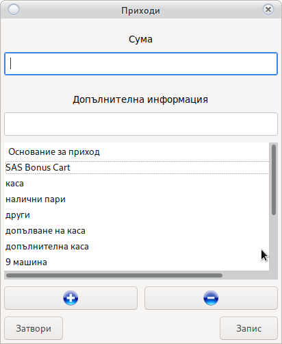
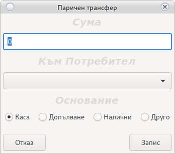
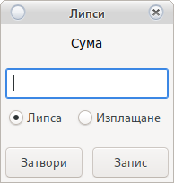
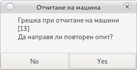
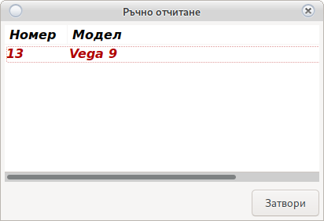
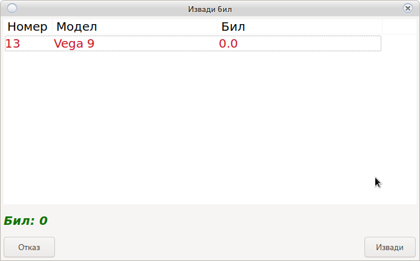
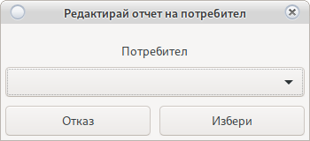

# Модул Отчети

Система за отчитане на крупие

В случай че излезе съобщение 

Погледни [Начало на Смяна](main.html#_8)

## Приходи

Въвежда се сумата на прихода.

Избира се Основание за прихода, и ако има се въвежда допълнително информация.

* Основание
    * Шефа донесе ми пари
    * Сервиза ми върна ресто
* Информация 
    * Жената на шефа
    * Техник
    
Ако основание липсва:

Бутон 

Добавя ново основание.

Бутон 

Премахва избраното основание.

Имената на основанията са уникални и разпознават малки и ГЛАВНИ букви.

> <h4 style="color:red">Внимание! 
> Премахването на основание не го изтрива, само го скрива. 
> Не забравяйте, че имената са уникални</h4>

> <h4 style="color:blue">Информация! 
> При грешка можете да поправите с двоен клик на прихода</h4>

## Трансфери

Система за прехвърляне на пари от един потребител към друг.

Това в вътрешен трансфер на пари от потребител __X__ към потребител __Y__

Въведете сумата и изберете потребител към който ще правите трансфер.

Изберете основание. За не заложени основания изберете друго и въведете описания.

Изисква потвърждение от потребител __Y__

> <h4 style="color:red">Внимание! 
> Посочената сума се приспада от касата на потребител __X__ и се зачислява в касата на потребител __Y__
> </h4>

## Разходи

Въвежда се сумата на разход.

Избира се Основание за разход, и ако има се въвежда допълнително информация.

* Основание
    * Сервиза ми иска пари
    * Дойде куриер
* Информация 
    * Еконт, Спиди
    * Техник
    
Ако основание липсва:

Бутон 

Добавя ново основание.

Бутон 

Премахва избраното основание.

Имената на основанията са уникални и разпознават малки и ГЛАВНИ букви.

> <h4 style="color:red">Внимание! 
> Премахването на основание не го изтрива, само го скрива. 
> Не забравяйте, че имената са уникални</h4>

> <h4 style="color:blue">Информация! 
> При грешка можете да поправите с двоен клик на разхода</h4>
>
## Липси

Система за отчитане на липси на потребители

Въвежда се сума и се избира тип.

* Липса
    
    Изважда сумата от касата на крупието и завежда липса 
    
* Изплащане

    Добавя сумата към касата на крупието и я приспада от доведените липси
    
В случай, че крупието не изплати липса в рамките на месец и се наложи спиране от възнаграждението,
то трябва да уведомите крупието и да предоставите сума за да бъде премахната от липсата чрез изплащане.

> <h4 style="color:red">Внимание! 
> Само потребителя на когото принадлежи липсата може да я премахне. 
> Можете да премахнете липса <a href="order.html#_12">заредите потребител</a> 
> Сумата ще бъде добавена в касата на крупието и физически парите трябва да му бъдат дадени.</h4>

## Отчет

Система за електронно отчитане на машини.

Автоматично взима всички броячи и блокира работата на била [Погледни](config_system.html)

Всички машини ще бъдат показани в [Основен прозорец](order.html#_1)

Машините отчетени по електронен път не могат да бъдат редактирани

В случай на грешка

* Машината не работи 
    
    Не е нужен втори опит. Изберете __No__ и отчетете [ръчно](order.html#_7)
    
* В случай на временно прекъсване

    Изчакайте 10-15 секунди и натиснете __Yes__  
    Системата ще направи повторен опит за отчет. 
    В случай на неуспешен повторен опит системата ще избере [ръчен отчет](order.html#_7)

## Ръчен отчет

Ръчно отчитане на машини. Използва се за машини без възможност за свързване към системата
или за машини с технически проблем.
 

> <h4 style="color:red">Внимание! 
> Не затваряйте прозореца преди да сте отчели всички машини. 
> Ако бъде затворен, машините с повреда ще изчезнат. 
> Ще се наложи повторно пискане на <a href="order.html#_6">отчет</a></h4>

С двоен клик отваря прозорец за отчитане на съответната машина

При проблем с SMIB контролера въведете електронните броячи в полетата.

В случай на повреда на машина изберете опцията отчет по механични броячи.
Въведете механичен вход и механичен изход.
В полето бил въведете сумата която намерите в касетата на машината.

> <h4 style="color:red">Внимание! 
> В зависимост от датата на последното <a href="main.html#_5">поправяне на механични броячи</a> 
> е възможно разминаване. 
> За да се избегнат разминавания следващият отчет задължително ще бъде ръчен. 
> Въведете електронни броячи.
> </h4>

> <h4 style="color:blue">Информация! 
> При грешка можете да поправите с двоен клик на отчетената машина</h4>
 
## Бил

Система за управление на била.
Системата следи парите в касетата. Ако бил не бъде изваден то той ще се натрупва.
Натрупания бил се зачислява в касата на потребителя който го вади и се занулява от касетата на машината.

С двоен клик се маркират машините от които била ще бъде изваден и те ще станат 
<h4 style="color:green">Зелени</h4>

След като извадите парите от касетите на посочените машини се избира се бутона __Извади__

<h2 style="color:red">Пари се броят задължително!</h2>

## Край на смяна

Приключване на смяната на крупие. Ще занули касата и всичко извършено през текущата смяна.

> <h4 style="color:red">Внимание! 
> Само когато целия отчет е завършен и всичко е точно до стотинка 
> След край на смяна редакция е невъзможна.
> </h4>

> <h4 style="color:blue">Информация! 
> Системата ще генерира <a href="order.html#_10">служебен разходи ордер</a></h4>

## Печат на РКО

Отпечатва разходен ордер за крупието. Разходния ордер съдържа цялата информация чрез 
която се изчислява касата на крупието.

## Зареди Крупие

С двоен клик на името в горен ляв ъгъл на [основния прозорец](order.html#_1) можете да заредите 
потребител за да проверите какви действия е извършил в профила си по време на отчет или да редактирате
в случай, че потребителя няма права за достъп.

> <h4 style="color:blue">Информация! 
> Заредения потребител ще придобие вашите права за достъп.</h4>

## Съобщения

Погледни [Съобщения](main.html#_15)