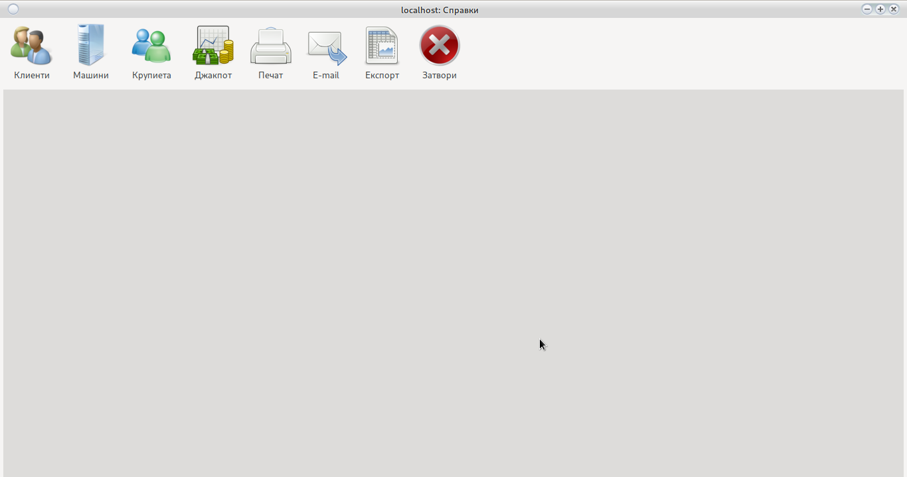
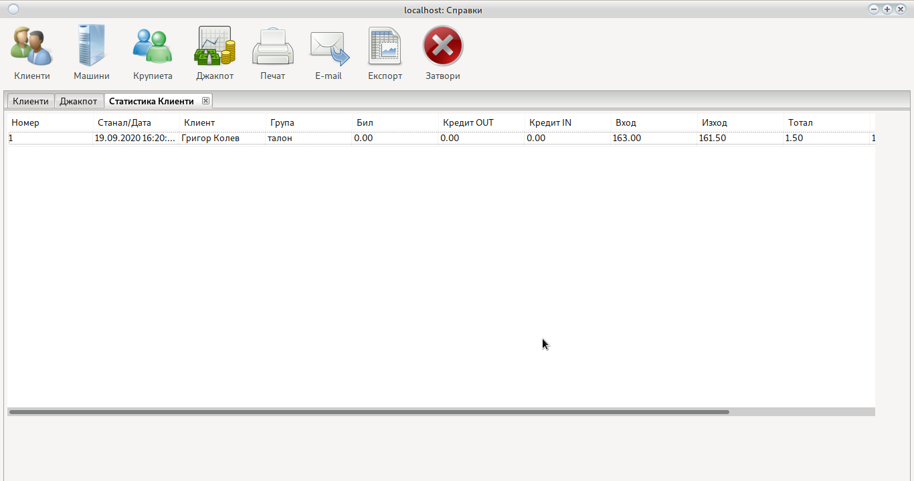
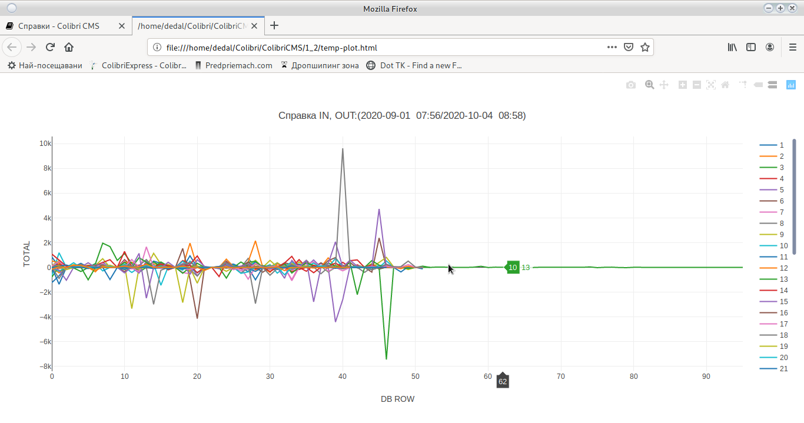
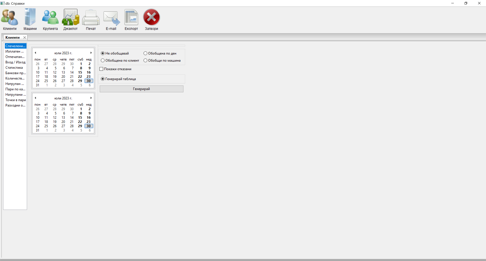
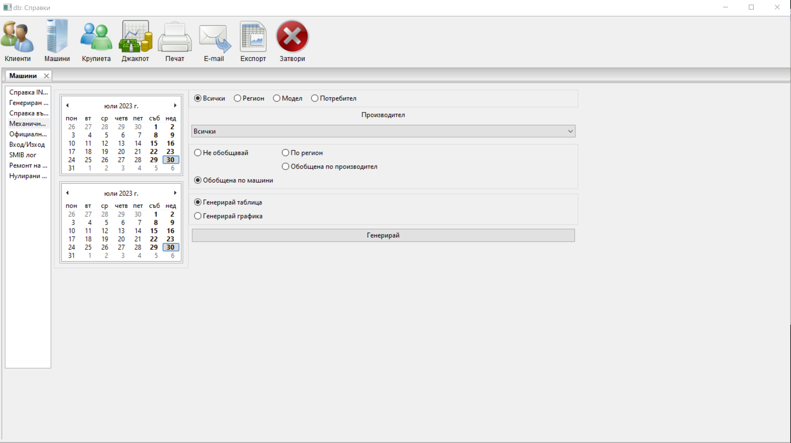
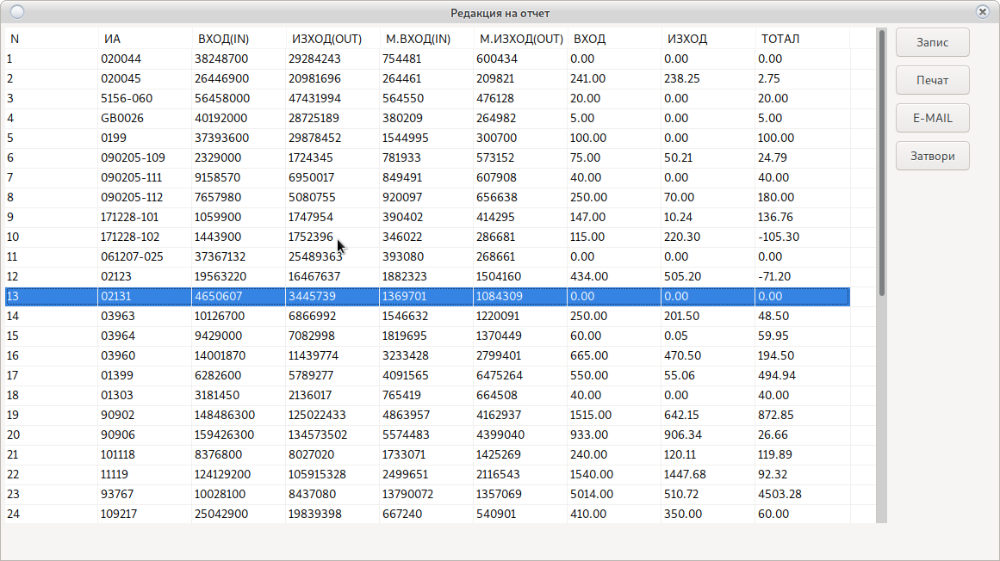
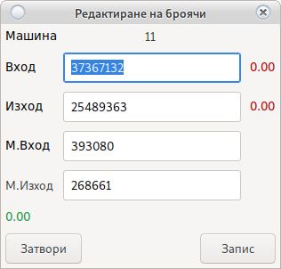
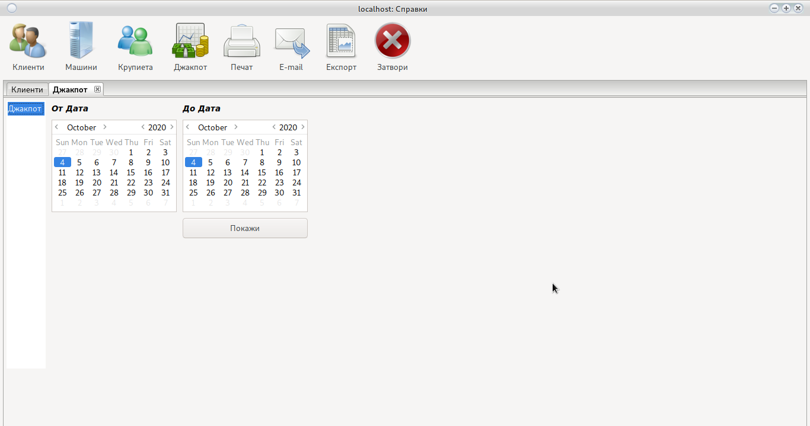

# Справки



<h5 style="color:red">
Справки за големи периоди от време, могат да накарат програмата за зависне.<br> 
Просто изчакайте докато информацията се обработи.</h5>

Всяка справка се отваря в свой собствен таб, генерирайки таблица с нужната информация
 


Възможно е генериране на графика. За генериране на графика се уверете, че опцията [Цял Екран](config_system.html#_2) e
изключена.



> Може да сортирате всяка таблица, кликайки върху името на колоната.
> При графика, премахнете излишните линии от легендата намираща се в дясно.

```
Изберете нужната справка от ляво.
Изберете на чална и крайна дата.
Използвайте опциите за филтриране и фина настройка.
Натиснете Генерирай.
Отворения нов таб съдържа нужната информация.
```

### Клиенти



Може да видите цялото име на настройката като задържите мишката върху името.

### Спечелени бонуси

Справка за всички бонуси спечелени от клиент чрез системата за [бонусиране](cust.html).

Не показва [Бонус Карти](config_bonus.html)

### Изплатен Мъни Бек

Справка за всички изплащания на [Мъни Бек](cust.html#_27)

### Отпечатани талони

Справка за всички отпечатани [талони за томбола](cust.html#_28) включително [свободно отпечатаните](cust.html#_30)

### Вход/Изход

Справка за направени входове и изходи през [кешлес система](config_system.html#smib_1)

### Статистика

Статистика на цялата игра на клиент за определения период

### Банкови преводи

Справка за пари преминали през ATM терминал

### Количество карти

Статистика за броя на картите притежавани от клиент

### Натрупан мънибек

Количеството мъни бек бонус натрупан от клиент

### Пари по карта

Пари които клиента има в неговата карта.

### Точки в пари

Точките могат да работят като талони за томбола или да се изплащат в пари. 

### Разходни ордери

Разходни касови ордери разпечатани от програмата. Необходим е POS принтер

<h5 style="color:blue">Не се използва календар<br>
Справката е за всички налични карти<br>
Възможно забавяне при голямо количество карти, моля изчакайте</h5>

## Машини

### IN, OUT, Тотал

Справка за реализацията на машините по електронни броячи.

### Генериран Бил

Показва била генериран от машината

### Справка Възвръщаемост

% на възвръщаемост на машините.

За правилна работа въведете броячите [WON и BET](device.html#_2) при инициализация.

### Механичен IN, OUT, Тотал

Справка за реализацията на машините по механични броячи.

### Отчети

Справка за всички направени [отчети за ДКХ](main.html#_7) и [разходни касови ордери](order.html#_10) 

Изберете тип и дата



Използвайте __Двоен Клик__ за отваряне на отчета



За поправка на отчет използвайте __двоен клик__




<h5 style="color:red">Възможни грешки при редакция на Месечен Отчет.</h5>

### Вход / Изход

Тази справка ще покаже всяко влагане и вадене на пари от машината. Машините пазят последните 50 - 100 влагания/тегления. На сървъра се пазят всички останали.

### SMIB Лог

Справка за грешки генерирани от SMIB контролерите

Изисква:

[Активен logging сървър](config_system.html#_15)

[Активна опция да изпращане на лог към сървър](config_system.html#smib_1)

### Ремонт на машина

Справка за всички извръшени ремонти от [Сервиз](service.html)

### Нулирани машини

Справка за нулирани машини от [Сервиз](service.html#_6)

## Крупиета

### Трансфери

Вътрешни трансфери на пари между различни потребители

Погледни [Трансфери](order.html#_3)

### Изваден бил

Показва колко и на кои машини е бил изваден бил.

Погледни:

[Изваждане на бил при отчет](order.html#_8) и [изваждане на бил в смяна](main.html#_17)

### Липси

Справка за зачислени и изплатени [липси](order.html#_5)

### Отчетени пари

Сумата която крупието е отчело след [край на смяна](order.html#_9)

### Приходи

Справка за всички [приходи](order.html#_2) различни от вход на машините

### Разходи

Справка за всички [разходи](order.html#_4) различни от изход на машините

### Лог файл

Записва всички действия на крупие (Отворена врата на бил, 
Отворена централна врата, рестартиран SMIB и др.)

### Бонус карти

Всички [бонус карти](config_bonus.html) поставени от крупие

### Вход/Изход по карта

Справка за [изплатени](cust.html#_32) и [добавени](cust.html#_31) пари в кешлес системата

Изисква [активен кешлес](config_system.html#smib_1)

### Работно време

Показва броя на отработените часове.

## Джакпот



Избирате начална и крайна дата.
Използвайте бутона __Генерирай__.

Информацията се взима от сървъра за джакпот и изисква стабилна мрежова връзка.

Не пускайте справка за големи периоди от време, може да забави работата на джакпот сървъра или
ще бъде невъзможно прехвърлянето на информацията.

## Печат

Отпечатва справката на принтер

Изисква настроен [принтер или PDF четец](config_system.html#_27)

## E-Mail

Изпраща справка по E-Mail на собственика.

Изисква [настроен e-mail адрес](config_system.html#_2)

# Експорт

Експортира справката в Microsoft excel таблица с формат xlsx. Необходимо е да имате инсталиран офис пакет за да я видите след експорта