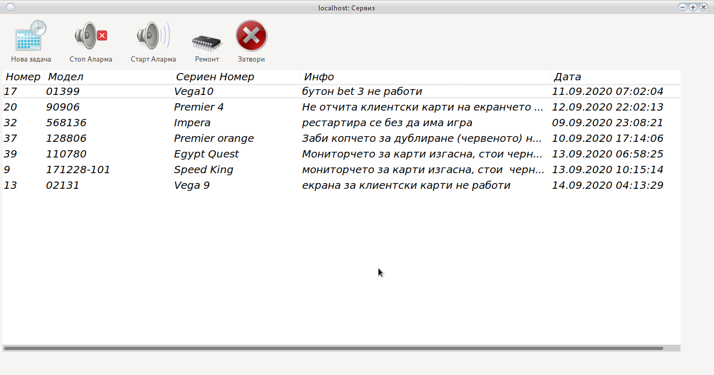

# Сервиз 

Начален екран за модул __Сервиз__

Това е сервизен модул. Използва се за севриз на машините. Винаги техника да знае какво има да прави и къде.

## Прочети/Редактирай задача

Двоен клик на задачата ще отвори възможност за Четене, Редактиране или Дописване.

Препоръчваме дописване, не редактиране на задачите.

## Нова Задача

В случай, че имате права може да подавате нова задача без да избирате машина:

__Пример: Монтирай телевизор__

Крупиетата могат да подават ремонти към сервиза само за определена машина.
[Погледни Тук](main.html#_26)

## Спри Аларма

Ще спре пищенето на машината.

## Пусни Аларма

Ще пусне пищенето на машината.

## Ремонт

Поправка на машина (Задача)

Зарежда се прозорец

Съществуват две опции

* Без нулиране
    
    Въвежда се сума на ремонт. 
    Купих кабел за 20 лева или Копче от ЕГТ за 12 лева. 
    Описва се извършения ремонт и избрания ред изчезва от активни задачи.
    
* С нулиране

    Поради технически проблем е нужно нулиране на машината. 

* Необходима сума за ремонт - незадължителна опция с която може да се опише цената на ремонта.
        
<h5 style="color:red">
Нулираните машини се добавят към дневния отчет  
</h5>