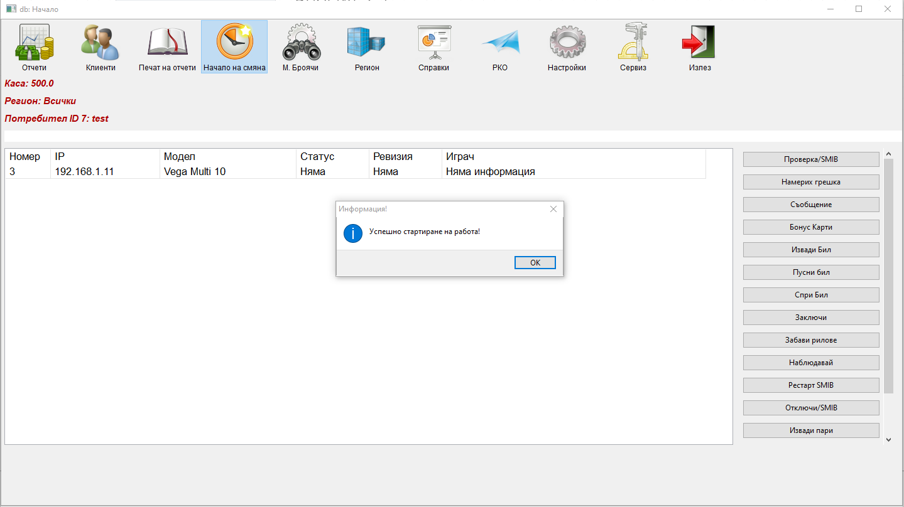

# Начало на смяна

Използва се за започване на работа от крупиетата. Програмата ще запише час на започване на смяната и ще подкани потребителя да избере регион ако има такива. Изборът на регион се прави двоен клик. Програмата ще покаже уведомително съобщение че смяната е стартирала успешно.

