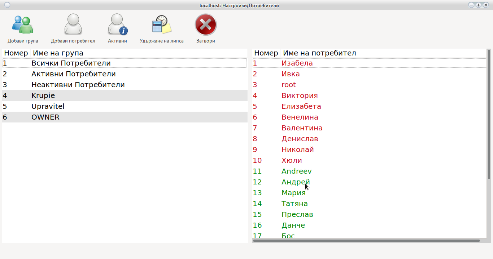
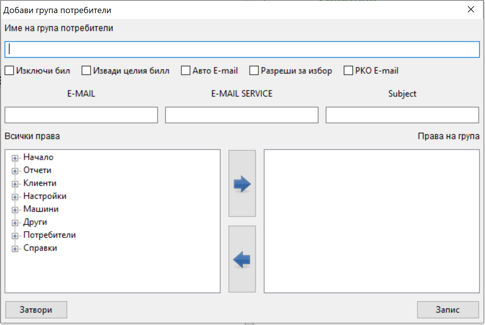
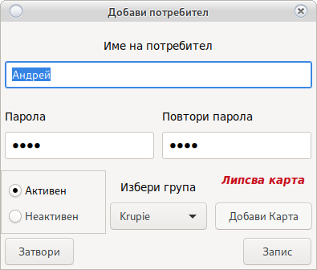
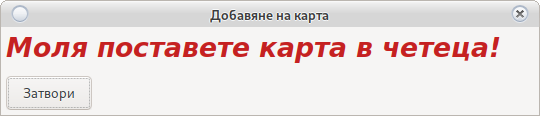
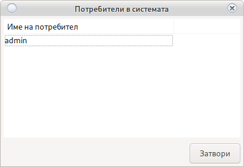
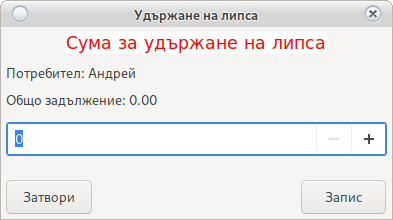

# Потребители, Групи и права за достъп

Система за права за достъп до програмата

## Добави/Редактирай Група

Добавя и редактира групи и права за достъп на група.

Може да видите всички потребители намиращи се в съответна група използвайки филтър
__Единичен Клик__ на името на групата [в ляво на основния прозорец](user.html#_1)

За добавяне на нова група използвайте бутона __Добави група__

За редактиране на съществуваща група __Двоен клик върху групата__ [в ляво на основния прозорец](user.html#_1)

Зарежда се прозорец за добавяне на група

Името на групата е свободно, но трябва да бъде уникално.
Разпознава __малки__ и __ГЛАВНИ__ букви

Създадена група не може да бъде премахната, изтрита или деактивирана.

В ляво на прозореца са изброени всички права по прозорци.

В дясно правата които групата притежава.

#### Добавяне на права.

Изберете право в ляво на прозореца и натиснете 

Правото ще се покаже в дясно при правата които потребителя има.

В случай, че маркирате цяла група права, то тя ще бъде добавена с всички възможни права в нея.

#### Премахване на права.

Изберете право в дясно на прозореца и натиснете 

Правото ще изчезне от правата които потребителя има.

В случай, че маркирате цяла група права, то тя ще бъде премахната с всички възможни права в нея.

* Изключи бил

    Указва на програмата дали била ще се заключи при отчет и/или вадене. 
    
    [Погледни](order.html)

* Авто E-Mail

    При пускане на [дневен отчет](main.html#_7), автоматично ще изпраща копие на собственика.
    
    Автоматично ще изпраща информация за нов ремонт на [сервиза](service.html) и собственика.
    
    При извършен ремонт, уведомява собственика.

* Извади Целия бил

    При [вадене на бил в отчет](order.html#_8) всички машини ще бъдат избрани за изваждане.
    
    В случай, че не вадите бил на определена машина използвайте __Двоен клик__

* E-Mail

    Имейл на собственик __E-mail1, E-mail2__

* E-MAIL Сервиз

    Имейл на сервиз погледни __Авто E-mail__ и [Сервиз](service.html)

* Subject

    Заглавие на E-Mail погледни __Авто E-mail__
    Служи за разпознаване от кое казино и кой POS терминал е изпратено съобщението.

* Разреши за Избор

    Управителя не би трябвало да има права за промяна на групи и потребители с висок приоритет
    като __Собственик__
    
    Избора на тази опция ще укаже, че групата е с нисък приоритет.
    
    В този случай ако правата за редакция на група са премахнати от група __Управител__,
    но са добавени права за създаване и редакция на потребител, всички от група управител ще могат да 
    добавят редактират потребители в група __Крупие__ без да могат да сменят правата.
    
    > <h5 style="color:red">Внимание! 
    > Напомняме, че всеки бутон трябва да бъде показан по прозорци 
    > Или ако потребител има достъп до редакция на потребители, 
    > Но в __Начало__ не е показан бутона __Настройки__ 
    > и/или в __Настройки__ не е показан бутона __Потребители__ 
    > то достъпът ще е __Няма да е възможен__
    > </h5>
    
    > <h4 style="color:blue">Информация! 
    > При промяна на правата, потребителя ще придобие новите права след повторен вход в системата.</h4>

    * PKO E-mail

        Включването на тази опция, ще изпраща e-mail на собственика с оборота след приключване на смяна

## Добави/Редактирай Потребител

Може да видите всички потребители намиращи се в съответна група използвайки филтър
__Единичен Клик__ на името на групата [в ляво на основния прозорец](user.html#_1)

За добавяне на нов потребител използвайте бутона __Нов Потребител__

За редакция на съществуваш __Двоен клик на избрания потребител__ [в дясно на основния прозорец](user.html#_1)

Отваря се прозорец за добавяне на потребител

Имената на потребителя трябва да са уникални. Разпознава __малки__ и __ГЛАВНИ__ букви.

Веднъж добавен Потребител не може да бъде премахнат а само деактивиран.

* Име на потребител

    Свободен текст за разпознаване
    
* Парола

    Парола за вход [може да бъде сменена](main.html#_27)
    
* Активен/Не Активен

    Ако потребителя е __Не Активен__ няма да се показва при [Вход](login.html)
    
* Група
    
    Потребителя ще придобие правата на избраната __Група__ от падащото меню
    
* Добави Карта
    
    [Изисква активен RFID четец](config_system.html#_23)
    
    Отваря
    
    
    
    Поставете карта в четеца и натиснете __Запис__
    
    Картата ще бъде инициализирана с потребителя и ще позволи [вход с карта](login.html) и 
    [скачаща кей система](config_system.md)

## Активни потребители

Показва всички влезли в системата потребители.

Ако е [настроено](config_system.html) потребителите могат да бъдат изхвърлени с __Двоен Клик__

> <h5 style="color:red">Внимание! 
> Не е тествано изхвърляне при отчитане на крупие.</h5>

## Удържане на липса

В случай, че липсата на крупие се удържа от заплата

тя може да бъде премахната от тук.

Изберете потребител от дясно на основния прозорец и натиснете __Удържане на липса__

Ще се отвори

Общо задължение е задължението натрупано в целия период на работа на потребителя.

Всички изплащания са приспаднати от сумата.

В случай на сума с отрицателен знак, то потребителя е надплатил всички задължения към организатора.

Въведете сумата която се удържа и натиснете __Запис__