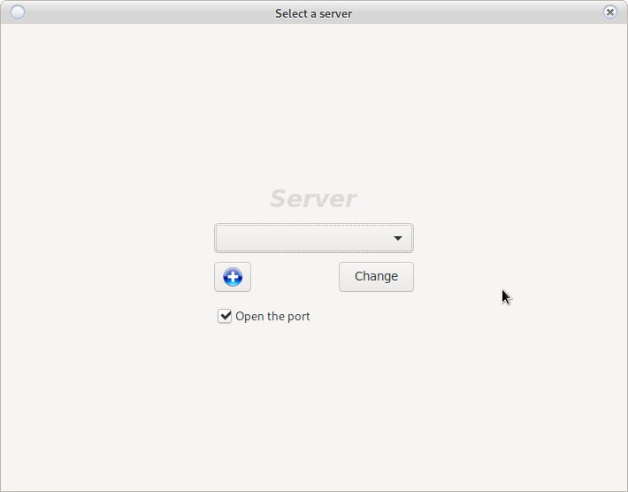
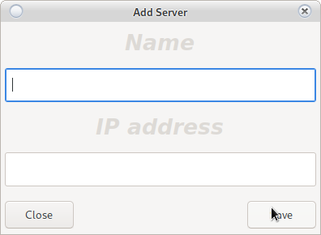

# Change casino

** In case of successful connection to the last chosen casino **

    From the login window click on
    Change the casino that will open Fig.1

** In case of no connection with last chosen casino **

    Fig.1 will open automatically
    `

> ** Fig.1 **
>
> 

If the object exists, select from the drop-down menu. From the + button
a new object is added. The new object must contain a Latin name (for recognition) and the IP of the object.
The router ports on the site must be routed to the server.

Open port is put in case:

    The server has an activated firewall.
    
    
Not required if:

    
    1. You are on a local network.
    2. If the server firewall is stopped.
    3. If the wall is already open for the this IP address.
    
    In these cases, the option will not work even if it is selected.
    
> <h5 style = "color: red"> It is not recommended to stop the firewall.
> If this is not possible, use the Ban process.
> Complete suspension of protection may cause unauthorized access to the information system. </h5>

# Add a new casino

Adding a new casino is done by the button 
from [Fig.1](change_server.html#change-casino)

Opens ** Fig.2 **

> ** Fig.2 **
>
> 

> <h5 style = "color: blue"> On some operating systems
> the program will need to be restarted to display the new object in the selection menu </h5>

** All fields are required. **

> <h2 style = "color: red"> The object name must be: </h2>
> <ul style = "color: red">
> <li> Written in Latin </li>
> <li> Unique without repeating </li>
> <li> The IP address of the object must be real and static </li>
> <li> Ports 5432 and 30593 are routed to the server </li>
> <li> It is recommended that service support port 44554 be redirected </li> </ul>

# Messages

* No connection to the server (It will open [Fig.1](change_server.html#add-a-new-casino)):

    * No internet
    
    * The pots are closed
    
    * Wrong object IP
    
    * OPEN PORT function is not started, the connection is blocked by the server firewall.
    
    * If a BAN process is running (you may be banned for 24 or until unlocked by an administrator) Not used when
    working firewall. Recommended use a firewall.
    
    * Server not working (contact administrator)

* Wrong date and time
    
    * The date and time on the work computer do not match with the server
    
    * RTC battery module is over, and setting over the clock from Internet fails (when you have
    internet connection the server will set date and time, even without working RTC module)

* No connection to RTC (in case the post terminal is set to synchronize with the server)
([Open [Fig.1](change_server.html#change-casino))

* No POS terminal registered. See [POS registration](config_system.html)

* Revision does not meet with the minimum revision (The system will be forced to update by the owner
 and the program will restart)

* Invalid base license (The program is not licensed or the license has expired. Contact an administrator)

* Approaching license expiration (Some of the licenses will expire in the next 10 days.
 Contact an administrator)