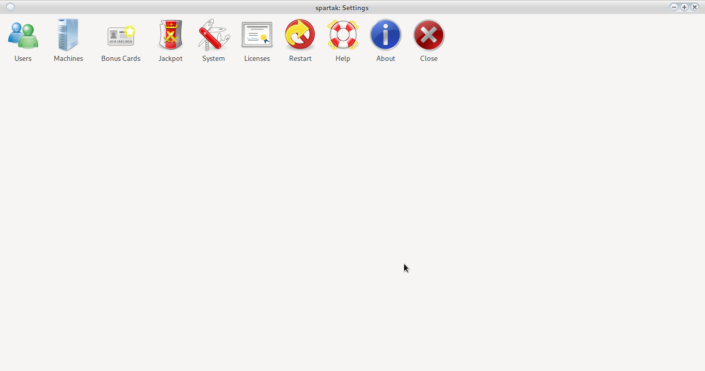
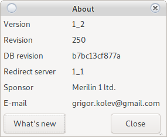

# System settings

## Users

View [Users](user.html)

## Machines

View [Machines](device.html)

## Bonus Cards

See [Bonus Cards](config_bonus.html)

## Jackpot

View [Jackpot](jackpot.html)

## System

View [System](config_system.html)

## Licenses

View [Licenses](license.html)

## Restart

Restart the program

## Help

Opens all system documentation.

## About

System information

Displays system information.

The __Change__ button opens a description of all changes in the respective revision.