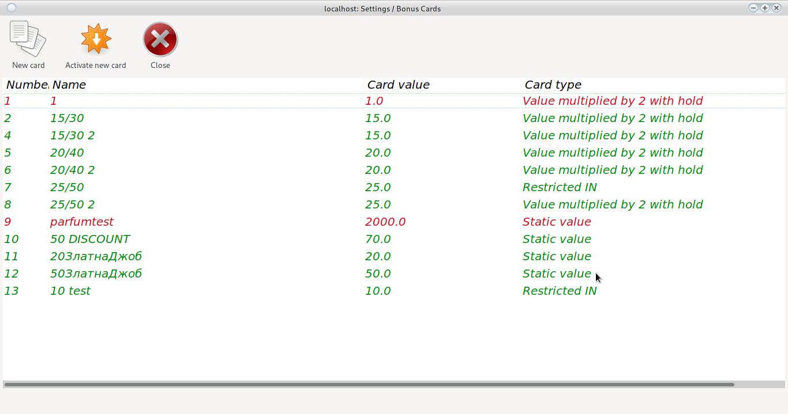
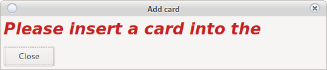

# Main window

Set up free bonus cards

## Add / Edit bonus cards

[Requires active RFID reader](config_system.html#printers-and-readers)

To add a new bonus card use __New card__

Insert a card into the reader and press __Save__

To edit an existing map __Use double click__

!([Add Bonus Card](../../img/colibri/bonus_new.png)

* Bonus card name

    Free unique recognition text. Knows __lowercase__ and __capital__ letters.
    
* Bonus amount

    This is the amount that will fall into the machine's credit.
    
* Scroll

    The amount dropped must be scrolled __X__ times to allow out  
    <h4 style = "color: red"> Attention!  
    Actively requires AFT
    </h4>

* Bonus type

    With the options you can adjust the type of bonus card.
    
    * Static
    
        In this case, BGN 15 will enter the machine
       
    * Static with hold
    
        BGN 15 will come in, but if they are not played, it will depend on the setting
        [withhold from croupier](user.md) or a reference will be saved.
        
    * 1 to 1
    
        BGN 15 will enter only if the machine has> = credit of BGN 15
        
    * 1 to 1 with deduction
    
        BGN 15 will enter only if the machine has> = credit of BGN 15  
        Depending on the setting
        [withhold from croupier](config_system.md) or a reference will be saved.
        
    * Multiplied by 2
        
        The Yue loan includes BGN 30  
        15 of them will be credited to the cashier of the croupier who is obliged to take them from the client.
        
    * Multiplied by 2 with deduction
    
        The Yue loan includes BGN 30  
        15 of them will be credited to the cashier of the croupier who is obliged to take them from the client.  
        Depending on the setting
        [withhold from croupier](user.md) or a reference will be saved.
    
    * Restricted IN
    
        Bonus is promo IN. You can not get out bonus but you can out won
        
<h5 style = "color: red"> Attention!  
None of the amounts will go through the IN counter on the machine.  
All amounts of type __Multiplied by 2__ or __Deduction__ are income, not croupier's expense.
</h5>

## Activate new cart

If add new it send message to SMIB to recognize it. 

<h5 style = "color: blue"> Make sure all machines are saved successfully  
Write later if necessary. </h5>