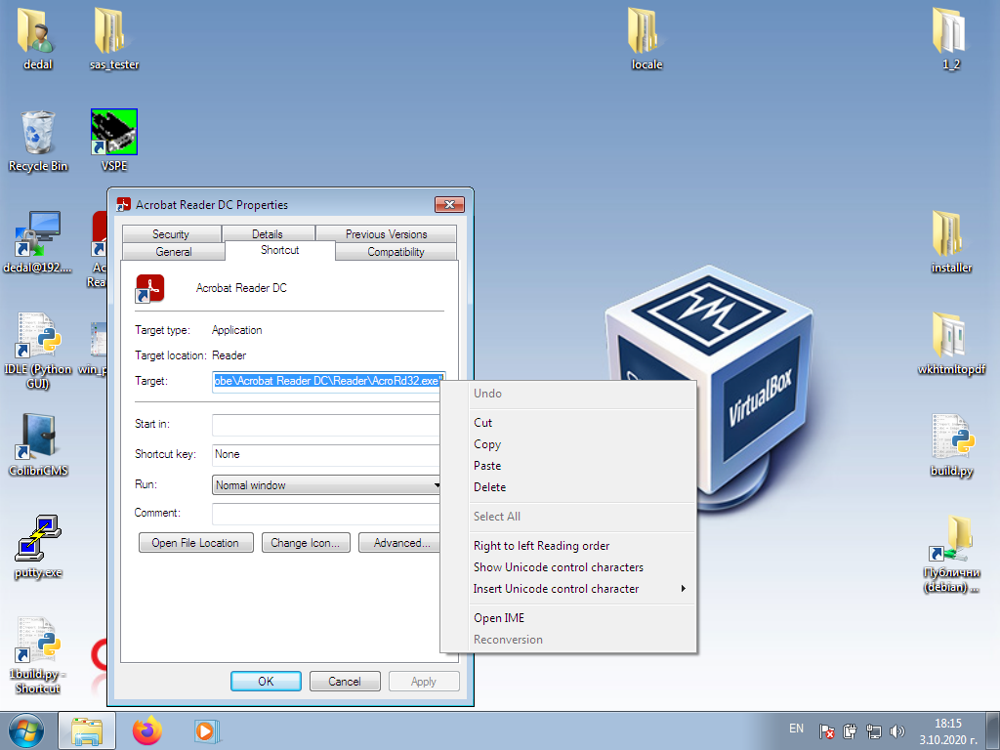

# System settings

Setting up the whole system.

Not included in [jackpot server](jackpot.html) settings

Some settings require a restart of the program to take effect.

<h5 style = "color: red">
Some of the settings are individual for each program, <br>
others are common to the whole system
Check out all the settings in detail </h5>


<h5 style = "color: blue">
The settings related to the program only are located in <b>colibri/colibri.conf</b> <br>
If you reinstall the program, copy <b>colibri.conf</b> <br>
After reinstalling, return it to the <b>colibri/</b> <br> directory
This will save your settings <br>
Do not change the path or partition of the program <br>
When changing a partition or path, register a <a href="config_system.html#workstations">POS terminal</a>
</h5>

## System

System settings regarding the mode of operation.


#### Date and time

The date and time are extremely important for the program.

In case of wrong date and/or time, the program will not start.

Please make sure the date and time are correct before using the program.

Ideally, the system checks the date and time from the Internet.

When the [Use RTC](config_system.html#internet) option is set the program will synchronize __Date and Time__
with the server.

In case the program does not start you can adjust __Date and Time__ from the options of your OS.

For small deviations, use the calendar and fields for an hour and a minute. Press __Record__

> <h5 style = "color: red"> Attention! <br>
> With a terminal manufactured by us, make sure the option
> <a href='config_system.html#internet'> Use RTC</a> is enabled. </h5>


#### Debug

The option is used by __Programmers__ to detect errors.
It opens a small white window describing the error.
When this option is disabled, errors are saved in a log file.

In case of critical errors please send __colibri/colibri.log__ to <a href="mailto:grigor.kolev@gmail.com"> Grigor Kolev </a>

> <h5 style = "color: blue"> The window cannot always be closed <br>
> Exiting a window does not mean a critical error and/or bug in the system <br>
> We recommend deactivating the option in run mode.
> </h5>


#### DB Debug

Database debugging. Used by programmers to fix errors in the database.
In case you activate this option all communication with the database will be saved in __colibri/colibri.log__

> <h5 style = "color: red"> We recommend disabling the option in run mode.
> </h5>

#### Full screen

The system will open in full screen. Shutting down the system will not be possible.

> <h5 style = "color: red"> It will not be possible to open any other program in OS <br>
> If you need to stop, use the [Restart](config.html#restart) button
> </h5>

#### Keyboard

It will show a virtual keyboard for touchscreen devices. Do not activate it on a computer with a hardware keyboard.

#### Enroll withholding

If you activate this option, all withheld [Bonus Cards](config_bonus.html#add-edit-bonus-cards) and [Customer bonuses](cust.html#addedit-group)
will be credited to the croupier's coffers.

Sometimes the croupiers can't figure out which bonuses are __Helled__.
Please use [quick reference](main.html#bonus-cards)

#### Login once

Indicates to the system that a user can only log in once. If the session from another program is not
closing, entry will be impossible.

There are cases (Electric shock, incorrect program shutdown, code error) when
a user will be left with a locked session.

Use [login form](login.html#unlock-a-locked-user) or deactivate session from [user settings](user.html#active-users)

#### Cash order printing

Prints cashier's order for disbursement. Otherwise, they are handwritten by the croupier. A POS printer is required.

#### Croupier/name in report

Removes the croupier's name on the daily report so that the croupier does not have to write his name manually. Filed with the NRA, use real names.

#### Money before report

This option requires the croupier to make a detailed inventory of the money he has before counting. The statement of the required amount collected will not be displayed until after completing this step.

#### NRA Token
Special token for connection with NRA. It is issued by the National Revenue Agency at the company's request. For more information and issuance of such a token, contact the NRA


#### Language

The system will load the selected location along with all the pillars.

In case you want to add a new language and/or change a template and/or message,
see [System Localization](locale.html)

#### Organizer

Used to print [daily report](main.html#print-reports)

#### Address of the organizer

Used to print [daily report](main.html#print-reports)

#### Game room

Used to print [daily report](main.html#print-reports)

#### Game room address

Used to print [daily report](main.html#print-reports)

#### Manager

Used to print [daily report](main.html#print-reports)

## Network

Connection settings


### Communication Section

#### Open Port

If the server firewall is active, this option is required, otherwise
connection to the casino will be impossible.

We recommend the use of a firewall, it restricts any access to the system not passed through
encryption algorithms. The encryption algorithm can be unique for each client <br>
contact <a href="mailto:grigor.kolev@gmail.com"> Grigor Kolev </a> <br>
A change in the encryption algorithm is paid extra and is not included in the initial price.

With an active firewall, the system records each IP that is accessed, and each IP can
to be banned.


#### Buffer

Do not change without consulting <a href="mailto:grigor.kolev@gmail.com"> Grigor Kolev </a>

An individual buffer will increase the security of the entire system. <br>
A change in the buffer is paid additionally and is not included in the initial price.

#### Time out

The time in which the server expects a response from the other elements of the system (Jackpot server, SMIB, Preview)

Do not make the time less than 10. You can increase in case of slow internet.

Consult <a href="mailto:grigor.kolev@gmail.com"> Grigor Kolev </a>

### Redirect Server Section

A redirect server plays a very important role in the whole system.
This is where all the information is contained.
The redirect server is also responsible for connecting to all SMIB controllers and setting up the Jackpot server.

The server inserts remote programs into the casino network. Responsible for the implementation of everything related to
[client module](cust.html)

#### Load

Loads __Redirect Server__ settings

#### Record

Saves the settings to the __Redirect Server__

#### Gmail option

The redirect server has a built-in e-mail server, but can also use gmail to send messages.

We recommend using __Gmail__

Please check the __SPAM__ folder before contacting <a href="mailto:grigor.kolev@gmail.com"> Grigor Kolev </a>

If necessary, set up a filter in your email.

#### Logging

Activates an error recording server. The server will take any error from each SMIB controller and
will save it to the base daylight. [Take a look](report.html)

You can disable the loggin server and redirect all errors to a computer on
[Service](service.html)

Contact <a href="mailto:grigor.kolev@gmail.com"> Grigor Kolev </a> for a remote computer debugging tool.

#### Clock

Usually, the server is checked via the Internet, but in the absence of such it uses an RTC module.

Clock mechanism that will adjust __Date and Time__

The server will synchronize the __Date and Time__ of the entire system.

> <h5 style = "color: red"> Attention! <br>
> Make sure the RTC module is placed correctly on the <br> server
> Make sure that the RC2032 battery of the RTC module is working.
> </h5>

#### TCP

Uses TCP protocol instead of UDP, which is the default

#### Variable encryption

Dynamically changes the encryption after each request. This function complicates the encryption and puts it into a changing key and randomly generated vector mode

#### NRA Test
Test server to NRA for developers. Used only by the developer.

#### Unlock with OCR
Enables the ability to unlock with an ID card reader.

#### SVN
Remote access function (remote control) of the program.

#### Firewall

Activates the firewall of the redirect server.

#### Ban system

Outdated technology. Relies on logs and imposes a ban for 24 hours with 3 times entered wrong password.

It will be removed in future revisions.

Please use __Firewall__

#### No protection

Disable all server security features.

> <h5 style = "color: red"> Attention! <br>
> Do not deactivate the protection if you are not sure what you are doing.
> </h5>

#### Email

The machines will signal a win or cashout to the specified e-mail
[Look](config_system.html#smib)

#### Subject

When a profit signal is given, it is used to recognize the various casinos

#### Printer

The system can be set up, all the print to go through the server and go to one printer.
The printer must be hooked up and set up on a redirect server.
Contact <a href="mailto:grigor.kolev@gmail.com"> Grigor Kolev </a> for more information

#### POS
Selection of POS (Point of sale) printer, if available. They are most often used for fiscal notes but can be used for other purposes as well

### RTC section

Real Time Clock module

> <h5 style = "color: red"> Attention! <br>
> Make sure the RTC module is placed correctly on the <br> server
> Make sure that the RC2032 battery of the RTC module is working.
> </h5>

#### Use RTC

Instructs the system to synchronize __Date and Time__ with the server each time it starts.

Recommended for POS terminal manufactured by us.

#### Check RTC Date and Time

Use the __Calendar__ and the fields __Hour and Minute__ to update the RTC Module.

> <h5 style = "color: red"> Attention! <br>
> Make sure the RTC module is placed correctly on the <br> server
> Make sure that the RC2032 battery of the RTC module is working.
> </h5>

## Printers and Readers

Printer and reader settings


> <h5 style = "color: red"> Attention! <br>
> Requires installed [wkhtmltopdf](https://wkhtmltopdf.org/) <br>
> For Window, add C:\Program Files\wkhtmltopdf\bin in the [search path](https://www.architectryan.com/2018/03/17/add-to-the-path-on-windows-10/) and reboot <br>
> For Debian or Ubuntu use apt install wkhtmltopdf <br>
> If you have difficulty installing wkhtmltopdf, contact <a href="mailto:grigor.kolev@gmail.com"> Grigor Kolev </a>
> </h5>

### Direct printing

I will print the required document directly on the selected printer.

> <h5 style = "color: red"> Attention! <br>
> On Windows, share the printers <br>
> Do not use spaces in sharing names. </h5>

If the option is not selected, it will open a __PDF__ document in the reader of your choice and you can do
print through reader options.

### POS Printer

Activates the POS printer for printing raffle coupons.

> <h5 style = "color: red"> Attention! <br>
> POS Printer must be in __Printer__ mode, will not work in __Serial port__ mode <br>
> We recommend using [Citizen CT-S2000](https://www.supplylineid.com/shop/printers/pos-epos-printers/citizen-ct-s2000-receipt-printer/) <br>
> Use a POS terminal manufactured by us to connect a POS printer </h5>

### Print to a server

Specifies whether the program will print to a local printer or to a remote printer attached to the server.

In case there are many POS terminals in one casino, connect the printer to the server and
select the option. This will allow all POS terminals to use the same printer.

You can use a shared printer or an Internet printer.
Contact <a href="mailto:grigor.kolev@gmail.com"> Grigor Kolev </a>

> <h5 style = "color: red"> Attention! <br>
> We recommend using a printer with Linux ARM drivers </h5>

### PDF program

* For Linux
    
    Enter the name of your favorite program for reading pdf documents
    
* For Windows

    Enter the path of the installed program for reading pdf documents <br>
    
    Use the right mouse button on the link of the preferences icon
    pdf reader and select __Proparties__
    
    
    
    Copy the text and paste it into the box
    
    
    
    Restart the program.
    

### Default printer

Select a local printer to print all Linux documents.

For Windows, enter a shared printer name without spaces.
See [Printer Sharing](https://support.microsoft.com/en-us/windows/share-your-network-printer-c9a152b5-59f3-b6f3-c99f-f39e5bf664c3)

> <h5 style = "color: red"> Attention! <br>
> Use the __Direct Print__ <br> option when active
> Will load all printers installed in <a href='https://www.cups.org/'> CUPS </a> <br>
> For Windows, enter the shared printer name you specified </h5>

### POS Printer

#### Select the default POS printer

Must be installed in [CUPS](https://www.cups.org/)

For Windows, the printer must be shared.
See [Printer Sharing](https://support.microsoft.com/en-us/windows/share-your-network-printer-c9a152b5-59f3-b6f3-c99f-f39e5bf664c3)
The shared printer name must not contain spaces.
Enter the name of the shared printer in the field.

#### Paper size of POS Printer

The system is set up for [Citizen CT-S2000](https://www.supplylineid.com/shop/printers/pos-epos-printers/citizen-ct-s2000-receipt-printer/)
with 80 mm width and 110 mm coupon length.

For a different printer, play with the numbers until you get the right size.

Use the __Test POS Printer__ button to see if the print is positioned relative to the paper.

#### Test POS Printer

Print test on POS printer

#### Add Info

Sets information to be printed on a POS printer.

It opens


These are the first 3 lines printed on the coupon.

Please note the paper size, it is not possible to print 1000 symbol symbols on 80 mm paper.

Use the __Test POS Printer__ button to see if the print is positioned relative to the paper.

### RFID Reader Section

Setting up and operating an RFID reader

All readers must be in __Serial Port__ mode

<h5 style = "color: red"> Use the RFID reader documentation to change the mode as needed. </h5>

#### Activate reader

Instructs the system to use an RFID card reader.

If you have any difficulties, contact <a href="mailto:grigor.kolev@gmail.com"> Grigor Kolev </a>

#### RFID reader port

* Linux
    
    __/dev/ttyACMХ__ or __/dev/ttyUSBX__

* For Windows

    __comX__
    
Replace __X__ with the port number.

#### Communication speed

Select the speed at which the serial port operates

#### Time out

The time in seconds at which the reader will generate an error for missing a card

#### Scanner scan time

Time is in milliseconds. The reader will check for a card every 500 milliseconds.

<h5 style = "color: red"> Not all readers support this feature <br>
Contact the RFID reader manufacturer </h5>


## Workstations

Installation of workstations.

In case a certain computer is not installed in the database, the system will not allow connection.

Or if you install the program on your computer on __Manager 1__ it will not be able to
to connect with __Casino 2__

If you leave a manager, remove the computer from the POS terminals to revoke access.


### Install

Authorization of POS Terminal

If the POS Terminal is not authorized to operate in the respective casino,
then the connection to the database will be impossible.

Every computer working with casino information must be authorized.

Use the __Install__ button


Enter a name to identify the computer.

Enter __Code sent to you by E-Mail__ and use the __Save__ button

<h5 style = "color: red"> When reinstalling a computer or changing the path of a program <br>
the system will request a new registration at a POS terminal <br>
</h5>

### Move

In addition to [deactivate user](user.html), remove the POS terminal on <br>
managers. Also, make sure the manager is [logged in](user.html#active-users) and drop it. <br>
If the [Login once](config_system.html#system) option is not enabled, restart the server, <br>
this will close all active sessions.

### Initialize

In case you forget the names of the POS terminals use __Initialization__

Button will remove all POS terminals except __Your__

## Kay System

__Kay System__ Settings

Requires a working [RFID](config_system.html#printers-and-readers) reader


### Jump code

It will make the quay system of the machines work only with [the dealer's card](user.html) which is
started change in selected [region](main.html#region)

Use __Record__ to change the settings

For proper operation, remove the [many keys](config_system.html#smib) option from the settings
on each SMIB controller.

### Промени при отчет - Report changes
Only for users with administrative rights. Can change the daily report if needed.

### Relay recording 1

Requires a working [RFID](config_system.html#printers-and-readers) reader

Depending on the location of the cables, it will record __OWNER__ or __ATENDANT__

In case of error, you can rotate from [SMIB settings](config_system.html#smib)

### Relay recording 2

Requires a working [RFID](cconfig_system.html#_27) reader

Depending on the location of the cables, it will record __OWNER__ or __ATENDANT__

In case of error, you can rotate from [SMIB settings](config_system.html#smib)

### Reset

To reset the settings, use the __Reset__ button

## Database

Database prevention and cleaning system


`````
Pg_dump is required for archiving
To return pg_restore

Install postgresql
For Linux
apt-get install postgresql

For Window
https://www.postgresql.org/download/
Add in the search path
`````

### Database backup

Select a directory to create an archive.

<h5 style = "color: blue"> We recommend backing up to a remote computer after each daily report. </h5>

### Restore from archive

Select an archive and return the information to the database.

<h5 style = "color: red"> Will remove everything saved after the archive date </h5>

### Clear Base

Removes all information older than one year - 1 day

 <h5 style = "color: red"> Be sure to back up the database </h5>

### Vacuum Base

It will speed up the database.

It will not affect the information.

<h5 style = "color: blue"> It may take a long time. </h5>

### New Indexing

It will speed up the database.

It will not affect the information.

<h5 style = "color: blue"> It may take a long time. </h5>

### Clear SMIB log

Removes all error information in SMIB controllers and report logos.

## SMIB

SMIB Controller Settings

From the drop-down menu, you can load the settings of only one machine or overwrite all.

> <h2 style = "color: red"> Attention! <br>
> In case of overwriting all machines you need to make sure they have the same hardware <br>
> The hardware must be docked on the same ports </h2>

Figure 1


Figure 2


Fig. 3


### Section PROC

Section defining the running processes in the SMIB controller.

Each option corresponds to a process.

Removing the __Jackpot Server__ option will block the deduction of the respective machine to the mysteries.

Removing __SAS__ will stop the SMIB controller from connecting to the machine.

<h5 style = "color: blue"> Be careful when stopping and running processes <br>
You need to know which process depends on __SAS__ and which on __RFID__ </h5>

### SAS Section

Setting up the SAS protocol

#### Configuration

   In 95% of cases, it is enough to choose __EGT__
   
   This setting will work on almost any machine you encounter.
   
   A big exception is the company __Casino Technologies__ which refuses to read the SAS protocol of
   IGT and do whatever they decide.
   
   It is interesting with __Casino Technologies__ that there are no two versions of one machine that work in the same way.
   
   We have tried to set automatic settings on each version of their machine that we have.
   
   We do not take responsibility for whether they work and how.
   
   If you encounter different versions or other manufacturers refusing to read the SAS protocol <br>
   play with the times and options in this section.
   
   Please if you hit, send us Model and version of the machine and a picture of the settings to add them
   in the auto setup menu.
   
#### Check date and time

The SMIB controller will synchronize the __Date and Time__ of the machine with its own at each restart.

SMIB Controller synchronizes with [RTC module](config_system.html#internet)

You can disable this option without affecting the operation of the system

#### AFT

Indicates to the SMIB controller that AFT is enabled on the machine.

The controller will use AFT whenever possible.

#### SAS Security

If the option is active the system will protect the Legacy bonus

When pouring a bonus without the participation of the SMIB controller, the machine will be locked.

To unlock [View](main.html#unlocksmib)

#### AFT Key 34

In very rare cases, `1 per 100,000` AFT communication requires activation of the option

#### Check for play

Recommended option. Checks if there is a selected game and its number.

__Casino Technologies__ refused to write it in the new versions of the machines they produced.

Stop the option in case of a bonus problem.

#### USB2RS

The system will use a USB adapter instead of standard serial communication.

#### Entertain Rill

Part of the security system

If the machine or SMIB controller is restarted, it will slow down the rotation of the reels.

The reels will return to standard mode after 3 minutes with a loan over BGN 1

On some machines, it will block the autoplay button (will work as a start)

#### Slow down communication

The SMIB controller is 100 times faster than the machines of __Casino Technologies__ with ARM and we have to put it to sleep.

__0.4 == 400 milliseconds__

Use the adjustment field

#### Stop Auto Play

Part of the security system

If the amount returned as a profit exceeds __field 1__ the controller will slow down the reels and/or block
__autoplay__ button for minutes from __field 2__

When setting __field 2__ with a value of 0, the roles and/or blocking of the autoplay button will
stay until [manual play](main.html#slow-down-the-reels)

#### SAS machine number

The new machines of __Casino Technologies__ refuse to say their number according to SAS protocol

Enter it manually __Example: 01, 02, 03, ...___

#### SAS timeout

Time in seconds after which the serial port will generate a missing connection error.

In 95% of machines 2 seconds is optimal

At __Casino Technologies__, raise it if necessary.

### Jackpot section

* Payment by hand

    The mysteries will not fall into the credit of the respective machine.
    With __Casino Technologies__ you may need to use this option.

* Use AFT

    In very rare cases, AFT communication requires the option to be enabled. It is activated only when necessary.
    
* Lock in case of loss

    In case the machine does not connect to the jackpot server in 20 consecutive attempts,
    then it will be locked.
    
    If the server fails, disable this option so that not all machines are blocked.
    
    During normal operation, it is good for the option to be active. It will notify you of a communication problem.
    
    Adjust the number of consecutive losses to be able to restart the server
    without blocking the entire casino.

* Fall on credit

    If the credit of the machine is below the specified amount in BGN, then winning a mystery is impossible.
    
### Client section

[Client module](cust.html) settings 

* Out after money

     If the credit is not above the amount required for scrolling, it does not allow out.
     Example: a BGN 10 bonus falls and BGN 20 is required for a cashout. With a tick, it can be made to BGN 20 and the game can continue even if it drops to BGN 10. Without this tick, you are out or lose.

* Lock bill if no user

    It is locked if there is no customer card

* Lock without a client

    It will not allow the machine to be played without a customer card inserted

* Use touch

    The machine is equipped with a touch to select bonuses
    
    If you remove this option make sure you have __AFT__ active

* Lock without client

    It will not allow the machine to play without inserting a client card

* Use video

    Choose whether to display an ad clip on the machines
    
* Time out

    Time after which the client will be deleted when removing the card
    
* Credit

    Once the loan falls below the specified amount, a bonus will open.
    
    Inactive __AFT__ to drop the bonus will require 1-2 spins
    
    Comply with [machine ratio](device.html).

* Video number

    Choosing exactly which ad video to show in order.

* Skin

     SMIB controller skin / theme selection. The two themes are available blue and yellow.

* SMIB controller logo

    You can make your own logo to replace the hummingbirds at the bottom left of the SMIB controller.
    
    Logo integration is not included in the price for more information contact
    <a href="mailto:grigor.kolev@gmail.com"> Grigor Kolev </a>
    
### Bonus section

Manages [bonus cards](config_bonus.html)

* Hold over

    The amount above which a cashout bonus will be deducted.
    
    Take a look: <br>
    [Hold bonus cards](config_bonus.html#add-edit-bonus-cards) <br>
    [Customer Bonus Withholding](cust.html#addedit-group) <br>
    [Settings/System](config_system.html#add-edit-bonus-cards)

* Delete Buffer

    The time in seconds during which the next [bonus](config_bonus.html) cannot be added 
    
### RFID section

    Sets the RFID reader of the SMIB controller

* RC255

    It should be selected in case the controller is RC255 type

[View](config_system.html#printers-and-readers)

The __Save Reader__ button changes the scan time

Not supported by all RFID readers. Please contact the reader manufacturer for
more information.

### SendMail section

The SMIB controller will notify the owner of a win or cashout above the specified amount

[View Auto E-Mail](config_system.html#system)

### LogServer section

* Discharge to server

    All errors generated by the SMIB controller will be sent to the server
    
* Server IP

    When [logging server](config_system.html#internet) is activated. Use __192.168.1.6__
    
    If you want to send errors to a remote computer, enter the IP of [service](config_system.html#internet)

* New

    Select the level of errors to be saved
    
### KeySystem section

Management of the Kay System

* Many keys

    By default, the system only works with one key at a time.
    
    Activating the option will allow up to 5 keys saved simultaneously
    
    If the limit of 5 is exceeded, the first entry will be removed.
    
    Please check [Kay System](config_system.html#smib) and [Users](user.html) <br>
    Before you decide on how to work.
    
* AFT option

    Will activate [customer cash](cust.html)
    
* Test Relay

    Will test whether the relay is connected correctly and the sequence of cables for __OWNER__ and __ATENDANT__
    
* Relay channels

    If the cables are installed incorrectly, you can quickly swap places by changing the numbers
    
    __1__ becomes __2__ and vice versa
    
    We do not advise such a change. It will confuse you if you program
    [Kay System on all machines](config_system.html#kay-system)

* Time out

     Relay opening time. Or how long for the relay to pause the machine after removing a key to put credit
    
### System section

System monitoring mode activated. No need, use only pro problems with
the machine, switches or SMIB controller.

* Verification processes

    Checks if all processes are working. Restart them if necessary
    
* No check

    Checks for connection to [Redirect Server](config_system.html#internet) and <br>
    [Jackpot server](jackpot.html) and attempts to repair the Lan port
    
* System check

    Checks the power supply of the map and the temperature in the box.
    At high temperatures, it will turn off the CPU cores in series to protect the SMIB controller.
    Will report a problem.
    
* Check interval in seconds

    Time during which to check the system
    
* Critical Temperature

    The temperature at which the CPU cores begin to block
    
* Log File

    The SMIB controller will also record all errors in its own log file, not only in [logging Server](config_system.html#internet)
    
### Control Section

Quick control of the SMIB controller

* Show Log

    Displays the errors recorded in the SMIB controller
    
* Include denomination

    Select a machine game to turn denomination off.
    
    For machines of __Casino Technologies__ is not possible.
    
* Stop denomination

    Disables the ability to play on a particular denomination.
    Select a game and the desired denomination to deactivate and press the button.
    
    It will not be possible to play the respective denomination if it is not reactivated.
    
    For __Casino Technologies__ machines it is not possible to stop denomination.
    The whole game will disappear from the screen if the machine is an old version (launch is possible after reset
    of SMIB controller and machine restart)
    In case of a new machine of __Casino Technologies__ the function does not work.
    
* Reset

    Resets the SMIB controller. All quay system cards and bonus cards will be removed.
    All SMIB controller settings will be deleted.
    [IP of SMIB controller will not be changed](device.html)

* Turn off the Jackpot

    The selected game will not count on the [Jackpot server](jackpot.html)
    
    Example: Tape measure
    
* Turn on the Jackpot

    If a game is turned off by [jackpot server](jackpot.html)
    you can turn it on again
    
* Auto update

    Only this [SMIB controller](config_system.html#update) will update 
    
    
* Restart

    [Restart SMIB controller](main.html#smib)

    
### LogConfig section

Changes the error recording levels of each process.

__DEBUG__ and __INFO__ are used by programmers

__WARNING__ is in case you have suspected irregularities

__ERROR__ will only record errors

__CRITICAL__ System-critical errors (Burned RFID reader)

If you set __WARNING__ all higher status messages such as __ERROR__ and __CRITICAL__ will be saved

Be careful with the level selection, it can overflow the memory of the SMIB controller and/or
The logging server database

## Update

System update


### SMIB

It will update all SMIB controllers until the selected revision

Leave blank in case you update to the last possible revision

### CMS

Updates the reporting program

The __Minimum Revision__ option will force all reporting programs connected to the casino
to catch up with this revision

An additional update program starts in Windows OS. From the aging window as
administrator select __Yes__ and wait. After the command prompt writes __Press any key to close!__
Press any button and start the program again.

> <h5 style = "color: red"> Attention! <br>
> Check the revision
> <a href="config.html#_10"> Here </a> </h5>

> <h5 style = "color: red"> Attention! <br>
> If the OS tells you that the program does not respond <br>
> Select: __Wait__ </h5>

### RedirectServer

Will update the __Redirect Server__

Please contact <a href="mailto:grigor.kolev@gmail.com"> Grigor Kolev </a> before updating.

When changing the database, migration is required and it is possible that __Redirect Server__ yes
does not start after update.