# Client module

This is the main module for customer management.

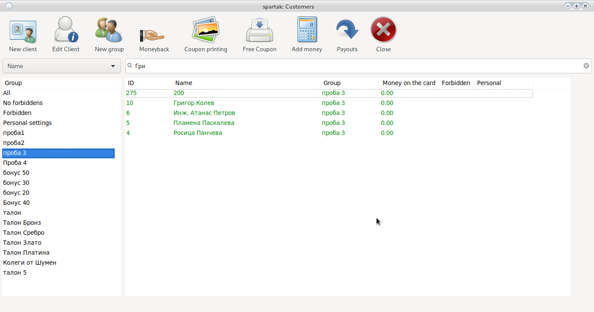

## Search for a customer

At the top of the main window is a search box.

From the drop-down menu, select criterion example __Name__ and enter Name or first letters.
By pressing the __enter__ button the system will perform wilting.

> <h5 style = "color: red"> Attention!  
> Recognizes lowercase and uppercase letters. </h5>

## Filter by group

In the left hour, there are built-in filters on the main window. With a single click on one of the groups,
the system will show the clients in this group.

## Add/Edit Group

Use the button to add a new group
<h4 style = "color: blue"> Add group </h4>

To edit an existing group:
<h4 style = "color: blue"> Double-click on the group name from [filter](cust.html#filter-by-group) </h4>

The system will open a group setup window

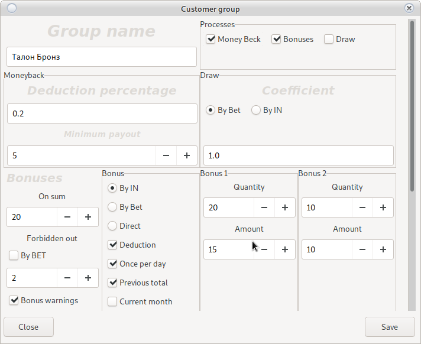

<h4 style = "color: blue"> Changing group settings will change all users in the group.  
Unless explicitly specified, the user uses individual settings.  
<a href="cust.html#_18"> Look Here </a> </h4>

### Group name

The name is free text. Used to allow the user to recognize one group from another.
> * Allowed to choose

     Dealers can only choose this group

> <h5 style = "color: red"> Attention!  
> <ul>
> <li> Recognizes lowercase and uppercase letters </li>
> <li> No duplicate names possible </li> </ul> </h5>

### Processes

These are the checkers in a square __Process__

They determine whether the group will deduct for __Money Beck__, __Coupons__ and __Bonus chests__

> <h5 style = "color: red"> Attention!  
> In case the process is stopped from here, then no setting of the respective process will work </h5>

### Money Beck

These are the settings of the Money Back system

See box __Monyback__

It connects two fields:

#### Percentage deduction

The deduction rate is based on a bet or works as an individual jackpot server.
<h3 style = "color: red"> 1 is 1% of each bet </h3>

> <h5 style = "color: red"> Attention!  
> 1 BGN = 100 credit
> 1% of 100 credit = 1
> </h5>

#### Minimum payout

The minimum amount in BGN that the client must reach in order to be paid by the croupier.
Only amounts greater than or equal to the set amount can be paid.

> <h5 style = "color: red"> Attention!  
> The system pays only full amounts. The accumulated pennies remain on the customer's balance sheet without being lost
> </h5>

### Maximum payout

If the money bag reaches the set amount, leva stops accumulating until the customer takes it

### Raffle coupons

This is the raffle coupon system.
Take a look at the __Draw__ box which has two settings

#### Method of calculation

There are two possible ways to calculate the number of coupons:
 * Beth (money rolling)
 * By Login (Deposit money)
 
> <h5 style = "color: red"> Attention!  
> We do not overwrite input calculation.
> It gives prerequisites to abuse input/output.
> Login counting will be removed in future versions.</h5>

#### Coefficient

The odds ratio is based on 100

or <h3 style = "color: red"> 1% = per 1 coupon per BGN 100 Bet  
0.5 = half a coupon for BGN 100 </h3>

#### Bonuses

This is the system for setting up the boxes with bonuses appearing on the display of the SMIB controller.

Use the scroll wheel until you see

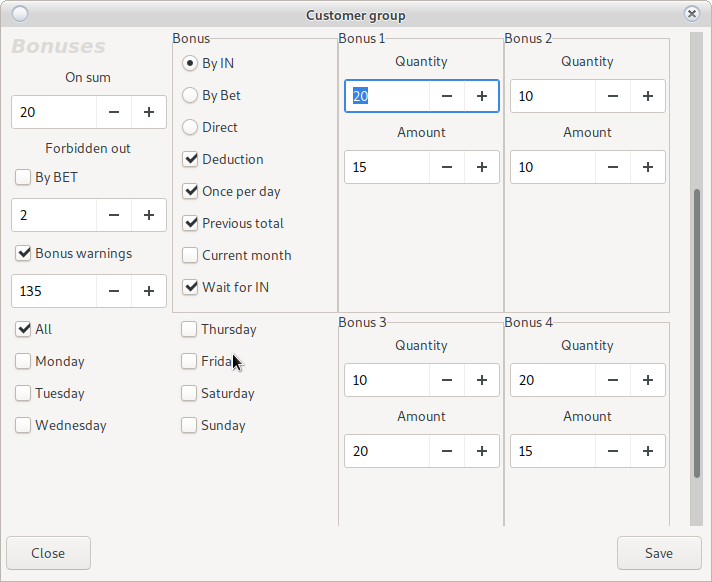

##### Section Sumy

* Amount option

This is the amount to show the bonus. Depending on the selected option, it is by bet or bet.
If the __Lost Money__ option is selected, the bonus will be displayed after the customer's total
the specified amount - the credit setting below [Here](config_system.html)

* Scroll bonus

Scrolling a bonus requires AFT. With option 1 set, the bonus will not require a scroll.
At 2 you will need to scroll twice.

Scrolling can be input or:

With a bonus of BGN 20 by scrolling x2, the exit will be possible on a BGN 40 credit.
In case of active option __Wait entry__ equal to the bonus with scrolling x2.
At BGN 20 bonus, the system will wait for BGN 20
entrance, out will be possible when reaching a loan of BGN 80.

Scroll with __Bet__ option:

The credit will be ignored and the system will allow an out when the beta becomes equal to or greater than the bonus X
the scroll or credit option falls under [Look here](config_system.html).

* Bonus warnings

When the customer's total reaches the specified amount, the display will show an invitation inviting the customer to
 download a paper bonus.
 
 
##### Section types of chests

* By IN

    The bonus will be calculated according to the customer's total.
    
* By Bet
    
    The bonus will be calculated on the Bet of the respective machine.
    
    __Does not calculate beta of all machines the customer has built during the day__

 * Previous total

     It detects the difference between money in and money out. Example: BGN 20 is inserted and 50 withdrawn, the total will be -30 and the amount will decrease. If there are 50 entered and 20 withdrawn, the total will be BGN 30.

* Direct

    Immediately after placing the card on the client, a bonus will be displayed

* Restricted

    The bonus passes as input. It cannot be withdrawn, but the profit can.
     > Example: 100 bonus comes in and the customer makes one spin for 1 BGN. You press out and it can't. You make a second spin for 1 BGN and the machine gives you back 10. The credit becomes 100-2+5 If you press cashout you can get 3 BGN
    
* Additional setup options
    * Withholding
    
        If the bonus is not lost, a __Detain__ will be made.
        The withholding can be referenced or credited to the croupier's cash register [View Trick](config_system.html)
    
    * Once per day
        
        The bonus will only be issued once a day for one customer. There is no indication of how many cards the client is playing.
         
    * Previous total 
        
        Active with bonus type  __By IN__ and __Once per day__.
        The bonus will only be displayed in a situation where the customer has lost the corresponding amount.
        __The total of the customer is calculated from all the machines he has played__
        
    * Current month
        
        Active with bonus type  __By IN__ and __Once per day__.
        The bonus will only be displayed in a situation where the customer has lost the corresponding amount.
        __The total of the customer is calculated from all the machines he has played__
        
    * Wait for entry
    
        After selecting the bonus box and accepting the bonus, the system will wait for an entry equal to the amount.
        for a bonus.

    * Many from redirect

         One bonus per day has such a checkbox (tick). A lot of redirect it's one bonus from one group per day, but it's not a problem to have 2,3 and more if they are from different groups
        
> <h4 style = "color: red"> Attention!  
> <ul> <li> All bonuses can be accepted or rejected. </li>
> <li> Canceled bonuses remain active until a daily report is released. </li>
> <li> Canceled bonuses can be played at any time and on any machine. </li>
> <li> The system accepts credit when removing a card as OUT </li>
> <li> The system accepts the credit when inserting a card as IN </li>
> <li> Be careful with the pennies in the loan. The total may not reach the required amount. </li>
> <li> Permissible difference from pennies [Look here](config_system.html) </li>
> </ul> </h4>    
> <h4 style = "color: blue">    
> The bonus system can work __With AFT__ and __Without AFT__
> <ul> <li> With AFT bonuses will go directly into the machine </li>
> <li> Without AFT, the bonus will require between one and three spins </li> </ul>
> </h4>
> <h4 style = "color: red"> Without AFT, adjust the credit in the machine </h4>

##### Days of the week

Bonuses will be active only on selected days.

When activated on __Wednesday__ the bonuses will be active from the daily report released on Wednesday to the daily
report released on Thursday.

For a special setting, see [Group Redirection](cust.html#group-redirection)

> <h4 style = "color: red"> Attention!  
> In case of using __Group redirection__ select option __All Days__
> </h4>

##### Bonus Cup Section

In its main part is a bowl in which you put a number of bonuses of a certain amount.

The more bonuses there are of a certain amount, the greater the chance that they will be withdrawn.

The cup does not end and with each draw the old bonuses are taken out and refilled.

> <h4 style = "color: red"> Attention!  
> Withdrawal of bonuses is random.  
> All crates contain 5 amounts randomly withdrawn.  
> From there it depends on the customer's choice</h4>

## Add/Edit Client

Adding a client is done by the __New Client__ button

To edit, select the required client and press __Edit Client__

The following window will open:

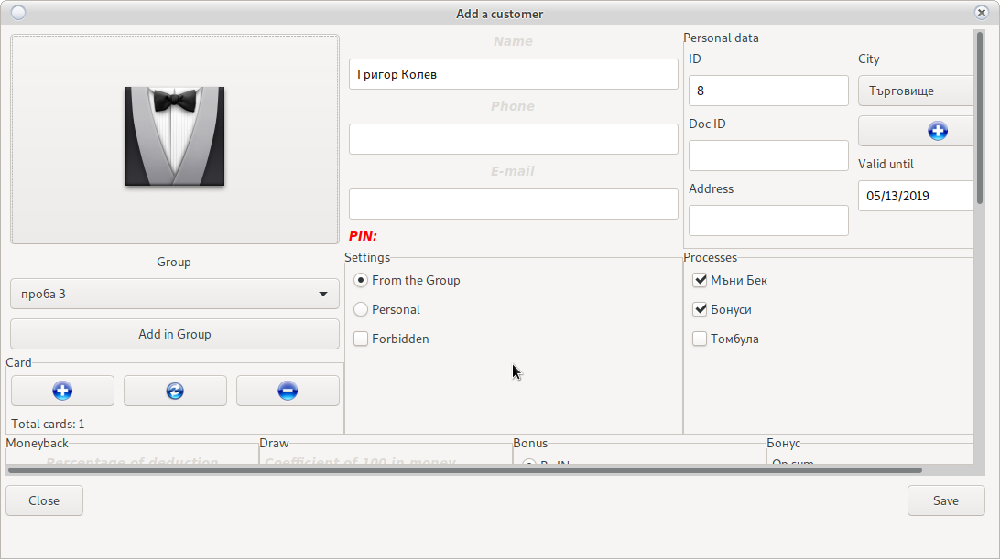

### Add a customer photo

In development. No active button.

### Section Group

Select a customer group from the drop-down menu.

Required attribute.

If no group has been created, use [Add Group](cust.html#addedit-group)

### Maps section

[Requires active RFID reader](config_system.html#printers-and-readers)

Add customer cards.

There is no limit to the number of cards.

The cards do not contain any information about the customer or the bonuses accumulated from the sky.

* Button 
    
    Adds a customer card.
    
    
    
    Insert the card into the reader and press __Save__
    Katra has been added and all machines will recognize the customer.

* Button 

    Remove a specific card from a customer.
    
    
    
    Insert the card into the reader and press __Save__
    The card will be removed and will not be attached to any machine.

* Button 
    
    Removes all customer cards.
    All cards will be removed and will not be active.

### Personal information

Mandatory __Customer name__ and __Location__

The name must be unique. Recognizes lowercase and uppercase letters.

__Location__ is selected from the drop-down menu.

In case it is missing, use the __Add__ button and it will open

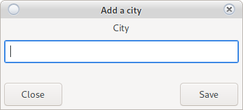

The name of the city must be unique. Recognizes lowercase and uppercase letters.
After saving __Location__ will appear in the drop-down menu.

All other attributes can be left blank.

> <h2 style = "color: red"> Attention!  
> In case you decide to fill in the remaining attributes  
> Observe the personal data law of the respective country. </h2>

### Prohibition

It will deactivate the client. The customer's cards will not be recognized by the machines.
Will not allow payment of __Money Beck__ and printing of __Coupons__

### Registered in the NRA

Clients who have registered with the NRA in the register for gambling addicts. It wants a token and they should not be allowed to play.

### PIN code

In development. Not used in this revision.

### Personal settings

Indicates that the client does not depend on the group and has individual settings.

In case of group change, this client's settings will not be changed.

To set up the client individually look [Here](cust.html#addedit-client) the logic of all settings works like
[New Group](cust.html#addedit-group) settings

## Pay moneyback

Payment of __Money Back__ [Requires active RFID reader](config_system.html#printers-and-readers)

Requires the client's frame to be marked by the croup of the working reader.

Insert the card into the reader. If the amount of [accumulated Money Beck corresponds to the minimum set](cust.html#addedit-group)

Accumulated __Money back__ will be zeroed and will be deducted from the croupier's cash register.

> <h4 style = "color: red"> Attention!  
> Requires access rights
> Only the full amount is paid. The pennies remain in the customer's account. </h4>

## Pay a moneyback without a card

Select customer from [main window](cust.html#client-module)

A right-click will open a menu.

Choose __Pay MoneyBack without a card__

Accumulated __Money back__ will be zeroed and will be deducted from the croupier's cash register.

> <h4 style = "color: red"> Attention!  
> Requires access rights
> Only the full amount is paid. The pennies remain in the customer's account. </h4>

## Remove card loss

If the rfid reader does not work properly, a client is lost.

Each loss is accumulated with general statistics such as input and output.

It is possible that the statistics will receive an unexpected total and will not open a bonus.

The button will remove the required statistics.

> <h4 style = "color: red"> Attention!  
> Removes all Credit IN and Credit OUT  
> Check the loss statistics first
> Use as a last resort! </h4>

## Coupon printing

Printing __ Coupons__ [Requires active RFID reader](config_system.html#printers-and-readers)

Requires the client's frame to be marked by the croup of the working reader.

Insert the card into the reader.

The accumulated _Coupons_ will be reset and will be printed on a POS printer.

> <h4 style = "color: red"> Attention!  
> Only the entire coupon is printed. The rest remains in the client's profile  
> Requires POS printer settings:  
> [Look](config_system.html) </h4>

## Print coupons without a card

Printing of __Coupons__

Insert the card into the reader.

The accumulated _Coupons_ will be reset and will be printed on a pos printer.

> <h4 style = "color: red"> Attention!  
> Only the entire coupon is printed. The rest remains in the client's profile  
> Requires POS printer settings:  
> [View](config_system.html) </h4>

## Free coupons

In the case of a machine without the possibility of mounting an SMIB controller, the coupons can be printed
 freely.

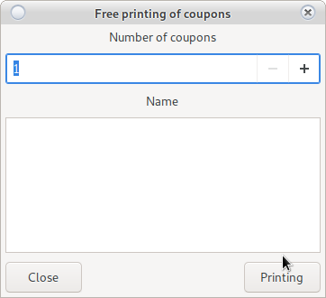

Enter the number of coupons and Customer Name. The coupons will be printed.

> <h4 style = "color: red"> Attention!  
> Requires POS printer settings:  
> [Look](config_system.html) </h4>
 
## Add money to a card

This is a casino cash register. Requires a customer card.

Requires AFT and setting of [SMIB keysystem section](config_system.html)

The money added to the customer's card will be added to the croupier's cash register.

Mark the card on the reader

A window will load

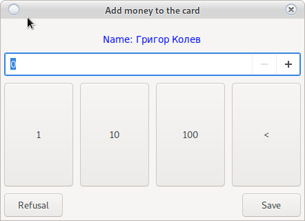

After inserting the card into the machine, the machine will make an IN for the same amount
This amount will not be taken into account in the report.

> <h4 style = "color: red"> Attention!  
> Does not work with two cards. The first machine will take all the credit
> In development. </h4>

## Pay money from a card

This is a casino cash register. Requires a customer card.

Requires AFT and setting of [SMIB keysystem section](config_system.html)

The money paid by the croupier will be taken out of the croupier's cash register and will be zeroed
at the client's cash desk.

Mark the card on the reader

Press __Record__

In case the customer pulls out a card from a machine.
The machine will make an OUT that will not be taken into account in the report.

> <h4 style = "color: red"> Attention!  
> Does not work with two cards
> In development. </h4>

## Money through ATM terminal

In the presence of a POS terminal.

The amount received through the terminal and put in the machine is an expense for the croupier.

The client is selected and __ATM__ is selected with the right mouse button

The amount of the transaction is selected.

The amount will be deducted from the cash desk of __Croupier__ and there is no need to write an expense.

## Quick customer reference

This is a quick reference.
Serves when we want to quickly check the client and divide it into a group.

Opens with __Double click of the client__

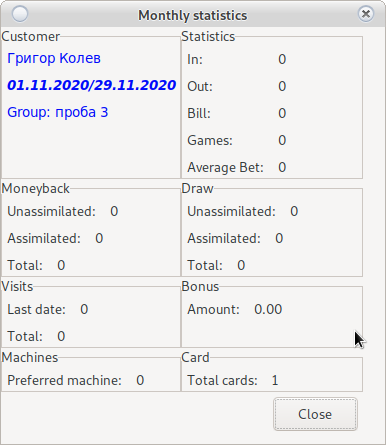

> <h4 style = "color: red"> Attention!  
> See the reference date.   </h4>

## Group redirection

At certain dates and times, one group of customers may be redirected with the settings to another.

__Fine settings__

Opens with the right mouse button [on filter](cust.html#filter-by-group)

It will load

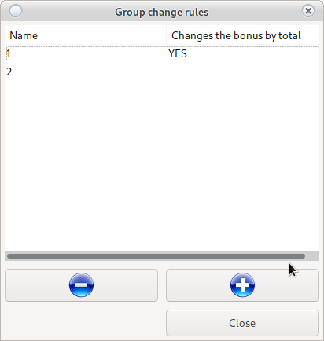

Group redirection rules have unique names.

* Button 
    
    Adds a new redirect rule.
    
* Button 

    Deletes a redirect rule.
    
The system allows all clients from group __X__ to accept the settings of group __Y__
in a certain period of time.

> <h4 style = "color: red"> Attention!  
> Does not work for clients with individual settings
> <a href="cust.html#addedit-client">Look HERE </a> 
> Bonuses redirects have a lower priority and are not executed
> if there is another active redirect </h4>

> <h3 style = "color: red"> Важно!  
> Bonus validity days are not assigned when redirecting.  
> Or if group __X__ does not work in the sequence, the redirection will not work either.
> </h3>

When you bring a redirect, you will see

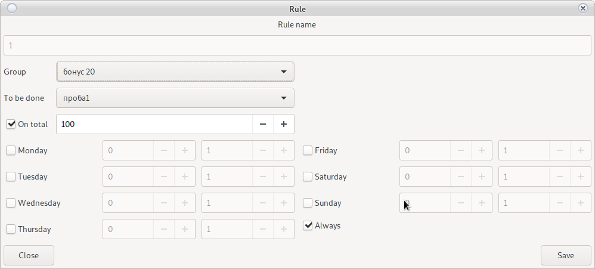

The redirect name is free, but must be unique. Used for user recognition.

The bonuses will appear in the reports with the name of the customer's recovery group, not with the redirected one.

* From Group
    
    This is the group that changes its settings
    
* To be done

    The group whose settings to accept. Even if the __Y__ group has no customers
    All customers of group __X__ will take its settings in the specified interval.  
    The interval is __day of the week__ from __hour to hour__
    
* When total to 

    If the option is activated, it changes the amount of bonuses if the total is based on the previous day, depending
    of the amount lost. There should be no redirects with a higher priority. 
    
## Book a machine for a customer

Right-click on the name of the desired customer and select __Reservation__

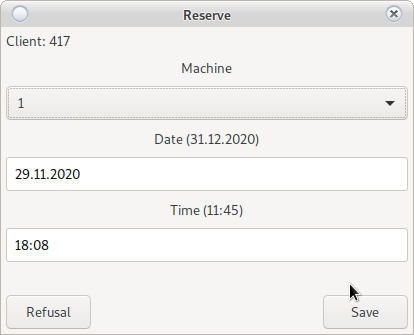
 
Enter when to select the selected machine and use __Save__
 
> <h4 style = "color: blue"> Attention!  
> The selected machine will be locked by SAS
> The machine will be unlocked after inserting a card belonging to a customer or  
> After reaching the specified time.
> </h4>
 
> <h4 style = "color: red"> Важно!  
> In case of an error, use the emergency button __Unlock SMIB__ or restart the SMIB controller.
> </h4> 

