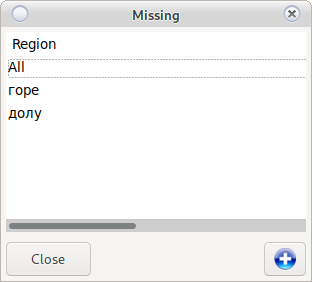

# Add machines

## Add / Edit Machine

To add a new machine use __Add Machine__

To edit an existing __Double click on the machine__ to the right of [Main window](device.html#add-machines)

A window for adding a machine will open

All fields are required

* Serial number
    
    Enter the serial number of the machine
    
* SMIB IP
    
    Enter the IP address of the SMIB controller
    In case the controller is new click on the field and press ctrl + n  
    This will automatically set the controller with the required IP address
    <h5 style = "color: red"> <ul> <li> Do not run two new controllers at the same time </li>
    <li> Adjust one at a time with ctrl + n </li>
    <li> Do not place two controllers with the same IP in the casino </li>
    <li> Change the IP of one with ctrl + n </li>
    <li> You can rearrange all IPs with ctrl + n without physically moving the controllers </li>
    <li> Never use IP addresses (192.168.1.5, 192.168.1.6, 192.168.1.9, 192.168.1.7, 192.168.1.8)
    for other devices on the network (DVR, Phone, Computer, etc.) </li> </ul> </h5>

* Get UUID

     Copies the machine's serial number to the clipboard.

* Version

     Shows the SMIB version
    
* Region

    Select the region in which the machine operates
    If there is no region, use 
    
* Manufacturer

    Machine manufacturer. Use the  for a new manufacturer
    
* Model

    Machine model. Use the  for a new model
    
* SAS Available

    For machines with SMIB control. [View automatic report](order.html#report)

* SAS Missing

    For machines without the possibility of connection in the system. [View manual report](order.html#manual-report)

* Option Working

    In case of removing a machine from a casino, remove the option
    <h5 style = "color: red"> Do not edit the machine, disable the old one and create a new one when changed. </h5>

* Scroll right

    In very rare cases, when reaching an 8-digit counter, the machines will cut the pennies.
    <h5 style = "color: red"> If you're not sure, leave the default. </h5>
    
* Download information

    It will take all the counters from the machine and fill in the fields.  
    Requires SAS Available

* Room in the hall

    Machine number in the hall. In some places, it is found as `License number`
    
* In

    Electronic input of the machine
    
* Out

    Electronic output of the machine
    
* M. In

    Mechanical input. Required for correct calculation of mechanical counter  
    View [edit mechanical counters](main.html#mcounters)
    
* M. Out

    Mechanical output. Required for correct calculation of mechanical counter  
    View [edit mechanical counters](main.html#mcounters)
    
* Bet

    Bet. Used to calculate the rate of return.
    
* Won

    Profit. Used to calculate the rate of return.
    
* Bill
    
    Bill counter. Serves to manage the bill.
    
* Odds

    Coefficient of the machine. Depends on the settings of the machine itself
    <h5 style = "color: blue"> 1 credit X 0.01 = 0.01 cents </h5>
    
* M. Odds

    Mechanical coefficient. Depends on the machine settings.
    <h5 style = "color: blue"> 100 credit X 0.01 = 0.01 stotinki * M.Coef = Scrolling through 1 lev </h5>
    

## Add Region

 adds a new region

Enter __Unique Name__ and press record.

The new region will appear in the list.

## Add Manufacturer

Add a new manufacturer

Enter __Unique Name__ and press the __Save__ button

The new name will appear in the list

## Add a model

Add a new machine model

Enter __Unique Name__ and press the __Save__ button

The new name will appear in the list

## Jackpot entry

Saves changes to the jackpot server

## Filters

To the left of [Main Window](device.html#home-window) are filters

__Single click__ will show to the right of [Main window](device.html#home-window) only the machines matching
of the conditions