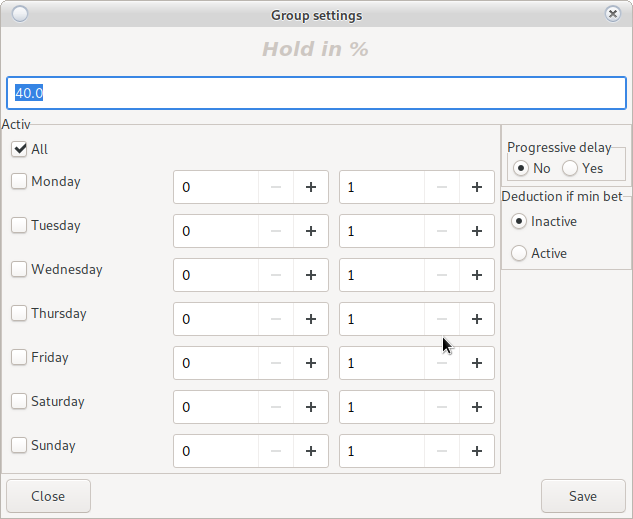

# Login to Jackpot Server

Requires a stable internet connection

For security purposes, all communication goes to [Redirect Server](config_system.html#internet)


User: __root__

Password: __123456__

<h5 style = "color: red"> Important! <br>
After login, create your user and remove __root__ <br>
The user for logging in to the Jackpot Server does not depend on the user of the Reporting System </h5>

# Main window

Main window of the settings program.


## Machines

Introduction of a new machine in the Jackpot Server

To add or change machines from [Server Reporting System](device.html#jackpot-entry)


<h5 style = "color: red"> Changes will not take effect until they are saved on the server </h5>

### Double click on a machine

Provides information about the machine and checks for a connection to __Jackpot Server__

### Add

To add a new machine to __Jackpot Server__

Look at the IP address of the SMIB controller and which machine number in the hall corresponds to
[Home Screen](main.html), you will need to enter it.


Enter the required information.

Do not use the option __mechanical counters__ will be removed in future versions.

Use the __Save__ button

### Edit

Edit an existing machine

Select the machine you want to edit and use the __Edit__ button


Change the required information.

Do not use the option __mechanical counters__ will be removed in future versions.

Use the __Save__ button

### Delete

Removes machine from __Jackpot Server__

Select a machine and press the __Delete__ button

### Help

Opens current documentation

### Percentage

Reduces SMIB controller deductions to all groups

At a value of 0.8 and a game of 1 lev (100 credits) the server will make a deduction of 80 credits.

### Turn off the game

The selected game will not be credited to __Jackpot Server__

Example: Tape measure

## Visualizations

Visualization settings


Visualizations can only participate in one group of mysteries

Free visualizations are not used and can be added to a new group.

Please release a preview before adding it to another [group](jackpot.html#groups)

### Add

New and free visualization. It can be used for a new group
or added to an existing one.

You may need to restart the new preview when initializing.

### Delete

Removes the selected preview.

Make sure the group is not left without previews.

### Audio Test

Sends a sound test signal to the selected preview.

### Help

Opens current documentation

### Restar

Restarts the selected preview

In development.

It may not work


## Groups

Mystery group settings. __Jackpot Server__ has no limit on the number of groups.

Groups like __classic game__ can contain up to 5 levels.

Groups like __time play__ can contain up to 2 levels

Groups like __bombs__ have no limit on the number of levels, but they do not have their own visualization.
They simply send a drop signal to a preview occupied by another group.


### Add a new group

Use the add button. Names are free, but must be unique.

Enter a recognition name and select a game type.


Use the __Save__ button

The new group will appear in the main window.

### Preview in a group

To add a new preview to the group, use the __right button__ on the group name.


To add vizualizations to a group use button 

 To remove vizualizations from group use button  

### Add a machine to a group

To add a machine to the group, use the __right button__ on the group name.


To add machine to a group use button 

To remove machine from group use button  

### Central group settings

This is a setting that is used in case no individual setting of __level__ has been added.



#### Retention in %

At 40% the mystery will keep 40% of the difference between __Initial__ and __End____ value
unless otherwise specified in the level itself.

#### Active

A day and time for the mystery group to be active. The rest of the time it is locked and does not rotate.

#### Progressive delay

The higher the mystery, the slower it counts.

#### Minimum bet deduction

When set __Minimum BET__ for a fall, the mystery will not count if the game is weak
from the minimum BET

### Add a level

Use the __right button__ on the group name

Depending on the selected type of game are divided into three types

#### Classic game


<h5 style = "color: red"> Attention! <br>
In a race, when a player is inactive for more than 3 minutes <br>
The server will remove the player from the participants and will reset all the bet </h5> he has accumulated

* Enter a unique name for recognition

* Base is the amount from which the mystery of initialization will begin

    After falling to the base will add the value of the accumulated hiden
    
    At initialization to borrow an initial value at will otherwise the mystery will
    starts with an amount of __0__

    If you do not want to have an Initial Value, after saving to the server, open in edit mode and
    make the base amount __0__

* Retention in% is the retention of a certain% before falling

    If you enter a value of 40 for a mystery with limits of 100-200, the mystery will fall after BGN 140. <br>
    Leave 0 to disable the <br> option
    If the hold rate is set in group settings and this option is disabled it will
    the group setting will be used
    This option has a higher priority, in case of activation the group setting will be ignored.

* From the amount

    The amount at which the mystery will enter active fall mode
    
* Up to the amount

    The amount that the mystery should not exceed
    
* Deduction in %

    1 equates 1% per 100 credits = 1 credit <br>
    at a ratio of 0.01 one credit = 0.01 stotinki <br>
    Look at the set factor of the machine
    <h5 style = "color: red"> Attention! <br>
    For machines with a ratio other than 0.01, the mystery will not fall on credit, <br>
    due to inability to pay the full amount. <br>
    Pay the amount by hand! </h5>
    
* Hidden %

    Percentage for deduction of hidden __hiden__ value <br>
    1 equates 1% per 100 credits = 1 credit <br>
    at a ratio of 0.01 one credit = 0.01 stotinki <br>
    Look at the set factor of the machine.
    
* Classic mystery

    After reaching a random amount, the mystery will fall into the credit of the machine
    
* Racing mystery

    Once a random amount is reached, the mystery will enter racing mode
    Will declare a value to fall
    All competitors start from __0__ <br>
    The contestants with the most accumulated __bet__ will appear on the scoreboard <br>
    After reaching the pre-announced amount, the server will decide who the winning player is. <br>
    
    <h5 style = "color: red"> Attention! <br>
    Only players raised on the board have a chance to win <br>
    The biggest bet doesn't have to be a win-win. <br>
    The accumulated bet only increases the chance. </h5>
    
    ```
      Total Bet = 100
      Total players = 3
      Player 1 bet = 50
      Player 2 bet = 30
      Player 3 bet = 20
  
      Player one has a 50% chance of winning.
   ```

* Range in competition

    Two amounts from which an amount will be chosen which will be added to the amount of the mystery
    when entering a race.
    
    <h5 style = "color: red"> Attention! <br>
    It is possible that the mystery exceeds the amount set in the field __To amount__ </h5>
    
    ```
        Amount up to = 100
        Mystery enters race mode = 90
        Adds random value between ranges in races: 10 to 50
        Selects a random value 20
        Announces a drop of BGN 110
    ```
* Number of players in a competition

    From 2 to 5 players on the board
    
* X2

    In a certain interval of time the sum of the mystery will be multiplied by 2 <br>
    <h5 style = "color: red"> Attention! <br>
    With a mystery value of 100 and an active option from 19 to 20 hours: <br>
    If the mystery falls in the time interval, its value will be 100 * 2 </h5>
    
* Minimal bet

    Not used in competition. This is the minimum amount a player must spin,
    to win a mystery.

* Mandatory card

    Requires card momul.
    
    In the absence of a client card, the mystery does not deduct.

#### Time game

This is a time-falling game and there is no upper limit on the amount accumulated.

Maximum number of levels 2.

<h5 style = "color: red"> Attention! <br>
Mysteries of the time type can fall only once in the specified time interval </h5>


* Name

    The name must be unique
    
* Period

    * Living room
        
        The mystery will be activated every day in the specified time interval
    
    * Weekly
    
        Select the days on which you want the mystery to be activated
        
* Value

    This is a value from which the mystery will always begin after a fall.
    
* From Hour

    Time for the mystery to enter __Active__ mode
    
* Until Time

    Time for the mystery to enter __Inactive__ mode
    
* Fixed value

    The mystery does not accumulate. The declared value falls.

* Accumulation

    The mystery accumulates with the deduction rate
    
    <h5 style = "color: red"> Attention! <br>
    If the mystery does not fall within the specified interval, its value will not be reset. <br>
    It will be transferred in the next time interval </h5>
    
    ```
        Day one initial value = BGN 50
        At the end of day 1 accumulated = BGN 10
        Day 2 initial value = BGN 60
        End of day 2 accumulated = BGN 50
        Day 3 initial value = BGN 110
        Fall and end of day 3
        Day 4 initial value = BGN 50
    ```

* Minimal bet

    A bet over which a player must play to win the mystery.
    
    
#### Bombs

The difference with __Time play__ is:

* no limit on the number of levels

* Does not require its own visualization

* Time intervals can contain minutes

    18.15 = 6 hours and 15 minutes.
    
### Help

Opens the current documentation

## Events

Reports of fallen mysteries


View [Reports](report.html)

## Server

Server information and rental server activation


### Activate

Extends the date of operation of a rental server.

Contact with <a href="mailto:grigor.kolev@gmail.com"> Grigor Kolev </a>

### CRC

Calculates and checks whether the CRC of the server corresponds to the version registered in __DKH__

Any unauthorized change will cause the __Jackpot Server__ to be blocked.

### Help

Opens the current documentation

## Users

User Management on __Jackpot Server__.

__Jackpot Server__ users are independent of [system users](user.html)


### Add

Adds a new user

### Remove

Select a user to remove and use the __Delete__ button

<h5 style = "color: red"> Attention! <br>
Remove all users or forgot password <br>
will not interfere with the operation of the server. <br>
But access to settings will be revoked without the possibility of recovery. </h5>

### Help

Opens the current documentation

## Refresh

Retrieves the necessary information from the server to change the settings

<h5 style = "color: red"> Attention! <br>
If you are unsure of the settings you have made <br>
Re-grow. This will remove all changes. </h5>

<h4 style = "color: red"> Attention! <br>
Make sure you have a stable internet connection with the server. <br>
If the information is recorded incorrectly, try saving again <br>
</h4>

<h4 style = "color: blue"> Attention! <br>
The information is transmitted through technology __Key, Value__ <br>
Each key must be stored in and intact or will not be saved
In case of communication interruption, it is possible to save one change, not another. <br>
We recommend changes to the server from __local network__
</h4>

## Write it down

Saves all changes to the server.

<h5 style = "color: red"> Attention! <br>
Do not make changes to the server during intense gameplay </h5>

## Hold

Stops the rotation of the server.

All mysteries will stop the deduction


## Play

Starts server rotation.

All mysteries will begin to count.

## Archive

Creates an archive of information from the __Jackpot Server__

Please use this option, it is not placed accidentally.

You can make archives in for many casinos, but only the last one for one casino will be active.

## Load

Loads information from a created archive.

## Help

Opens the current documentation

## Exit

Exit the program and serve in [login window](jackpot.html#login-to-jackpot-server)