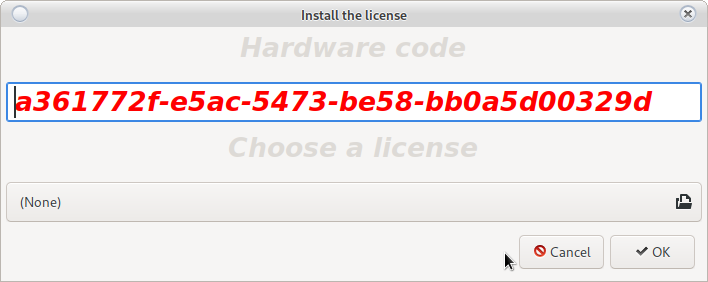

# Licensing system

Software licensing system. A system that protects intellectual labor.
Any change in licenses will cause the system to crash.

Please do not attempt to modify the license

"You are responsible for such actions."

Do not modify or copy the cutters on the information server

"It will cause a system crash."

Do not attempt to install a license intended on another server.

<h5 style = "color: red"> Licenses are valid only for the device for which they were created </h5>

<h5 style = "color: red"> All licenses are valid for 2 years. </h5>

<h5 style = "color: red"> The system will warn you 10 days before any licenses expire. </h5>

<h5 style = "color: red"> Any license may be revoked without notice from the manufacturer
This will cause the system to crash. </h5>

In case of a license problem, contact

<a href="mailto:grigor.kolev@gmail.com"> Grigor Kolev </a>

## Validation

By double-clicking on the respective license, you can check if it is valid and installed correctly.

## New license

To add a new license use the __New License__ button

The following window will open:

Send the non-generated code to:

<a href="mailto:grigor.kolev@gmail.com"> Grigor Kolev </a>

You will be returned a file with the appropriate license.

From the __Select license__ option select the submitted file and use the __OK__ button

The new license will appear in the [main window](license.html#licensing-system)

<h5 style = "color: red"> Make sure the new license is installed  
using a double click. </h5>

<h3 style = "color: red"> Important!  
The uploaded file is valid for __45__ minutes.  
Install immediately upon receipt. </h3>

