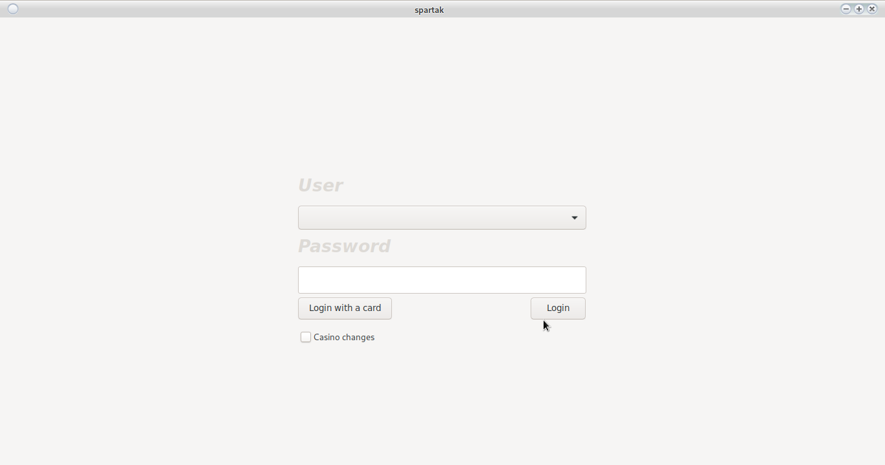
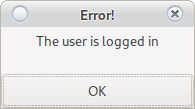
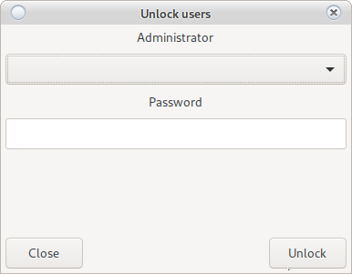

# Login to the system

Main login window.
A user is selected from the drop-down menu and enters a password. Inactive users are not displayed.

Default:
 
 * User __root__
 * Password __123456__
 
> ** Fig.1 **
>
> 


# Change the casino and add a new one

See [Change server](change_server.html)

# Change the login method

Card Login [Requires active RFID reader](config_system.html#printers-and-readers)

From the button "Login with Card" changes the way of login to the system (from standard password login to login with card)

View [Settings/System/Printers and Card Reader](config_system.html)

When choosing a login with a card, each user logged in once this way will lose the opportunity to
login with a password if the system is set to login once. A message appears on the screen.
<h5 style = "color: red"> For unlocking, see [Unlocking a locked user](login.html#unlock-a-locked-user). </h5>




[Settings/System/System](config_system.html)

# Unlock a locked user

When the login once setting is active, a message from Fig.2 can be displayed

This means that the user has logged in from another program or the program is closed incorrectly.


> ** Fig.2 **
>
> 

Use the __CTRL + q__ button then the Fig.3 window for unlocking the user will be displayed.

A user with unlock rights must be selected. This action will unlock all locked users.

> ** Fig.3 **
>
> 


```
Restarting the server unlocks all users.
Restarting the server discards all users.
```

# Registration at POS Terminal

[Workstation registration](config_system.html#workstations)

# Licensing

[Settings/Licenses](license.html)

# Messages

* Not registered POS.
    * The owner has taken away the rights of the computer to connect to the casino
    * The computer is a new POS terminal.
    * The operating system is reinstalled or there is a change in system partitions
    
    The system can be registered by a user with rights.
    
    [View](config_system.html#workstations)

* Invalid base license
    * The system is new
    * License has expired
    * License is forcibly revoked (in case of an attempt to change the system code)
    
    Please contact an administrator to renew your license.
    
    With a forcibly revoked license, renewal is not possible.
    
    [View](license.html#new-license)
    
* Expiring license
    * One of the registered licenses is expiring.
    
    Contact an administrator within 10 days. <br>
    [View](license.html)
    
* Wrong password
    * The system recognizes lowercase and uppercase letters
    * Look at the input language
    * Connect with a user with rights to change the password
    
    After changing the password from another user in the main panel, press ctrl + p to choose a new password.

