# Home window

This is the first window after logging in.
There are module selection buttons, emergency buttons and quick action buttons.

> <h5 style = "color: red"> If you don't see any of the buttons, you probably don't have access rights to
 the corresponding function or module </h5>

** Fig.1 **
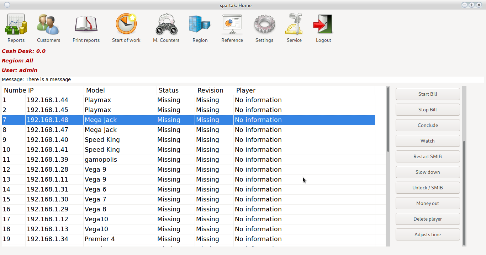

# Modules

## Reports

Cash flow reporting and management module.
For more information, see [Reports](order.html)

## Clients

Client card management module.
For more information, see [Customers](cust.html)

## M.Counters

Checking and repairing the mechanical counters of the machines.
A window opens:

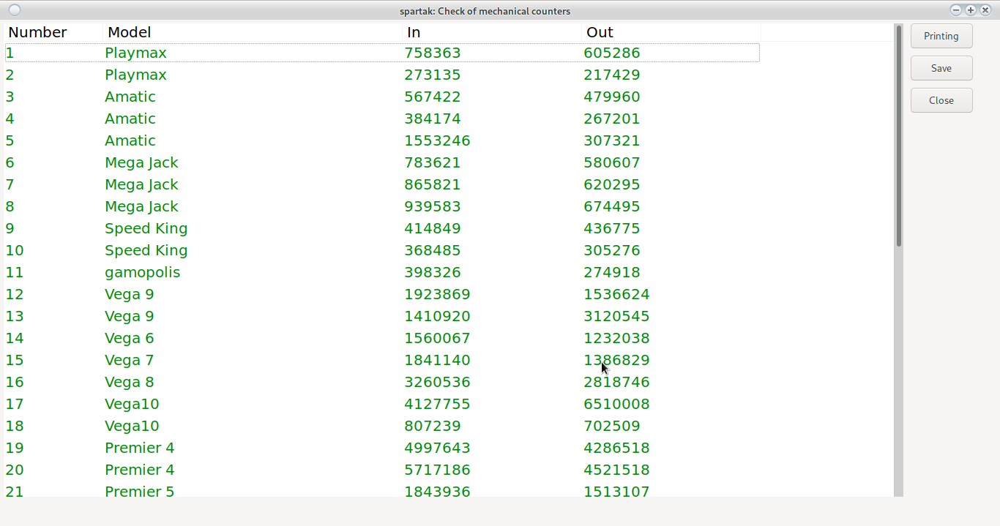

From the print button, a sheet with the current counters and a field for making changes is displayed.

If there are changes in the double-click counters on the respective machine, it opens

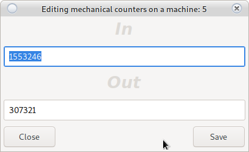

Mechanical counters are repaired and recorded. The system will return to repair mechanical counters.
The machines that have been repaired are marked in red.

The changes will not take effect until the __Save__ button is clicked in the main window.

> <h5 style = "color: red"> Recommended check of mechanical counters is every month.  
Depending on the coefficient, it is possible to give a difference of 2 to 50 BGN. </h5>

## Region

Select the region in which the user works.
Opens a dawn to change the region.

> <h5 style = "color: blue"> Only machines running in the selected region are displayed in the main window. </h5>

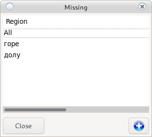

 adds a new region

## Print reports

Printing a report for __DKH__
Opens a report window.

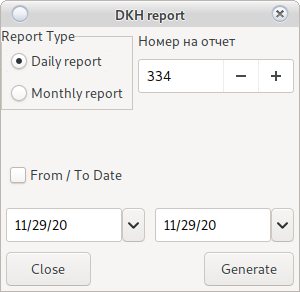

Select report type:

* Daily report
    
    It takes the previous daily date as the starting date and the current date as the end date.
    
    The daily report number can be changed if you have rights.
    
    Collects all the information and prints it.
    
* Monthly report
    
    > <h5 style = "color: blue"> In case you don't see __From / To date__.
    > Contact the owner to add rights </h5>
    
    If __From / To date__ is not selected, it assumes the previous daily start date, and the current current end date.
    
    When selecting __From / To date__ will use the set values
    
    The monthly report number can be changed if you have rights.
     
    Collects all the information and prints it.

## Start of shift

A croupier change starts and a region selection window opens.

From there, the user selects the region in which he works.

> <h5 style = "color: blue"> Only machines running in the selected region are displayed in the main window. </h5>

A new region can be added from the  button.

The system always remembers the last selected region. Due to frequent errors, the system will not allow a report if
no shift started.

> <h5 style = "color: red"> Warning!   The system will not allow a report if there is no start of change </h5>
> <h6 style = "color: blue"> In the wrong region, look at </h6>
> [Region](main.html#region)

## Reference

Help module. For more information, see [References](report.html)

## Settings

Settings module. For more information, see [Settings](config.html)

## Service

Settings module. For more information, see [Service](service.html)

## Exit

Will end the user session and return the system to [Login](login.html)

# Quick action

The buttons to the right of the main window

## SMIB check

It will check if all SMIB controls are working and have a connection to a central server.

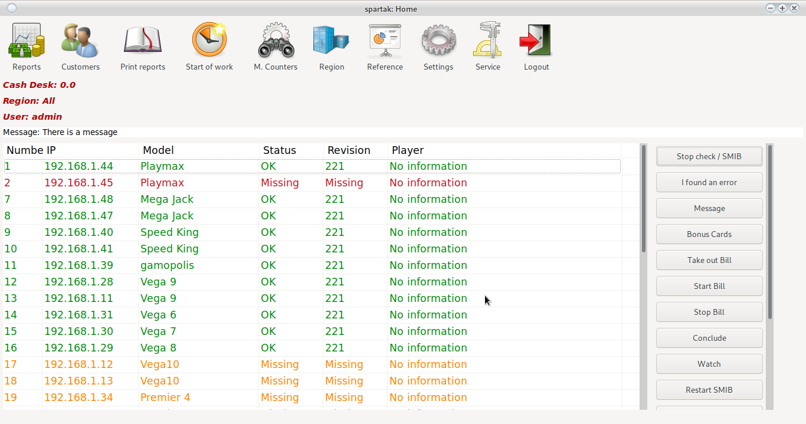

In case it is delayed on a certain non-working controller, all after it will be colored in <h5 style = "color: red"> Red </h5>

Just wait for the process to continue.

The tested SMIB controllers are by color as follows:

* <h5 style = "color: black"> Not checked </h5>
* <h5 style = "color: green"> The controller is running </h5>
* <h5 style = "color: red"> No connection to controller </h5>
* <h5 style = "color: blue"> The controller is running and there is a player on the machine </h5>
* <h5 style = "color: purple"> The controller has an unknown revision (Update) </h5>
* <h5 style = "color: yellow"> The controller has an unknown revision (Update) </h5>

## I found a software error

Collects all the necessary logs from the selected machine and sends them to the programmers.

It helps to make the program better. Does not collect counters or personal information, only
information about the errors generated in the code.

## Messages

Allows writing messages between users of the system.
Opens a message dialog

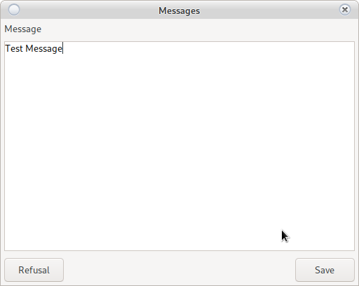

After entering a message, it can be read even by any user with a double click on
inscription

`Message: There is a message`

> <h5 style = "color: red"> Attention!  
> Unauthorized users are unable to write or edit messages </h5>

## Bonus Cards

This is a reference to the moment of all fallen customer bonuses, bonus cards and all those who need it
be hit if the feature is enabled [for customers](cust.html) and/or [bonus cards](config_bonus.html)

> <h5 style = "color: red"> Attention!  
> In case you want the withheld bonuses to be credited to the croupier's cash register  
> look </h5>
> `Settings/System/System`

## Take out Bill

Quick removal of the ridge from the machines. Used in case the croupier needs to find quickly
money in the middle of the shift.

Detects the current state of the ridge and displays the amount in the cartridge.
By double-clicking it is determined from which machines it will be taken out as the numbering of the machine will be colored in

<h5 style = "color: green"> Green </h5>

The machine's bill will stop taking money until it is clicked again
 the machine does not turn red <h5 style = "color: red"> Red </h5> or the __Remove__ button is not pressed.
 
If the bill does not block, see `Settings/System/System` [Here](config_system.html#system)

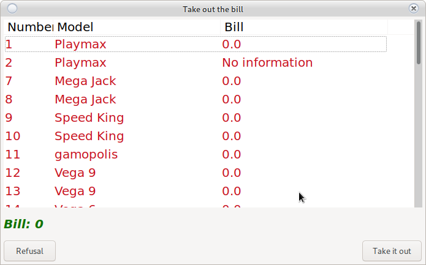

After pressing the __Down__ button, the collected amount will be credited to the croupier's box office, and the bills will
continue their normal operation.

> <h5 style = "color: red"> Attention!  
> The system will make a zero entry in the report reports.
> There will be no input and output in the record, but there will be.
> This entry will not prevent you from continuing to work, it is simply informative. </h5>

## Play the bill

In case it was not started due to a technical problem after [Report](order.html) or was [stopped](main.html#play-the-bill) it would start
 of the machine in operating mode.

## Stop bill

She stopped at the machine of the machine.

The bills will go out and they will stop taking money. It can be used in case the croupier remains
no money. This will force customers to pay in cash and not put the money in the bill.

Use [Play Bill](main.html#play-the-bill) to restart the bill 

## Reservation

It will currently lock the machine under SAS.
When pressed again, it will unlock.

> <h5 style = "color: red"> Attention!  
> Button is under development.
> The full functionality will appear in one of the next revisions.
> The logic is for the machine to be reserved for customer __X__ to __Date and time__.
> In case the customer for whom the machine is reserved puts a card in it, it will be unlocked automatically.
> Tdug client will not be able to build on the specified machine until __Date and time__.</h5>

## Watch

Real-time machine monitoring system.

From [Start window](main.html#home-window) select a machine

<h5 style = "color: blue"> In case you want to select more than one machine use ctrl + Click on the machine </h5>

<h5 style = "color: blue"> In case you want to select all machines use shift + click on first machine + click on last machine </h5>

A monitoring setup window will open

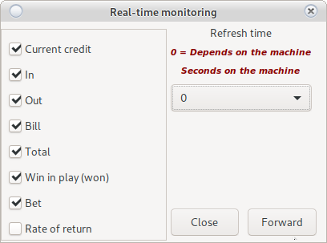

On the left you select the parameters you want to monitor, and on the right you slow down the monitoring cycle by __X__ seconds.

> <h5 style = "color: red"> Attention!  
> <ul> <li> The more machines you select, the slower the cycle will be and it is possible to skip one or two beta </li>
> <li> If you select only one machine, the refresh rate will be so fast that it will be difficult to monitor. </li>
> <li> Adjust the refresh time from the settings window. </li>
> <li> One spin of the reels takes 1 second. </li>
> <li> If you select a machine with a technical problem, it will cause a big delay in all machines. </li>
> <li> Do not select a damaged machine or a machine with a damaged SMIB controller. </li> </ul> </h5>

Then with the __Noview__ button a window will open:

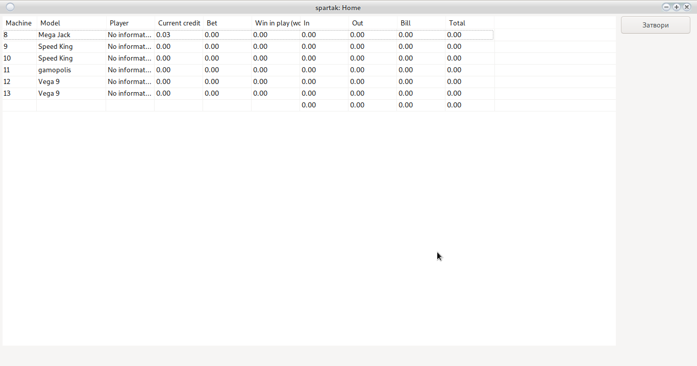

From the __Close__ button you return to [Home window](main.html#home-window)

## Restart SMIB

Restarts the SMIB controller. In the vast majority of cases, only a software restart is required.
Hardware restart is required mainly when adding new items to the screen of the card module or
in case the SMIB controller is also a preview and there are new elements added to it.

<h5 style = "color: blue"> In case you want to select more than one machine use ctrl + Click on the machine </h5>

<h5 style = "color: blue"> In case you want to select all machines use shift + click on first machine + click on last machine </h5>

Hardware restart in the fastest case starts after one minute, this will cause the display to turn off
and reload the SMIB controller.

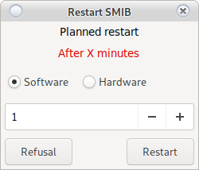

> <h5 style = "color: red"> Attention!  
> <ul>
> <li> The software restart is immediate and takes about 10 seconds. Does not turn off the controller </li>
> <li> The hardware restart takes at least 1 minute to start and about a minute to fully boot the system. </li>
> <li> The card reader should not have a card inserted (it will cause the controller to block) </li>
> <li> Hardware restart can be scheduled over time in restart setup (600 means after 10 minutes) </li> </ul>
> </h5>

## Slow down the reels

Delays the stock rotation stock by __X Milliseconds__
It will open a setup window

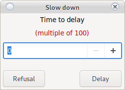

> <h5 style = "color: red"> Attention!  
> <ul> <li> Delay time must be a multiple of 100 (100, 200, 300, 1500) </li>
> <li> For EGT machines the autoplay button will start working as a start </li> </ul>
> </h5>

## Unlock/SMIB

The system has a built-in security system for legacies bonus look [Here](config_system.html#smib)

<h5 style = "color: blue"> In case you want to select more than one machine use ctrl + Click on the machine </h5>

<h5 style = "color: blue"> In case you want to select all machines use shift + click on first machine + click on last machine </h5>

In case of placing legacy bonus did not go through the encryption of the SMIB controller, the machine will be locked.

> <h5 style = "color: red"> Attention!  
> Check for foreign devices before unlocking the machine. </h5>

## Take out the money

Emergency button. In the case of a bet scrolling is not possible out of the money.
If a croupier makes a mistake, this button will take the money out of the machine without consequences for its operation.

> <h5 style = "color: red"> Attention!  
> Requires AFT, see [Settings/System/SMIB](config_system.html#smib)</h5>

## Delete player

Emergency button.

If due to a technical problem the customer's card remains attached to the controller,
then this card cannot be used on another machine.

The card pasting function is for synchronization between all controllers.

Until the client and all the information is saved by one controller on a central server, another
the controller is unable to load the same card.

> <h5 style = "color: red"> Attention!  
> There may be a technical problem in the machine that does not allow recording
> (broken SAS cable, damaged switch or damaged RG45)
> This button will release all clients manually. </h5>

## Check the time

Checks the date and time of the machine with the set value.

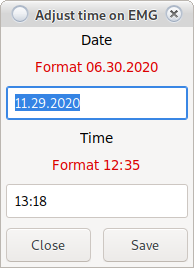

> <h5 style = "color: red"> Attention!  
> Observe the specified format </h5>

## For repair

Double-clicking on the machine signals a problem in the machine (burned monitor, not working button, etc.)

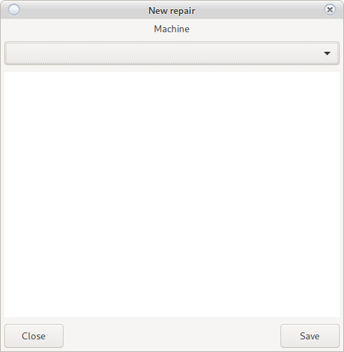

The machine number is selected automatically.

Describe the problem and press the __Save__ button

If it is [configured](config_system.html#system) the signal is automatically forwarded to the service e-mail and
 is recorded in the information system.
 
## Change user password
 
 Press ctrl + p will open a window to change the user's password
 
## Help
 
 Press F1 or fn + F1 to open the documentation

