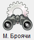

# Mechanical counters

> * With the button  from the main menu of the program one can see the display of the mechanical counters of the machines.
> * By double clicking on the machine the counters can be changed if necessary.

> * The print button will print the current state of the counters.
> * The record button will record the current state of the server counters.