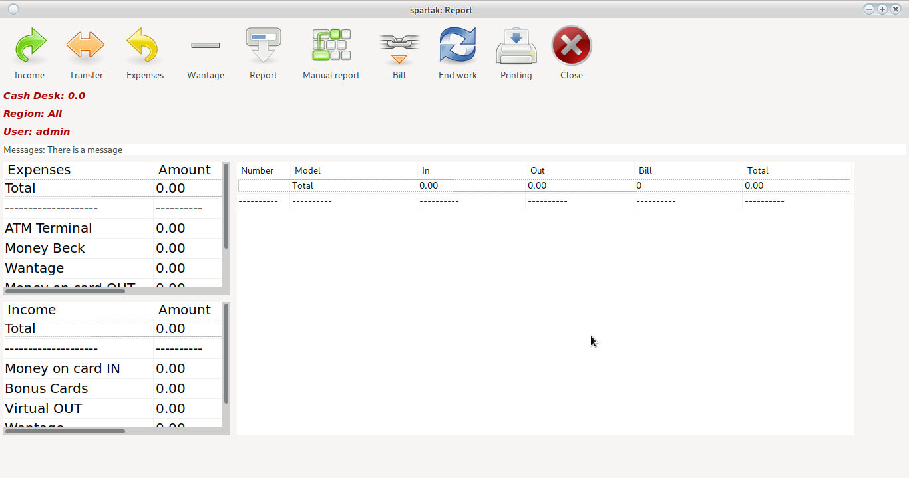
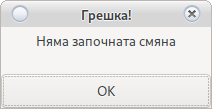
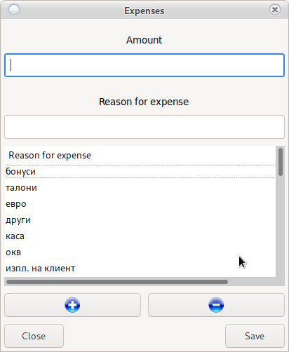
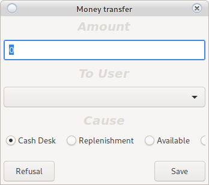
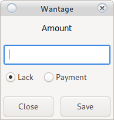
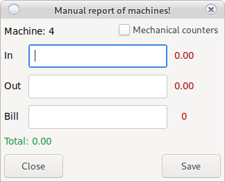
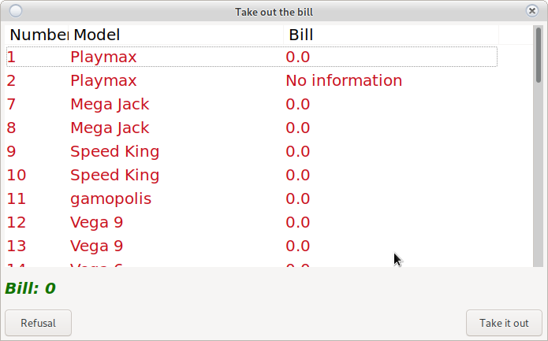
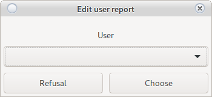

# Reports module

Croupier reporting system

In case a message came out

Look at [Start of Change](main.html#start-of-shift)

## Income

Enter the amount of income.

Select Reason for income, and if any, enter additional information.

* Basic
    * The boss brought me money
    * The service returned my change
* Information
    * The wife of the boss
    * Technician
    
If there is no reason:

 button

Adds a new reason.

 button

Removes the selected reason.

The names of the grounds are unique and recognize lowercase and uppercase letters.

> <h4 style = "color: red"> Attention!  
> Removing a base does not delete it, it just hides it
> Remember that names are unique </h4>

> <h4 style = "color: blue">    
> If you make a mistake, you can double-click on revenue </h4>

## Transfers

System for transferring money from one user to another.

This in internal money transfer from user __X__ to user __Y__

Enter the amount and select the user to whom you will make the transfer.

Choose a reason. For unfounded reasons, choose another and enter descriptions.

Requires user confirmation __Y__

> <h4 style = "color: red"> Attention!  
> The specified amount is deducted from the user's cash register __X__ and credited to the user's cash desk __Y__
> </h4>

## Expenses

Enter the amount of expense.

Select Reason for cost, and if any, enter additional information.

* Basic
    * My service requires money
    * The courier came
* Information
    * Econt, Speedy
    * Technician
    
If there is no reason:

 button

Adds a new reason.

 button

Removes the selected reason.

The names of the grounds are unique and recognize lowercase and uppercase letters.

> <h4 style = "color: red"> Attention!  
> Removing a ground does not delete it, it just hides it
> Remember that names are unique </h4>

> <h4 style = "color: blue">    
> If you make a mistake, you can double-click the cost </h4>
>
## Missing

User shortage reporting system

Enter an amount and select a type.

* Lack
    
    Withdraws the amount from the croupier's cash register and records a shortfall
    
* Payment

    He adds the amount to the croupier's cash register and deducts it from the given shortcomings
    
In case the croupier does not pay the absence within a month and it is necessary to suspend the remuneration,
it must notify the croupier and provide an amount to be removed from the shortfall by payment.

> <h4 style = "color: red"> Attention!  
> Only the user to whom the absence belongs can remove it.  
> You can remove missing <a href="order.html#_12"> load user </a>  
> The amount will be added to the croupier's cash register and the money must be physically given to him. </h4>

## Report

Electronic machine reading system.

Automatically takes all counters and blocks the operation of the ridge [View] (config_system.html)

All machines will be displayed in [Main Window](order.html#reports-module)

Machines read electronically cannot be edited

In case of an error

* The machine does not work
    
    No second attempt is required. Select __No__ and report [manually](order.html#manual-report)
    
* In case of temporary interruption

    Wait 10-15 seconds and press __Yes__  
    The system will retry the report
    In case of a failed retry, the system will select [manual report](order.html#manual-report)

## Manual report

Manual reading of machines. Used for machines without the ability to connect to the system
or for machines with a technical problem.
 

> <h4 style = "color: red"> Attention!  
> Do not close the window until you have read all the machines
> If closed, damaged machines will disappear
> You will need to re-write the <a href="order.html#_6"> report </a> </h4>

Double-click to open a window for reporting the respective machine

If there is a problem with the SMIB controller, enter the electronic counters in the flight.

In case of machine failure, select the report option by mechanical counters.
Enter mechanical input and mechanical output.
In the field enter the amount you find in the cartridge of the machine.

> <h4 style = "color: red"> Attention!  
> Depending on the date of the last <a href="main.html#mcounters"> repair of mechanical counters </a>  
> discrepancy possible
> To avoid discrepancies, the next report will necessarily be manual
> Enter electronic counters.
> </h4>

> <h4 style = "color: blue">    
> In case of an error, you can fix it by double-clicking on the reported machine </h4>
 
## Bill

Ridge management system.
The system monitors the money in the cartridge. If it is not removed, it will accumulate.
Accumulated was credited to the cash register of the user who takes it out and is reset from the cartridge of the machine.

Double-click to mark the machines from which it will be removed and they will become
<h4 style = "color: green"> Green </h4>

After removing the money from the cassettes of the specified machines, select the __Down__ button

<h2 style = "color: red"> Money must be counted! </h2>

## End of shift

Completion of the croupier change. They will zero the cash register and everything done during the current shift.

> <h4 style = "color: red"> Attention!  
> Only when the whole report is complete and everything is exactly to the penny  
> After the end of the shift, editing is not possible.
> </h4>

> <h4 style = "color: blue">    
> The system will generate a <a href="order.html#printing-of-rko"> business expense order </a> </h4>

## Printing of RKO

Prints an expense order for the croupier. The expense order contains all the information through
which is calculated by the croupier's cashier.

## Load the Croupier

By clicking on the name in the upper left corner of the [main window](order.html#reports-module) you can load the
user to check what actions he has performed in his account during a report or edit
in case the user does not have access rights.

> <h4 style = "color: blue">    
> The loaded user will acquire your access rights. </h4>

## Messages

View [Messages](main.html#messages)