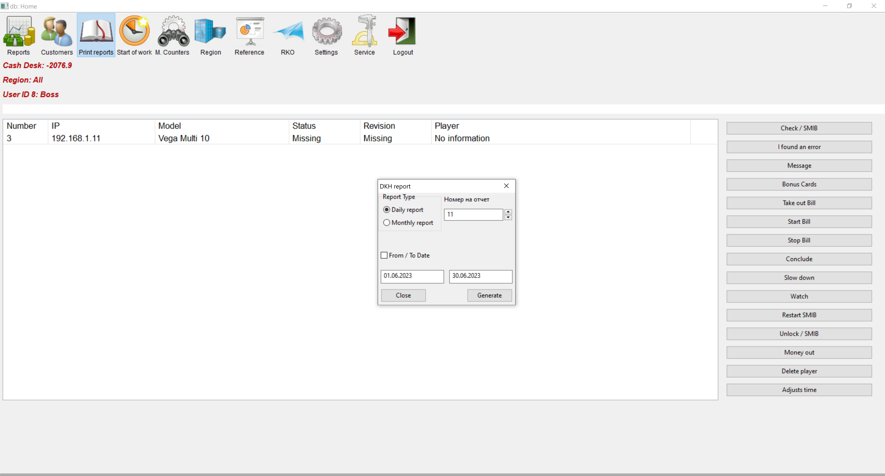

# Print reports

Used to print a report. Daily, monthly or optional from date to date.
> * May take a long time when selecting a longer period.
> * You can change the print settings from the settings menu.
  Look at [Settings / System Settings / Printers and Readers](config_system.html#_31)