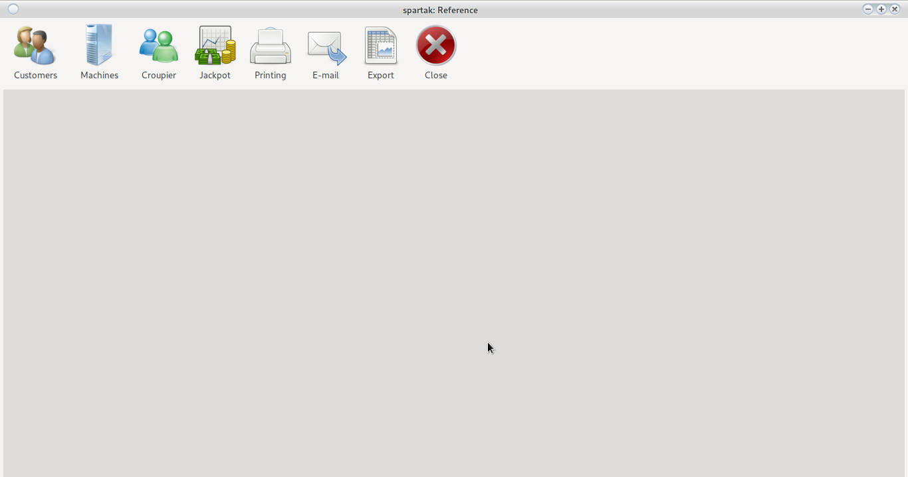
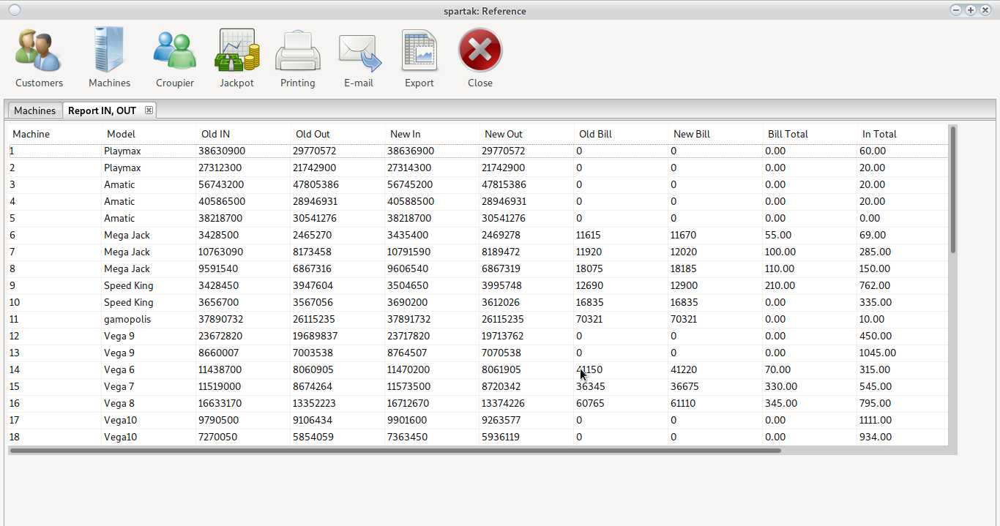
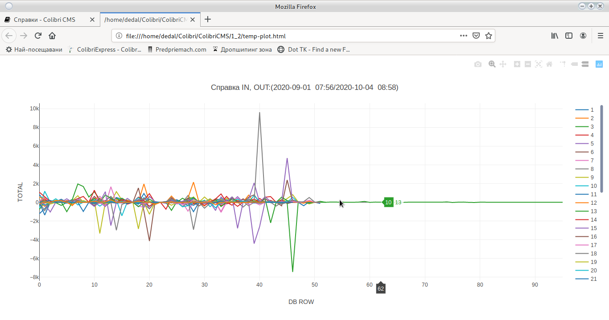
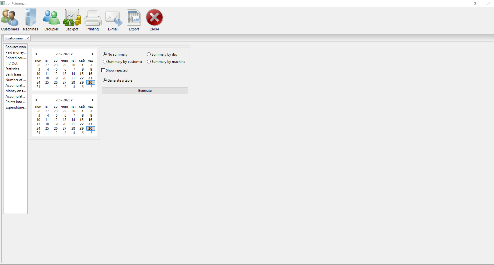
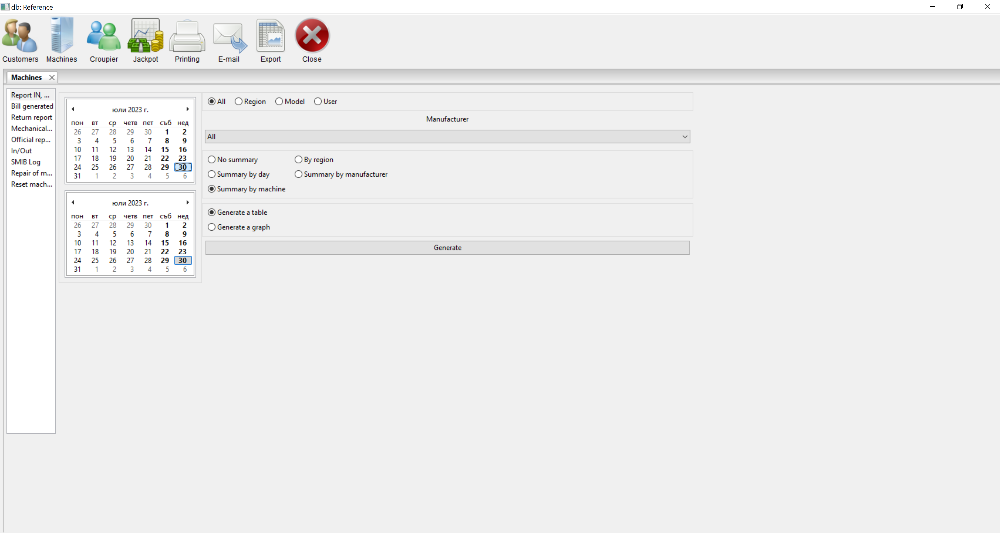
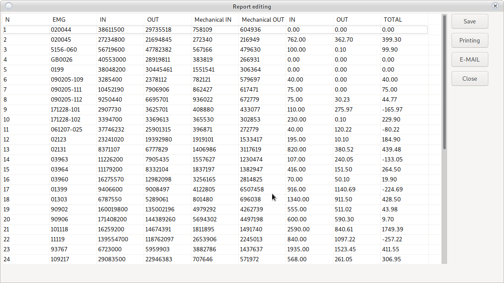
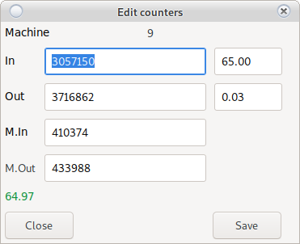
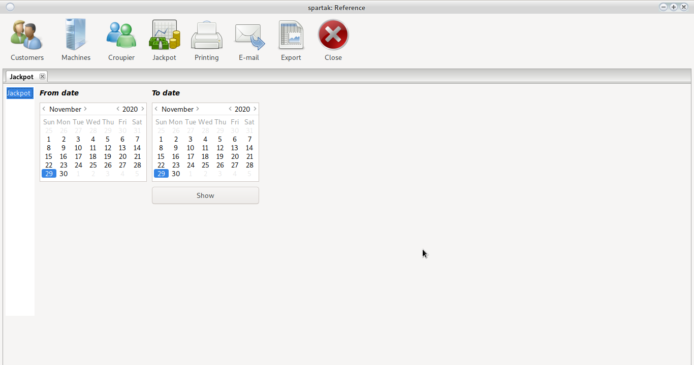

# Reference



<h5 style = "color: red">
Reports for long periods of time can make the program hang
Just wait for the information to be processed. </h5>

Each report opens in its own tab, generating a table with the necessary information
 


It is possible to generate a schedule. To generate the graph, make sure that the [Full Screen] option (config_system.html # _2) is
off.



> You can sort each table by clicking on the column name.
> In the graph, remove the deleted lines from the legend on the right.

```
Select the required report from the left.
Choose a start and end date.
Use the filtering and fine-tuning options.
Click Generate.
The opened new tab contains the necessary information.
```

## Customers



You can see the full name of the setting by hovering over the name.

### Earning bonuses

Reference for all bonuses earned by a customer through the [bonus](cust.html) system.

Does not show [Bonus Cards](config_bonus.html)

### Money Back paid

Reference for all [Money Back](cust.html#pay-moneyback) payout

### Printed coupons

Reference for all printed [coupons](cust.html#coupon-printing) including [free printed](cust.html#free-coupons)

### Input Output

Reference for inputs and outputs made through [cash system](config_system.html#smib)

### Statistics

Statistics of the entire game per client for the specified period

### Bank transfers

Information about money passed through ATM terminal

### Number of cards

Statistics on the number of cards held by a customer

### Accumulated moneyback

The amount of money back bonus accumulated by a customer

### Money on the card

Money that the client has on his card.

### Accumulated points

The amount of bonus points accumulated by a customer

### Points in Money

Points can work as raffle tickets or be redeemed for cash. 

### Expenditure orders

Cash orders printed by the program. POS printer required

<h5 style = "color: blue"> No calendar is used <br>
The reference is for all available cards <br>
Possible delay with a large number of cards, please wait </h5>

## Machines

### IN, OUT, Total

Information on the realization of the machines by electronic counters.

### Generated Bill

Shows were generated by the machine

### Return

% of machine return.

For proper operation, enter the [WON and BET](device.html#add-edit-machine) counters at initialization.

### Mechanical IN, OUT, Total

Information on the realization of the machines by mechanical counters.

### Reports

Reference for all made [reports](main.html#print-reports) and [cash orders](order.html#printing-of-rko)

Select type and date



Use __Double Click__ to open the report



Use __double click__ to fix a report




<h5 style = "color: red"> Possible errors when editing a Monthly Report. </h5>

### Input Output

This report will show every deposit and withdrawal of money from the machine. Machines keep the last 50 - 100 deposits/withdrawals. All others are kept on the server.

### SMIB Log

Error report generated by SMIB controllers

Requires:

[Active logging server](config_system.html#_15)

[Active option to send log to server](config_system.html#smib_1)

### Machine repair

Information on all repairs performed by [Service](service.html)

### Reset machines

Reference for reset machines from [Service](service.html#_6)

## Croupiers

### Transfers

Internal money transfers between different users

View [Transfers](order.html#_3)

### Removed

Shows how many and on which machines it was removed.

Look at:

[Remove Bill from Report](order.html#_8) and [Remove Bill in Shift](main.html#_17)

### Missing

Report on credited and paid [absences](order.html#_5)

### Reported money

The amount that the croupier reported after [end of shift](order.html#_9)

### Income

Reference for all [revenue](order.html#_2) other than machine input

### Expenses

Reference for all [costs](order.html#_4) other than machine output

### Log file

Records all the actions of the croupier (Open door of the bill,
Open central door, restarted SMIB, etc.)

### Bonus cards

All [bonus cards](config_bonus.html) placed by the croupier

### Card Input/Output

Information on [paid](cust.html#_32) and [added](cust.html#_31) money in the cash system

Requires [active cache](config_system.html#smib_1)

### Work time

Shows the number of hours worked.

## Jackpot



You choose the start and end date.
Use the __Generate__ button.

The information is taken from the jackpot server and requires a stable network connection.

Do not run a report for long periods of time, it may slow down the jackpot server or
it will be impossible to transfer the information.

## Print

Prints a report on a printer

Requires configured [printer or PDF reader](config_system.html#_27)

## E-Mail

Sends a report by E-Mail to the owner.

Requires [configured email address](config_system.html#_2)

# Export

Exports the lookup to a Microsoft Excel table in xlsx format. You need to have an office package installed to see it after export
