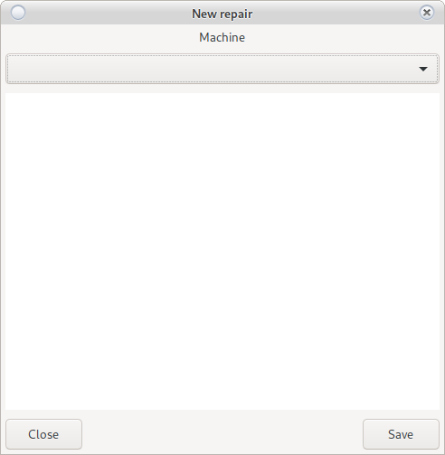

# Service

Home screen for module __Service__

This is a service module. Used for serial machines. Always technique to know what to do and where.

## Read/Edit Task

Double-clicking on the task will open the possibility for Reading, Editing or Writing.

We recommend writing, not editing tasks.

## New Task

In case you have rights you can submit a new task without choosing a machine:

__Example: Mount a TV__

The croupiers can submit repairs to the service only for a certain machine.
[View Here](main.html#_26)

## Stop Alarm

The beeping of the machine will stop.

## Play Alarm

It will let the machine scream.

## Repair

Machine Repair (Task)

A window is loading

There are two options

* No reset
    
    Enter the number of repairs.  
    I bought a cable for BGN 20 or an EGT button for BGN 12.  
    The performed repair is described and the selected order disappears from active tasks.
    
* With reset

    Due to a technical problem, the machine needs to be reset
    From here, the reset methods can be divided into options:
    
    * Without accounting machine
        
        The machine will be reset in the system without reporting. You must be clear about what you are doing.
        
    * Reports by mechanical counters or by hand by electronic
        
        SMIB The controller does not work or the machine does not work  
        You can read it manually by electronic counters or by mechanics.
    * Take out Bill
        
        Did we poison the cartridge on the ridge to get the money out of the machine?
    
    * Transfer
        
        By default, all money from the machine will be credited to equipment  
        When transferring, he will ask for a choice of croupier and confirmation from the croupier  
        After confirmation, the money will be transferred from the cash register to the cashier's office.
        
<h5 style="color:red">
Reset three machines are added to the daily report  
</h5>