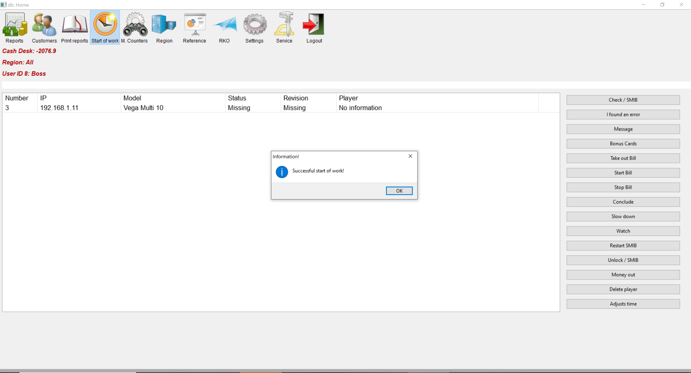

# Start of shift

It is used to initiate work by the croupiers. The program will record the start time of the shift and prompt the user to select a region if available. Double-click to select the region. The program will display a notification message that the change has started successfully.