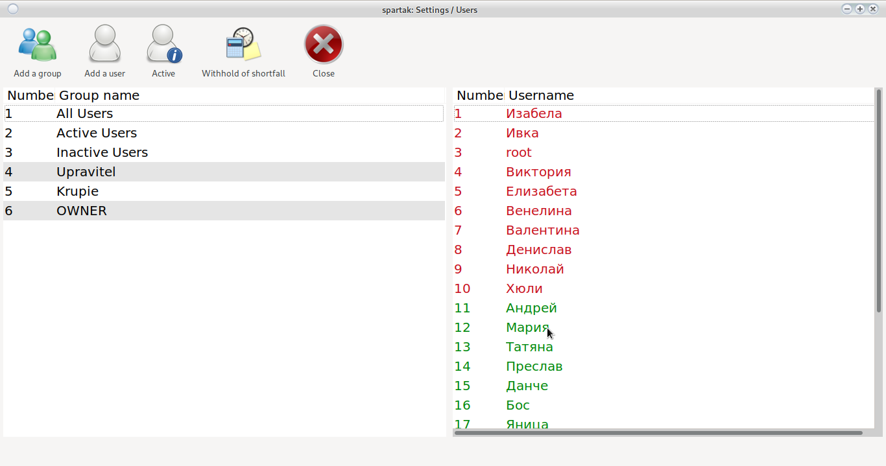
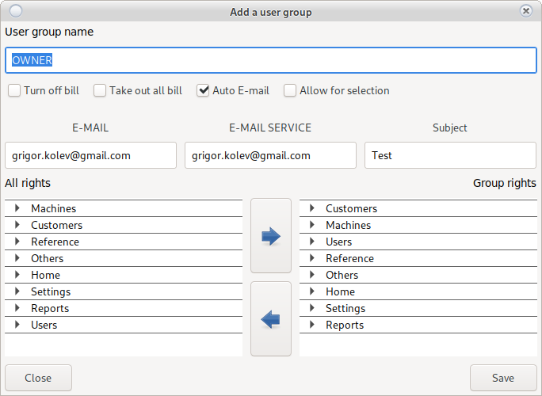
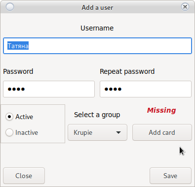
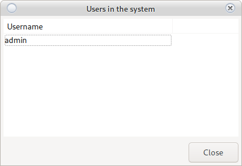
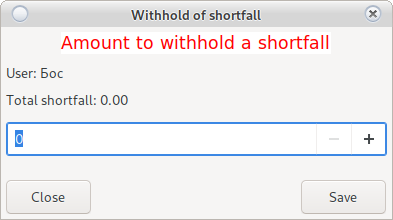

# Users, Groups and access rights

Program access rights system

## Add / Edit Group

Adds and edits groups and group access rights.

You can see all users in a group using the filler
__Single Click__ on the group name [left of the main window](user.html#users-groups-and-access-rights)

To add a new group use the __Add group__ button

To edit an existing group __Double click on the group__ [left of the main window](user.html#users-groups-and-access-rights)

A window for adding a group is loaded

The name of the group is free, but it must be unique.
Recognizes __lowercase__ and __capital__ letters

A created group cannot be removed, deleted or deactivated.

To the left of the window are listed all the rights by windows.

To the right are the rights that the group owns.

* Add rights.

    Select right on the left of the window and click 
    
    The right will appear to the right of the user's rights.
    
    In case you mark an entire group of rights, it will be added with all possible rights in it.

* Removing rights.

    Select right on the right of the window and click 
    
    The right will disappear from the rights that the user has.
    
    In case you mark an entire group of rights, it will be removed with all possible rights in it.

* Turn off the bill

    Indicates to the program whether it will be locked during reporting and / or extraction.
    
    [View](order.html)

* Auto E-Mail

    When you run [daily report](main.html#print-reports), it will automatically send a copy to the owner.
    
    It will automatically send information about new repairs to [service](service.html) and the owner.
    
    When repairs are made, notify the owner.

* Take out the whole bill

    When [billing report](order.html#bill) all machines will be selected for subtraction.
    
    In case you do not remove the ridge on a specific machine use __Double click__

* E-Mail

    Email to __Email1,Email2__

* E-MAIL Service

    Email service look __Auto E-mail__ and [Service](service.html)

* Subject

    Title of E-Mail look __Auto E-mail__
    Used to identify from which casino and which POS terminal the message was sent.

* Enable Selection

    The manager should not have the right to change high-priority groups and users
    as __Owner__
    
    Selecting this option will indicate that the group has a low priority.
    
    In this case, if group editing rights have been removed from the __Manager__ group,
    but user creation and editing rights have been added, everyone in the manager group will be able to
    add edit users in the __Croup__ group without being able to change rights.
    
    > <h5 style = "color: red"> Attention!  
    > We remind you that each button must be displayed in windows  
    > Or if a user has access to a user's edit,  
    > But in __Home__ the __Settings__   button is not displayed
    > and/or in __Settings__ the __Users__   button is not displayed
    > access will be __No possible__
    > </h5>
    
    > <h4 style = "color: blue">    
    > When changing the rights, the user will acquire the new rights after re-logging in. </h4>

    * PKO E-mail

         Enabling this option will send an e-mail to the owner with the turnover after a shift is completed

## Add / Edit User

You can see all users in a group using the filler
__Single Click__ on the group name [left of the main window](user.html#users-groups-and-access-rights)

To add a new user use the __New User__ button

To edit an existing __Double click of the selected user__ [to the right of the main window](user.html#users-groups-and-access-rights)

A window for adding a user opens

Usernames must be unique. Recognizes __lowercase__ and __capital__ letters.

Once added, a User cannot be removed but only deactivated.

* Username

    Free text recognition
    
* Password

    Login password [can be changed](main.html#change-user-password)
    
* Active/Not Active

    If the user is __Not Active__ will not be displayed at [Login](login.html)
    
* Group
    
    The user will acquire the rights of the selected __Group__ from the drop-down menu
    
* Add Map
    
    [Requires active RFID reader](config_system.html#printers-and-readers)
    
    It opens
    
    
    
    Insert a card into the reader and press __Save__
    
    The card will be initialized with the user and will allow [card login](login.html) and
    [jumping quay system](config_system.md)

## Active users

Shows all logged in users.

If [settings](config_system.html) is set, users can be discarded with __Double-click__

> <h5 style = "color: red"> Attention!  
> No croup discards tested. </h5>

## Hold missing

In case the lack of a croupier is deducted from the salary

it can be removed from here.

Select a user to the right of the main window and press __Help Miss__

It will open

A total obligation is the obligation accumulated during the entire period of the user's work.

All payments are deducted from the amount.

In case of an amount with a negative sign, the user has overpaid all obligations to the organizer.

Enter the amount to be deducted and press __Save__