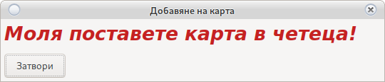

# Основен прозорец

Настройка на свободни бонус карти

## Добавяне/Редакция на бонус карти

[Изисква активен RFID четец](config_system.html#_27)

За добавяне на нова бонус карта използвайте __Нова карта__

Поставете карта в четеца и натиснете __Запис__

За редакция на съществуваща карта __Използвакте двоен клик__

* Име на бонус карта

    Свободен уникален текст за разпознаване. Познава __малки__ и __ГЛАВНИ__ букви.
    
* Сума на бонуса

    Това е сумата която ще падне в кредита на машината.
    
* Превърти

    Падналата сума трябва да бъде превъртяна __Х__ пъти за да бъде позволен аут 
    <h4 style="color:red">Внимание! 
    Изисква активно AFT
    </h4>

* Тип на бонус

    Чрез опциите може да регулирате типът на бонус картата.
    
    * Статичен
    
        В този случай в машината ще влязат 15 лева
       
    * Статичен с удържане
    
        Ще влязат 15 лева, но ако не бъдат изиграни ще се в зависимост от настройката
        [удържат от крупието](config_system.md) или ще се запише справка.
        
    * 1 към 1
    
        Ще влезе 15 лева само ако в машината има >= кредит от 15 лева
        
    * 1 към 1 с удържане
    
        Ще влезе 15 лева само ако в машината има >= кредит от 15 лева 
        В зависимост от настройката
        [удържат от крупието](user.md) или ще се запише справка.
        
    * Умножена по 2
        
        В кредита юе влязат 30 лева  
        15 от тях ще бъдат зачислени в касата на крупието което е длъжно да ги вземе от клиента.
        
    * Умножена по 2 с удържане
    
        В кредита юе влязат 30 лева  
        15 от тях ще бъдат зачислени в касата на крупието което е длъжно да ги вземе от клиента. 
        В зависимост от настройката
        [удържат от крупието](user.md) или ще се запише справка.
        
    * Не усвоямем вход
    
        Бонуса влиза като промо вход и не може да бъде изваден. Всяка печалба по време на игра
        може да бъде извадена  
        
       
        
<h5 style="color:red">Внимание! 
Нито една от сумите няма да мине през брояча IN на машината. 
Всички суми от тип __Умножена по 2__ или от __Удържане__ се явяват приход, не разход на крупие.
</h5>

## Активирай нова карта

При запис на нова, активира разпознаването на SMIB контролера

<h5 style="color:blue">Уверете се, че всички машини за записани успешно 
Запишете позторно при нужда.</h5>