# Модул клиенти

Това е основния модул за управление на клиенти. 

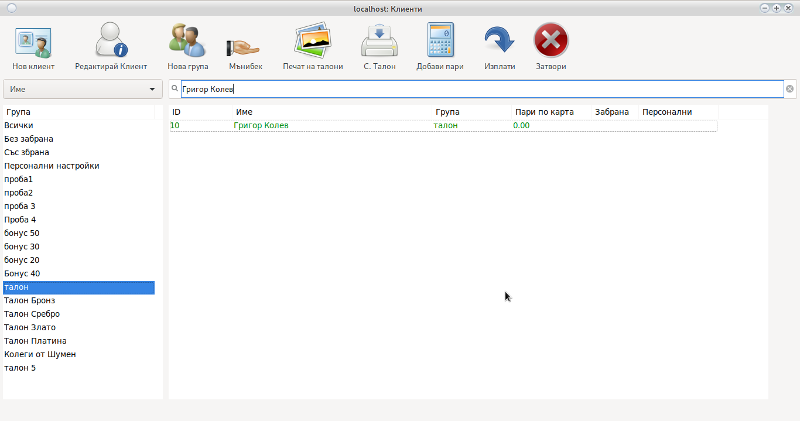

## Търсене на клиент

В най-горната част на основния прозорец се намира поле за търсене.

От падащото меню се избира критерий пример __Име__ и се въвежда Име или първи букви.
С натискане на бутон __enter__ системата ще извърши вилтриране.

> <h5 style="color:red">Внимание! 
> Разпознава малки и главни букви.</h5>

## Филтър по група

В лявата час има на основния прозорец има вградени филтри. С единичен клик върху някоя от групите
системата ще покаже криентите намиращи се в тази група.

## Добави/Редактирай група

За добавяне на нова група използвайте бутона 
<h4 style="color:blue">Добави група</h4>

За редакция на вече съществуваща група:
<h4 style="color:blue">Кликнете с двоен клик върху името на групата от [филтъра](cust.html#_3)</h4>

Системата ще отвори прозорец за настройка на група

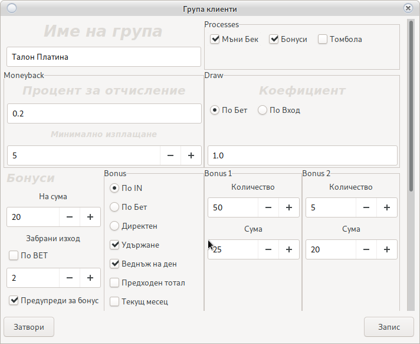]

<h4 style="color:blue">Промяна на настройките на група, ще промени всички потребители в групата. 
Ако изрично не е зададено, че попребителя използва индивидуални настройки. 
<a href="cust.html#_18">Погледни Тук</a></h4>

### Име на група

Името е свободен текст. Използва се за да може потребителя да разпознае една група от друга.

> <h5 style="color:red">Внимание! 
> <ul>
> <li>Разпознава малки и главни букви</li>
> <li>Не е въможно повтарящи се имена</li></ul></h5>

### Процеси

Това са чофките в каре __Process__

Те определят дали групата ще отчислява за __Мъни Бек__, __Талони__ и __Бонус сандъци__

> <h5 style="color:red">Внимание! 
> В случай, че процеса е спрян от тук, то нито една настройка на съответния процес няма да работи</h5>

### Мъни Бек

Това са настройките на Мъни Бек системата

Погледнете карето __Monyback__

То савържа две полета:

#### Процент на отчисление

Процента на отчисление е на база бет или работи като индифидуален джакпот сървър.
<h3 style="color:red">1 е 1% от всеки залог</h3>

> <h5 style="color:red">Внимание! 
> 1 лев = 100 стотинки
> 1% от 100 стотинки = 1 стотинка
> </h5>

#### Минимално изплащане

Минималната сума в лева до която трябва да достигне клиента, за да може бъде изплатена от крупието.
Само суми по-големи или равни на зададената могат да бъдат изплатени.

> <h5 style="color:red">Внимание! 
> Системата изплаща само цели суми. Натрупаните стотинки остават по баланса на клиенте без да се губят
> </h5>

### Талони за томбола

Това е системата за натрупване на талони за томбола.
Погледнете карето __Draw__ което има две настройки

#### Начин на пресмятане

Има два възможни начина на пресмятане на броя талони:
 * По Бет (развъртяни пари)
 * По Вход (Вкарани пари)
 
> <h5 style="color:red">Внимание! 
> Не препивъчваме пресмятане по вход.
> То дава предпоставки да се правят злоупотреби с вход/изход.
> В бъдещи версии ще бъде премахнато пресмятането по вход.</h5>

#### коефициент

коефициента на таслните е на база 100

или <h3 style="color:red">1% = на 1 талон на 100 лева Бет 
0.5 = половин талон на 100 лева</h3>

#### Бонуси

Това е системата за настройки на сандъците с бонуси излизащи на дисплея на SMIB контролера.

Използвайте скрола докато не видите 

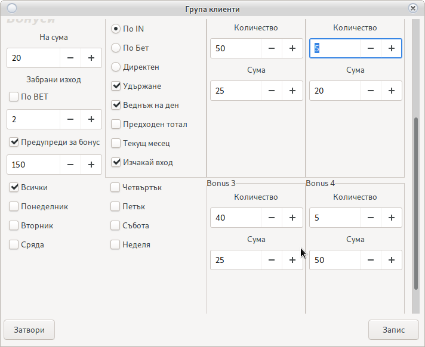

##### Секция Суми 

* Опция на сума

Това е сумата на която да се покаже бонуса. В зависимост от избраната опция тя е по вход или бет.
При избот на опция __На загубени Пари__ бонуса ще се покаже след като общия тотал на клиента достигне 
посочената сума (настройката за кредит под сума [Тук](config_system.html#smib_1))

* Превъртане на бонус

Превъртането на бонус изисква AFT. При зададена опция 1 бонусът няма да изизква превъртане.
При 2 ще е нужно да се превърти двапъти.

Превъртането може да е по вход или:

При бонус 20 лева с превъртане х2 изхода ще стане възможен на 40 лева кредит.
В случай на активна опция __Изчакай вход__ равен на бонуса с превъртане х2. 
При 20 лева бонус системата ще чака 20 лева
вход, аут ще бъде възможен при достигане на 80 лева кредит.

Превъртане с опция __По Бет__:

Кредита ще бъде игнориран и системата ще позволи аут когато бета стане равен или по-голям от бонуса Х
опцията за превъртане или кредита падне под [Погледни тук](config_system.html#smib_1).

* Предупреди за бонус

Когато тотала на клиента достигне посочената сума, на дисплея ще се покаже надпис приканващ клиента да
 изтегли хартиен бонус.
 
 
##### Секция видове сандъци

* По IN

    Пресмятането на бонуса ще се извърши по тотала на клиента.
    
* По Bet
    
    Пресмятането на бонуса ще се извърши по Bet на съответната машина.
    
    __Не изчислява бета от всички машини на които клиента е изграл през деня__

* Директен

    Веднага след посавяне на картата на клиента ще се покаже бонус
    
* Допълнителни опции за настройка
    * Удържане
    
        Ако бонусът не е загубен ще се извърши __Удържане__
        Удържането може да бъде справочно или зачислено към касата на крупието [Погледни Тук](config_system.html#_2)
    
    * Веднъж на ден
        
        Бонус ще излиза само веднъж на ден за един клиент. Няма сначение с колко карти играе клиента.
         
    * Предходен тотал
        
        Активна при бонус тип __По IN__ и __Веднъж на ден__.
        Бонус ще се покаже само в ситуация в която клиента е загубил съответната сума предходния ден.
        __Изчислява се тотал на клиента от всички машини на които е играл предходен ден__
        
    * Текущ месец
    
        Активна при бонус тип __По IN__ и __Веднъж на ден__.
        Бонус ще се покаже само в ситуация в която клиента е загубил съответната сума текущ месец.
        __Изчислява се тотал на клиента от всички машини на които е играл текущ месец__
        
    * Изчакай вход
    
        След избиране на бонус сандък и приемане на бонуса системата ще изчака вход равен на сумата 
        на бонус.
        
> <h4 style="color:red">Внимание! 
> <ul><li>Всички бонуси могат да бъдат приети или отказани.</li>
> <li>Отказаните бонуси остават активни до пускане на дневен отчет.</li>
> <li>Отказаните бонуси могат да бъдат играни по всяко време и на всяка машина.</li>
> <li>Системата приема кредита при премахване на карта като OUT</li>
> <li>Системата приема кредита при поставяне на карта като IN</li>
> <li>Внимавайте със стотинките в кредита. Може тотала да не достигне нужната сума.</li>
> <li>Допустима разлика от стотинки [Погледни тук](config_system.html#smib_1)</li>
> </ul></h4>  
> <h4 style="color:blue">Информация! 
> Системата за бонуси може да работи __С AFT__ и __Без AFT__
> <ul><li>С AFT бонусите ще влязат директно в машината</li>
> <li>Без AFT бонусът ще иска между едно и три завъртания</li></ul>
> </h4>
> <h4 style="color:red">Без AFT съобразете кредита в машината</h4>

##### Дни от седмицата

Бонусите ще бъдат активни само в избраните дни.

При активиране в __Сряда__ бонусите ще са активни от дневния отчет пуснат в Сряда до дневния 
отчет пуснат в Четвъртък.

За по специална настройка погледнете [Пренасочване на група](cust.html#_34) 

> <h4 style="color:red">Внимание! 
> В случай на използване на __Пренасочване на група__ изберете опция __Всички Дни__
> </h4>

##### Секция Бонус купа

В основната си част представлява купа в която поставяте брой бинуси от определена сума.

Колкото повече бонуси има от определена сума, толкова шанса да бъдат изтеглени се увеличава.

Купата не свършва и при свяко теглене се вадят старите бонуси и се пълни отново.

> <h4 style="color:red">Внимание! 
> Тегленето на бонуси е на случаен принцип. 
> Всичките сандъци съдържат случайно изтеглени 5 суми. 
> От там зависи от избора на клиента. </h4>

## Добави/Редактирай клиент

Добавяне на клиент се извършва от бутона __Нов Клиент__

За редакция изберете нужния клиент и натиснете __Редактирай Клиент__

Ще се отвори следния прозорец:

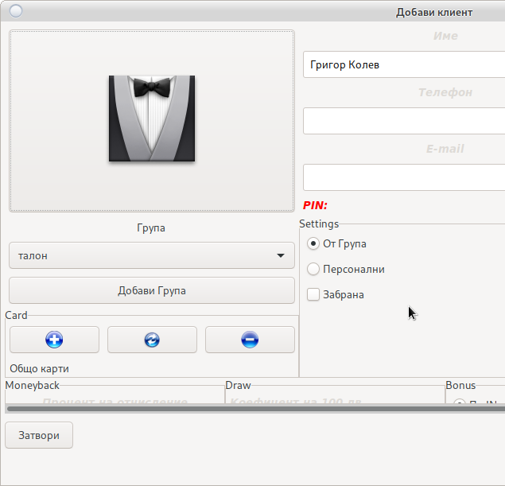

### Добавяне на снимка на клиент

В разработка. Не активен бутон.

### Секция Група

Избирате група на клиент от падащото меню. 

Задължителен атрибут.

В случай, че няма създадена група използвайте [Добави Група](cust.html#_4)

### Секция Карти

[Изисква активен RFID четец](config_system.html#_27)

Добавяне на карти на клиент.

Няма ограничение в броя на картите.

Картите не съдържат никаква информация за клиента или натрупаните от небо бонуси.

* Бутон 
    
    Добавя добавя карта на клиент.
    
    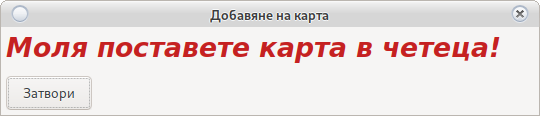
    
    Поставете картата на четеца и натиснете __Запис__
    картата е добавена и всички машини ще разпознаят клиента.

* Бутон 

    Премахване на определена карта от клиент.
    
    
    
    Поставете картата на четеца и натиснете __Запис__
    Картата ще бъде премахната и няма да е кативна на нито една машина.

* Бутон 
    
    Премахва всички карти на клиент.
    Всички карти ще бъдат премахнати и няма да бъдат активни.

### Лична информация

Задължително е __Име на клиент__ и __Населено място__

Името трябва да е уникално. Разпознава малки и ГЛАВНИ букви.

__Населено място__ се избира от падащото меню. 

В случай, че липсва използвайте бутона __Добави__ и ще се отвори

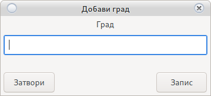

Името на града трябва да бъде уникално. Разпознава малки и ГЛАВНИ букви.
След запис __Населеното място__ ще се появи в падащото меню.

Всички останали атрубути могат да останат празни.

> <h2 style="color:red">Внимание! 
> В случай, че решите да попълвате останалите атрубути  
> Спазвайте закона за лични данни на съотъветната страна.</h2>

### Забрана

Ще деактивира клиента. Картите на клиента няма да бъдат разпознати от машините.
Няма да позволи изплащане на __Мъни Бек__ и отпечатване на __Талони__

### PIN код

В разработка. Не се използва в тази ревизия.

### Персонални настройки

Указва, че клиента не зависи от групата и има индивидуални настройки.

В случай на промяна на групата, настройките на този клиент няма да бъдат променени.

За да настроите клиента индивидуално изберете тази опция. Логиката на всички настройки е като 
настройките на [Нова Групата](cust.html#_4) 

## Изплати мънибек

Изплащане на __Мъни бек__ [Изисква активен RFID четец](config_system.html#_27)

Изисква картата на клиента да бъде маркирана от крупе на работния четец.

Поставете картата в четеца. Ако сумата на [натрупания Мъни Бек отговаря на минимално зададената](cust.html#_4)

Натрупания __Мъни бек__ ще бъде занулен и ще бъде приспаднат от касата на крупието.

> <h4 style="color:red">Внимание! 
> Изисква права за достъп
> Изплаща се само цяла сума. Стотинките остават в профила на клиента.</h4>

## Изплати мънибек без карта

Избирате клиента от [основния прозорец](cust.html#_1)

С десен бутон ще се отвори меню.

Избирате __Изплати МъниБек без карта__ 

Натрупания __Мъни бек__ ще бъде занулен и ще бъде приспаднат от касата на крупието.

> <h4 style="color:red">Внимание! 
> Изисква права за достъп
> Изплаща се само цяла сума. Стотинките остават в профила на клиента.</h4>

## Премахни загуба на карта

При неправилна работа на rfid четеца се получава загуба на клиент.

Всяка загуба се натрупва с обща статистика като вход и изход.

Възможно е статистиката да получи неочакван тотал и да не отвори бонус.

Бутона ще премахне нужната статистика.

> <h4 style="color:red">Внимание! 
> Премахва целия Кредит IN и Кредир OUT 
> Първо проверете статистиката за загуба. 
> Използвайте в краен случай!</h4>

## Печат на талони

Печат на __Талони__ [Изисква активен RFID четец](config_system.html#_27)

Изисква картата на клиента да бъде маркирана от крупе на работния четец.

Поставете картата в четеца.

Натрупаните _Талони_ ще бъде занулен и ще бъде разпечатани на пос принтер.

> <h4 style="color:red">Внимание! 
> Отпечатва се само цял талон. Останалата част остава в профила на клиента 
> Изисква настройки на POS принтер: 
> [Погледни](config_system.html#_27)</h4>

## Печат на талони без карта

Печат на __Талони__

Поставете картата в четеца. 

Натрупаните _Талони_ ще бъде занулен и ще бъде разпечатани на пос принтер.

> <h4 style="color:red">Внимание! 
> Отпечатва се само цял талон. Останалата част остава в профила на клиента 
> Изисква настройки на POS принтер: 
> [Погледни](config_system.html#_27)</h4>

## Свободни талони

В случай на машина без възможност за монтиране на SMIB контролер, талоните могат да бъдат отпечатани
 свободно.

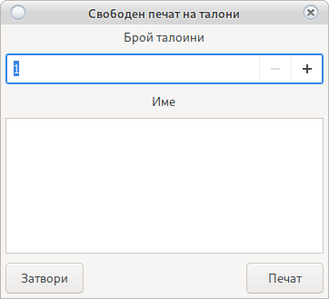

Въвеждате брой талони и Име на клиент. Талоните ще бъдат разпечатани.

> <h4 style="color:red">Внимание! 
> Изисква настройки на POS принтер: 
> [Погледни](config_system.html#_27)</h4>
 
## Добави пари в карта

Това е каса на казиното. Изисква карта на клиент.

Изисква AFT и на настройка на [SMIB секция keysystem](config_system.html#smib_1)

Парите добавени в картата на клиента ще бъдат добавени в касата на крупието.

Маркирайте картата на четеца

Ще се зареди прозорец

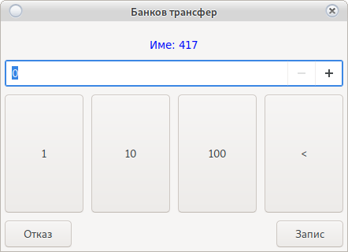

След поставяне на карта в машина, машината ще направи IN за същата сума 
Тази сума няма да се вземе под внимание при отчет.

> <h4 style="color:red">Внимание! 
> Не работи с две карти. Първата машина ще вземе целия кредит. 
> В разработка.</h4>

## Изплати пари от карта

Това е каса на казиното. Изисква карта на клиент.

Изисква AFT и на настройка на [SMIB секция keysystem](config_system.html#smib_1)

Парите изплатени от крупие ще се извадят от касата на крупието и ще бъдат занулени 
в касата на клиента.

Маркирайте картата на четеца

Натиснете __Запис__

В случай, че клиента извади карта от машина.
Машината ще направи OUT който няма да бъде взет под внимание при отчет.

> <h4 style="color:red">Внимание! 
> Не работи с две карти. 
> В разработка.</h4>

## Пари през ATM терминал

При наличие на пос терминал.

Сумата постъпила през терминала и сложена в машината е разход за крупие.

Избира се клиента и с дясно копче на мишката се избира __ATM__

Избира се сумата на транзакцията.

Сумата ще бъде извадена от касата на __Крупие__ и не е нужно писането на разход.

## Бърза справка за клиент

Това е бърза справка. 
Служи когато искаме бързо да проверим клиента и да го разпределим в група.

Отваря се с __Двоен клик на клиента__

> <h4 style="color:red">Внимание! 
> Погледнете датата на справката. </h4>

## Пренасочване на група

Може в определени дати и часове една група от клиенти да бъде пренасочена с натройките на друга.

__Финни настройки__

Отваря се с дясно копче на мишката [върху филтър](cust.html#_3)

Ще зареди 

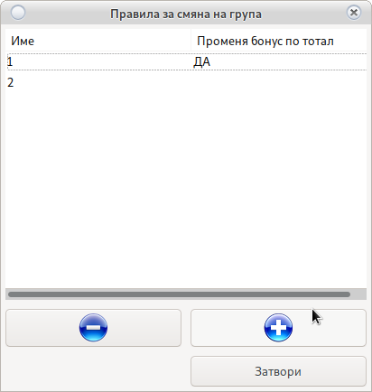

Правилата за пренасочване на група са с уникални имена.

* Бутон 
    
    Добавя ново правило за пренасочване.
    
* Бутон 

    Изтрива правило за пренасочване.
    
Системата позволява всички клиенти от група __Х__ да приемат настройките на група __Y__ 
в определен период от време.

> <h4 style="color:red">Внимание! 
> Не работи за клиенти с индивидуални настройки. 
> <a href="cust.html#_18">Погледни ТУК</a>
> Пренасовчанията променящи бонусите на база тотал са с по-нисък приоритет и не се изпълняват
> ако има друго активно пренасочване</h4>

> <h3 style="color:red">Важно! 
> Дните на актувност на бонуса не се присвояват при пренасочване. 
> Или ако група __X__ не работи в сряда то и пренасочването няма да работи.
> </h3>

При довавяне на пренасочване ще видите

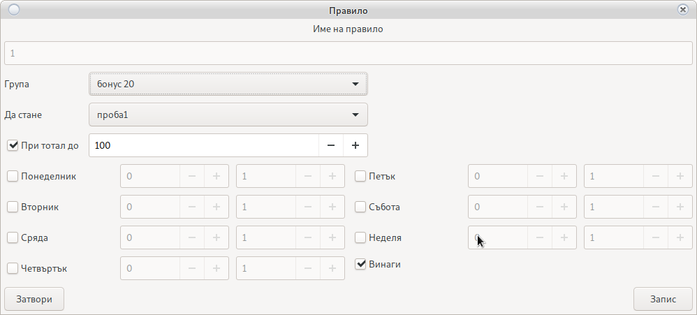

Името на пренасочването е свободно, но трабва да е уникално. Служи за разпознаване от потребителя.

Бонусите ще се покажат в справките с името на отновната група на клиента, не с пренасочената.

* От Група
    
    Това е групата която за смени настройките си
    
* Да стане

    Групата чиито натройки да приеме. Дори и група __Y__ да няма никакви клиенти
    Всички клиенти на група __X__ ще вземат нейните настроки в посочения интервал. 
    Интервала е __ден от седмицата__ от __час до час__

* При тотал до
    
    Ако опцията се активира променя сумата на бонусите ако тотала е на база предходен ден в зависимост
    от загубената сума. Не трябва да има пренасочвания с по-висок приоритет.
    
## Резервация на машина за клиент

С десен бутон на мишката на името на желания клиент и избирате __Резервация__

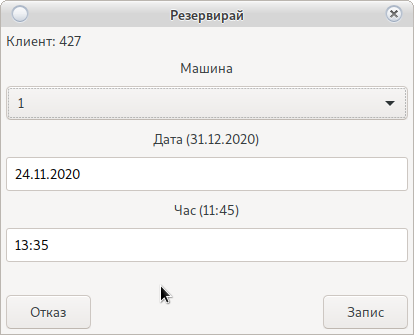
 
Въведете до кога да бъде резервирана избраната машина и използвайте __Запис__
 
> <h4 style="color:blue">Внимание! 
> Избраната машина ще се заключи по SAS. 
> Машината ще се отключи след поставяне на карта принадлежаща на клиент или  
> След достигане на посоченото време.
> </h4>
 
> <h4 style="color:red">Важно! 
> При грешка използвайте авариент бутон __Отключи SMIB__ или рестартирайте SMIB контролера.
> </h4>