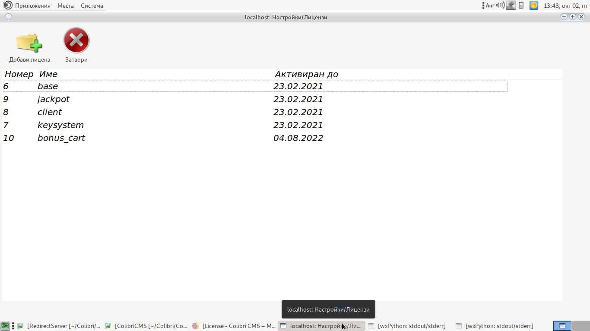
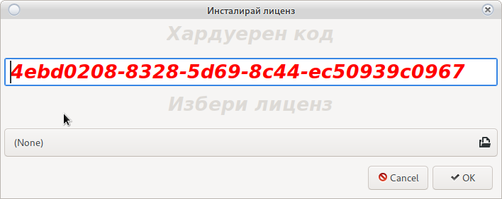

# Система за лицензи

Система за лицензиране на софтуера. Система защитаваща интелектуалния труд.
Всяка промяна в лицензите ще предизвика срив в системата.

Моля не се опитвайте да променяте лъчно лиценз 

`Сами носите отговорност за подобни дейтвия`

Не промянайте и не копирайте катрите на информационния сървър 

`Ще бредисвика срив в системата`

Не правете опит да инсталирате лиценз предназначе на друг сървър.

<h5 style="color:red">Лицензите са валидни само за устройството за което са създадени</h5>

<h5 style="color:red">Всички лицензи са валидни за 2 години.</h5>

<h5 style="color:red">Системата ще предупреди 10 дена преди изтичане на някой от лицензите.</h5>

<h5 style="color:red">Всеки лиценз може да бъде отнет без предупреждение от производителя 
Това ще предизвика срив в съответната система.</h5>

В случай на проблем с лицензите се свържете с 

<a href="mailto:grigor.kolev@gmail.com">Grigor Kolev</a>

## Проверка за валидност

С двоен клик на съответния лиценз може да проверите дали е валиден и правилно инсталиран.

## Нов лиценз

За добавяне на нов лиценз използвайте бутона __Нов Лиценз__

Ще се отвори следния прозорец:

Ненерирания код изпратете на:

<a href="mailto:grigor.kolev@gmail.com">Grigor Kolev</a>

Ще ви бъде върнат файл със съответния лиценз.

От опцията __Избери лиценз__ изберете изпратения файл и използвайте бутона __OK__

Новия лиценз ще се появи в [основния прозорец](license.html#_1)

<h5 style="color:red">Проверете дали новия лиценз е инсталиран 
с използване на двоен клик.</h5>

<h3 style="color:red">Важно! 
Изпратения файл е с валидност от __45__ минути. 
Инсталирайте веднага след получаване.</h3>

